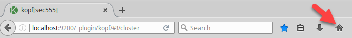
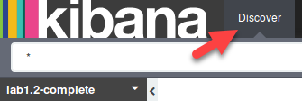
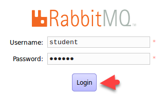
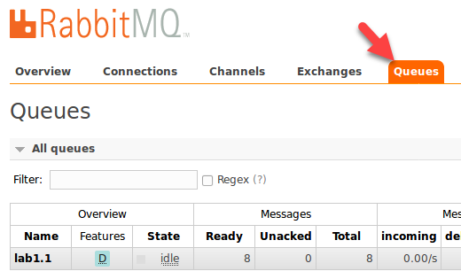
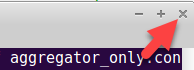
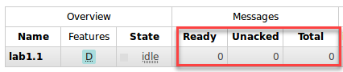
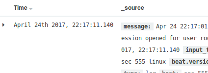
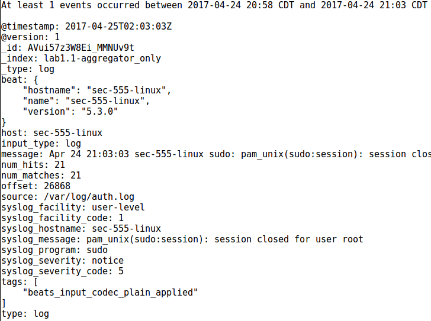

Lab 1.1 - Introduction to SOF-ELK
=================================

Objectives
==========

-   Be comfortable with using SOF-ELK

-   Establish a high level understanding of SIEM architecture

-   Learn how to manually collect logs

-   Interact with the various components of a SIEM

-   Use an alert engine to create an alert

Exercise Preparation
====================

Log into the Sec-555 VM

-   Username: student

-   Password: sec555


Open a terminal by double clicking on Terminal

Start the **RabbitMQ** (log broker) service. To do this type "**sudo service rabbitmq-server start**" at the terminal.

```bash
$ sudo service rabbitmq-server start
```

Note: This service is not started by default to save system resources. In a production environment, this would be configured to start automatically.**

The overall objective of this lab is to learn the various components a SIEM by using them. Installation of each component has already been performed and all configuration files have been pre-built.

**Logstash** (log aggregator) configuration files are in **/labs/lab1.1/files/**
The **Filebeat** (log agent) configuration file is located at **/etc/filebeat/lab1.yml

This lab deals with reading logs from **/var/log/** on your student virtual machine. Thus, the number of logs represented and the timestamps will not match the pictures in the step-by-step instructions.

Exercise: No hints
==================

1.  Send logs from **/var/log/\*.log** to **Logstash** (log aggregator) using **Filebeat** (log agent). Output logs to the screen

2.  Send logs from **/var/log/\*.log** to Logstash using **Filebeat** and output logs to **Elasticsearch** (storage) in an index called **lab1.1-aggregator\_only**

3.  View logs from the **lab1.1-aggregator\_only** index using **Kibana** (search/report system)

4.  Send logs from **/var/log/\*.log** to Logstash using **Filebeat** and output logs to **RabbitMQ** (log broker)

5.  Use Logstash to pull logs out of **RabbitMQ** and send them to **Elasticsearch** in an index called **lab1.1-broker**

6.  View the logs from the **lab1.1-broker** index using **Kibana**

7.  Use **ElastAlert** (alert engine) to test the rule **/opt/elastalert/rules/lab1-1\_freqeuncy.yaml**. This is an example rule that triggers an alert if **sudo** is found in any logs. **ElastAlert** has a utility called **elastalert-test-rule** that can be used to test rules.

Exercise – Step-by-step instructions
====================================

1. Use a log agent and send logs to a log aggregator
---------

In this section, the config files will pickup logs using **Filebeat** and send them to **Logstash**, which will only display them to the screen. This demonstrates a log agent sending logs to a central location.

To send logs from a log agent to a log aggregator the log aggregator must first be running. SOF-ELK uses **Logstash** as a log aggregator but for this class the service is not enabled. Manually run **Logstash** and have it use the configuration file called **debug.conf**. Do this by running the command 

```bash
$ /opt/logstash/bin/logstash -v -f /labs/lab1.1/files/debug.conf
```

Wait until you see "**Pipeline Main Started**".


This means that Logstash is running. Next, open a new terminal that will be used to demonstrate a log agent. To do this left click on the purple terminal icon at the top of the screen.


This terminal will be referred to as the **Agent Terminal**. The next steps are to be performed on the **Agent Terminal**. This is used to visually distinguish between Logstash, a log aggregator on the **black terminal**, and Filebeat, a log agent on the purple terminal. Typically, Filebeat would be ran on a remote machine. In the **Agent Terminal** run Filebeat using the command below.

```bash
$ sudo /usr/share/filebeat/bin/filebeat -c /etc/filebeat/lab1.yml
```

When prompted for the student password enter **sec555**.


Switch back to **black terminal** and you should see that Logstash has accepted the logs sent from Filebeat. The output should look like the image below but **WILL NOT** be the same. The logs and timestamps will be specific to your system.


**Note:** Outputting logs to the screen can be helpful for debugging.

Within the **black terminal** hit **CTRL + C** to stop Logstash.


Switch back to the **Agent Terminal** and hit **CTRL + C** to stop Filebeat. Filebeat will not display anything when stopped. Instead it will simply terminate.

2. Use a log agent and send logs through a log aggregator into storage
---------
In this section, the config files will pickup logs using **Filebeat** and send them to **Logstash**, which will then forward the logs to **Elasticsearch** for storage. This demonstrates a log agent sending logs to a central location which in turn parses and stores the logs.

Switch back to the **black terminal** and run Logstash with the **aggregator\_only.conf** configuration file. Do this by running the command below. *This is a single line command*.**

```bash
$ /opt/logstash/bin/logstash -v -f /labs/lab1.1/files/aggregator_only.conf
```

Wait until you see "**Pipeline Main Started**". Switch back to the **Agent Terminal** run Filebeat using the command below:

```bash
$ sudo /usr/share/filebeat/bin/filebeat -c /etc/filebeat/lab1.yml
```

This time the **black terminal** will not show logs. This is because they are being sent directly to Elasticsearch, the back-end storage system. If logs are properly received, then an index called **lab1.1-aggregator\_only** should be created and contain all the logs Filebeat sent. There are multiple ways to see if logs were accepted and the index was created. One method is to use a web based management tool. Most SIEMs provide a GUI method for this. For Elasticsearch you can use Marvel, scripts, or community plugins such as kopf. This lab uses kopf. First open Firefox.


The home page defaults to **Kibana**, which is the search and reporting interface. Switch to **kopf** by clicking on it in the **Bookmarks Toolbar**. kopf is a GUI management interface for monitoring and changing Elasticsearch.


The page displayed is a web front end to manage Elasticsearch settings and indexes.


**Note**: Indexes are special files that split logs across shards. If this terminology makes your head hurt, then think of an index as a traditional database. Under the hood a shard operates differently than a traditional database but conceptually is similar. This picture shows that **lab1.1-aggregator\_only** has **11** logs. You can tell this by looking at the number of docs found immediately under the index name. This **may not match** the number of logs on your system. This is because the configuration file in use is reading new logs stored in **/var/log/** on your student virtual machine. This interface regular updates. This means you can use it to see how many logs are coming in during log ingestion.

Hit **CTRL + C** to stop Logstash.


Switch back to the **Agent Terminal** and hit **CTRL + C** to stop Filebeat. Filebeat will not display anything when stopped. Instead it will simply terminate.

3. View the logs stored in the index lab1.1-aggregator_only
---------
In this section, the **Kibana** is used to view the logs stored in **Elasticsearch**. This demonstrates the ability to search and report of logs once they have been collected.

While still in Firefox click on the Home button. The homepage for the Sec-555 virtual machine is **http://localhost:5601/app/kibana** which is Kibana.



To see logs from a new index you must tell Kibana about the index. To do this click on **Settings** and then enter the index name of **lab1.1-aggregator\_only** under **Index name or pattern**. Then select the **Time-field** name of **@timestamp** and click **Create**.


Now you can switch back to the **Discover** tab and select this index to view the logs.



You should now see the logs you have collected.


If you cannot see any logs it may be that the logs are older than the last 15 minutes. This is the default time span selected in Kibana. You can change this by clicking on the **date picker** in the top right corner. This will allow you to pick a longer period such as the **Last 5 years**.


4. Use Filebeat and Logstash to send logs to RabbitMQ (log broker)
---------
In this section, the config files will take logs using **Filebeat** and send them to **Logstash**, which will then forward the logs to **RabbitMQ** for temporary storage. This demonstrates a log agent sending logs to a central location which in turns places the logs into a temporarily holding location. In this scenario, no parsing or log enrichment is done. Using a log broker such as **RabbitMQ** helps handle spikes in traffic so that logs are not dropped.

Sending logs directly into back end storage is not a good idea. If Logstash is taking too long to process the logs, then you could end up with a loss of logs. Instead send them to a log broker such as RabbitMQ. Do this by starting Logstash using the **aggregator\_only.conf** configuration file. Switch back to the **black terminal** and run the command below. *This command is a single line command*.

```bash
$ /opt/logstash/bin/logstash -v -f /labs/lab1.1/files/aggregator_to_broker.conf
```

Wait until you see "**Pipeline Main Started**". Switch back to the **Agent Terminal** run Filebeat using **sudo /usr/share/filebeat/bin/filebeat -c /etc/filebeat/lab1.yml**.

```bash
$ sudo /usr/share/filebeat/bin/filebeat -c /etc/filebeat/lab1.yml
```

This time logs should be sent to the log broker rather than Elasticsearch. To see this, switch back to **Firefox** and click on the bookmark to **RabbitMQ Management**.


Login with the username **student** and password of **sec555**



The home page shows how many logs are currently in the log broker.


In this case the quantity is **8**. This number ***may be different*** on your system as the configuration file used by Filebeat is reading new logs generated in **/var/log/** on your virtual machine. This view is helpful but it does not breakdown the logs. Click on the **Queues** tab.

**Note**: At this point logs are sent unparsed. The goal is to get them into a log broker as quickly as possible to avoid bottlenecks.



This view shows the total number of logs, \# of incoming logs, and \# of outgoing logs per queue. In this example, only one queue exists. However, a production log broker may have a queue for Windows logs, firewall logs, and any other logs going through the broker.

Switch back to the **black terminal** and hit **CTRL + C** to stop Logstash.


Switch back to the **Agent Terminal** and hit **CTRL + C** to stop Filebeat. Filebeat will not display anything when stopped. Instead it will simply terminate. Close out of the **Agent Terminal** by clicking the **X** in the top right corner of the terminal.



5. Use Logstash to pull logs out of RabbitMQ, parse them, and then send them to Elasticsearch
---------
In this section, **Logstash**, is used to pull logs out of **RabbitMQ** so that they can be parsed and enriched. After parsing and enrichment logs are sent to Elasticsearch for storage. This step demonstrates one or more log aggregators pulling logs out of a log broker for processing.

The log broker is a temporary queue. It is not intended to be searched or used other than as a buffer. To pull the logs out of **RabbitMQ**, parse them, and then send them off to Elasticsearch use the Logstash configuration file called **broker\_to\_storage.conf**. Do this by running the command below *as a single line*:

```bash
$ /opt/logstash/bin/logstash -v -f /labs/lab1.1/files/broker_to_storage.conf
```

Switch back to **Firefox** and look at the **RabbitMQ** queue for lab1.1. After a few seconds, it should show the total logs in the queue at **0**.



This means the logs have been retrieved out of the log broker, parsed, and then stored in Elasticsearch. You can verify with kopf that a new index called **lab1.1-broker** has been created or you can move on to adding the index to Kibana. If you try to add an index to Kibana and the index does not exist it will not let you select a time field.

Switch back to the **black terminal** and hit **CTRL + C** to stop Logstash.


Then stop RabbitMQ using **sudo service rabbitmq-server stop**

```bash
$ sudo service rabbitmq-server stop
```

6. View the logs from the lab1.1-broker index using Kibana
---------
In this section, the **Kibana** is used to view the logs stored in **Elasticsearch**. This demonstrates the ability to search and report of logs once they have been collected.

Switch to Firefox and click on the **Home** button.


In Kibana, click on the Settings tab and enter **lab1.1-broker** for the **Index name or pattern** and **@timestamp** for the **Time-field** name. Then click on **Create**.**


Now you can switch back to the **Discover** tab and select this index to view the logs.


You should now see the logs you have collected.


If you cannot see any it may be that the logs are older than the last 15 minutes. Change this by clicking on the **date picker** in the top right corner. This will allow you to pick a longer period such as the **Last 5 years**.


You should now be able to see logs generated by your system that were collected through a log broker.



**Note**: The Time and \_source displayed on your system **WILL NOT** match this image. This is because this lab involves collecting live logs from your virtual machine.

7. Use ElastAlert (an alert engine for Elasticsearch) to test an alert that triggers if a log contains sudo
---------
In this section, **ElastAlert** is used to generate alerts against logs stored in **Elasticsearch**. This demonstrates how an alert engine functions. In this instance, you are alerting on any logs that contain the string **sudo**.

In the black terminal use the **elastalert-test-rule** utility to test the rule file at **/opt/elastalert/rules/lab1-1\_frequency.yaml**. Do this by running the command. *This command is a single line command*.

```bash
$ elastalert-test-rule --config /opt/elastalert/config.yaml /opt/elastalert/rules/lab1-1_frequency.yaml
```

The output should be like this:


The picture above shows the rule would have triggered **21** alerts. This number **may not match** the number on your system as it depends on how many times you have used the command **sudo** on your virtual machine. Scrolling up would show you some of the logs the alert would have triggered on.



**Note**: This information is passed on to whatever system the alert is sent to whether it is email or 3<sup>rd</sup> party application such as Pager Duty. You can also view any triggered alerts in Kibana using the index of **elastalert\_status**. Note, however, the **elastalert-test-rule** utility is only for testing and does not log to this index.

Bonus Challenge 1 – Create a custom alert
=========================================

Use ElastAlert to create an alert that will trigger anytime the user root has 10 failed logons within the last 30 minutes. Then get **elastalert-test-rule** to trigger for this rule.
