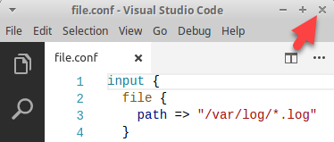
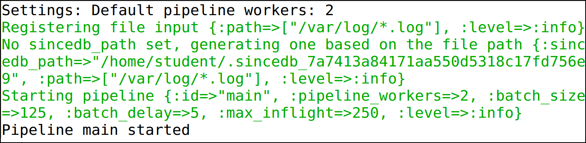
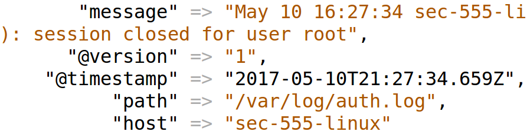
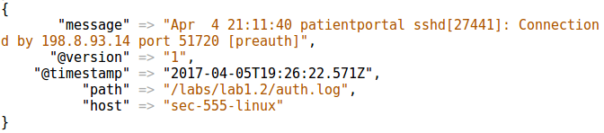
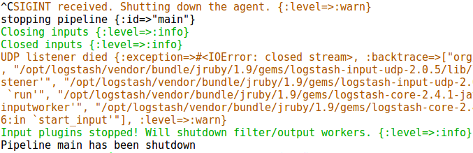
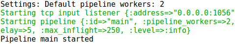

Lab 1.2 - Log Ingestion from Files and Network Connections
==========================================================

Objectives
==========

-   Perform manual ingestion of log data

-   Become familiar with multiple forms of log ingestion

-   Understand the difference between picking up logs from a file compared to network ports

-   Understand how to manually ingest files for incident response purposes

-   Become familiar with debugging or monitoring logs during ingestion

Exercise Preparation
====================

Log into the Sec-555 VM

-   Username: student

-   Password: sec555


Open a terminal by double-clicking on Terminal

Exercise: No hints
==================

1.  Read logs from **/var/log/** using the Logstash

2.  Send **/labs/lab1.2/auth.log** to Logstash over UDP port 1055

3.  Send **/labs/lab1.2/auth.log** to Logstash over TCP port 1056

4.  Send **/labs/lab1.2/auth.log** to Elasticsearch

5.  View the logs within Kibana

Exercise – Step-by-step instructions
====================================

1. Read logs from /var/log using Logstash
---------
First, create a Logstash configuration file using the Visual Studio Code Editor to read the logs in **/var/log/**

```bash
$ code /labs/lab1.2/student/file.conf
```

Next, enter the configuration needed to read **/var/log/** and output to the screen.

```javascript
input {
  file {
    path => "/var/log/*.log"
  }
}

output {
  stdout { codec => rubydebug }
}
```

Save the file by either using **CTRL + S** or clicking **File -&gt; Save**. Then **close** out of Visual Studio Code by clicking the **X** in the top right corner.




Next run Logstash and tell it to use the **file.conf** configuration file you just created.

```bash
$ /opt/logstash/bin/logstash -v -f /labs/lab1.2/student/file.conf
```

**Note**: The **-v** parameter stands for verbose output. It is helpful for troubleshooting or manual interaction of Logstash. The **-f** parameter tells Logstash which configuration file or file to load. In this example only **file.conf** is loaded. However, **-f** can also be used to load all configuration files in a folder.

If your configuration file is working you should see “**Pipeline main started**”.



Now open a **second terminal** by clicking on the terminal icon or double clicking on **Terminal** which is found on the desktop.


The **second terminal** is going to be used to generate some logs. In the **second terminal**, use the command **sudo su** to become the **root** user.

```bash
$ sudo su
```

When prompted for credentials enter **sec555** as the password.


After becoming the **root** user, type **exit** to change back to the **student** user. The **\#** sign represents that you are root and the **$** sign represents being a standard user.

```bash
exit
```

Back in the **first terminal** you should see logs like this:



This means that Logstash is properly monitoring **/var/log** for new logs. You can repeat the **sudo su** and **exit** commands to generate more logs. When you are done close out of the **second terminal**.

Back in the original terminal hit **CTRL + C** to stop Logstash.


2.  Now try configuring Logstash to listen on UDP port 1055
---------
First, create a new configuration file called **udp1055.conf**.

```bash
$ code /labs/lab1.2/student/udp1055.conf
```

Next, enter the configuration needed to listen on UDP port 1055 and output to the screen.

```javascript
input {
  udp {
    port => 1055
  }
}

output {
  stdout { codec => rubydebug }
}
```

Save the file by either using **CTRL + S** or clicking **File -&gt; Save**. Then **close** out of Visual Studio Code by clicking the **X** in the top right corner.

Next run Logstash and tell it to use the **udp1055.conf** configuration file you just created.

```bash
$ /opt/logstash/bin/logstash -v -f /labs/lab1.2/student/udp1055.conf
```

If your configuration file is working you should see “**Pipeline main started**”.


At this point Logstash is listening on UDP port 1055. Any data received over UDP port 1055 will be turned into a log. Normally, logs are sent over the network using either **Syslog** or a log agent such as NXLog. We will use **NXLog** for now.

Send logs to UDP port 1055 using **NXLog** as a log agent.

First, open a new terminal that will be used to simulate a log agent. To do this left click on the purple terminal icon at the top of the screen.


This terminal will be referred to as either the **Agent Terminal** or terminal with the purple background. The next steps are to be performed on the **Agent Terminal**. This is used to visually distinguish between Logstash, a log aggregator on the black terminal, and NXLog, a log agent on the purple terminal. Typically, NXLog would be ran on a remote machine.

Within the **Agent Terminal**, create a NXLog configuration file called **nxlog.conf**.

```bash
$ code /labs/lab1.2/student/nxlog.conf
```

Next, enter the configuration needed to listen on UDP port 1055 and output to the screen.

```bash
<Input in>
  Module        im_file
  File      	"/labs/lab1.2/auth.log"
  ReadFromLast  FALSE
  SavePos       FALSE
</Input>

<Output out>
  Module        om_udp
  Host      127.0.0.1
  Port      1055
</Output>
<Route 1>
  Path in => out
</Route>
```

Save the file by either using **CTRL + S** or clicking **File -&gt; Save**. Then **close** out of Visual Studio Code by clicking the **X** in the top right corner.

In the **Agent Terminal** run **nxlog-processor** and tell it to use the **nxlog.conf** configuration file you just created.

```bash
$ sudo /usr/bin/nxlog-processor -c /labs/lab1.2/student/nxlog.conf
```

When prompted for the student password enter **sec555**.

The **nxlog-processor** binary is used to process logs and then stop. It is used to manually invoke NXLog or for command line batch jobs. Normally the **/etc/nxlog/nxlog.conf** file would be edited and then the NXLog service would be restarted. The service would read the logs and then wait for additional changes.

Back on the **black terminal** you should have received logs sent from NXLog.



While still on the **black terminal** hit **CTRL + C** to stop Logstash.



3. Now try accepting logs over TCP instead of UDP
---------
Perform these steps on the **black terminal**. First, create a new configuration file called **tcp1056.conf**.

```bash
$ code /labs/lab1.2/student/tcp1056.conf
```

Next, enter the configuration needed to listen on TCP port 1056 and output to the screen.

```javascript
input {
  tcp {
    port => 1056
  }
}

output {
  stdout { codec => rubydebug }
}
```

Save the file by either using **CTRL + S** or clicking **File -&gt; Save**. Then **close** out of Visual Studio Code by clicking the **X** in the top right corner.

Run Logstash and tell it to use the **tcp1056.conf** configuration file you just created.

```bash
$ /opt/logstash/bin/logstash -v -f /labs/lab1.2/student/tcp1056.conf
```

If your configuration file is working you should see “**Pipeline main started**”.



At this point Logstash is listening on TCP port 1056. Any data received over TCP port 1056.

This time instead of using **NXLog** to send **auth.log** to Logstash use **netcat**. This tool is built into many Linux operating systems and can be used to listening on a port or sending content over the network. Switch to the **Agent Terminal** and run the below command.

```bash
$ nc 127.0.0.1 1056 < /labs/lab1.2/auth.log
```

This will grab the contents of **auth.log** and send them over TCP to port 1056. This would work whether it was done with NXLog, netcat, or even a scripting language like PowerShell or Python.

Back in the **black terminal** you should have received logs sent from netcat.


While still on the **black terminal** hit **CTRL + C** to stop Logstash.

4. Now instead of sending logs to the console send them to Elasticsearch.
---------
In the **black terminal** create a new configuration file called **es.conf**.

```bash
$ code /labs/lab1.2/student/es.conf
```

The file to look like this:

```javascript
input {
  tcp {
    port => 1056
  }
}

output {
  elasticsearch { 
    index => "lab1.2"
 }
}
```

Save the file by either using **CTRL + S** or clicking **File -&gt; Save**. Then **close** out of Visual Studio Code by clicking the **X** in the top right corner.

Run Logstash using the **es.conf** configuration file.

```bash
$ /opt/logstash/bin/logstash -v -f /labs/lab1.2/student/es.conf
```

Because output is sent to Elasticsearch no logs will be seen from the terminal.


Switch to the **Agent Terminal** and use **netcat** to send logs to Logstash using the command below.

```bash
$ nc 127.0.0.1 1056 < /labs/lab1.2/auth.log
```

You can tell when all logs have been sent as the command prompt will be presented again. You can now close out of the **Agent Terminal**. Switch to the **black terminal** hit **CTRL + C** to stop Logstash.

5. Now view the logs that were sent to Elasticsearch
---------
Open Firefox. The home page is set to **http://localhost:5601/app/kibana** which is Kibana’s default configuration.


To see the logs you just collected, click on **Settings** and then enter **lab1.2** as the **index name or pattern** and select **@timestamp** as the **Time-field name**. Then click on **Create**.


Now switch to your index by clicking on **Discover** and selecting the **lab1.2** index.


Set the time to the **Last 5 years** by clicking on the time field in the top right corner and selecting **Last 5 years**.


Minimize the time picker window by clicking on the up arrow.


You should now be able to view and search your logs in Kibana. You should have **3,250** logs.


Now feel free to browse around the Kibana interface and look at the logs ingested. Once complete you may close Firefox and all terminals.

**Note**: Logs may be in Kibana but they are not parsed. This makes it difficult to search for anything.

Bonus Challenge 1 – Accept logs on well-known ports
===================================================

By default, ports below 1024 are considered well-known ports. For a process to listen on one of these ports the account used to run the process usually requires administrative rights. However, some common log sources such as syslog use ports that are well known ports. Running Logstash as root will allow listening on well-known ports but introduces a major security risk.

Try to identify a way for Logstash to accept logs on port 555 without root privileges.

**Note:** The simplest way to do this is to redirect traffic to Logstash on a higher port such as with Iptables.

Bonus Challenge 2 – Identify which accounts were successfully brute forced
==========================================================================

Upon completing this lab, you should have 3,250 logs from **auth.log**. These logs represent a brute force attack against multiple users. Try finding which user(s) were or were not compromised from this attack.

**Note:** You will find that this is difficult to do as logs have been accepted but they have not been parsed.
