Lab 1.3 - Log Enrichment and Parsing
==========================================================

Objectives
==========

-   Build and apply log parsers

-   Identify and fix parsing issues

-   Apply log enrichment to make logs more meaningful

-   Understand the importance of field standardization

-   Perform basic log correlation

Exercise Preparation
====================

Log into the Sec-555 VM

-   Username: student

-   Password: sec555


Exercise: No hints
==================

1.  Read and parse the contents of **/labs/lab1.3/auth.log**. Initially parse out fields for **syslog\_timestamp**, **syslog\_hostname**, **syslog\_program**, **syslog\_pid**, and **syslog\_message** using **grok**. Send the logs into Elasticsearch

    **Note**: May be helpful to start with **/labs/lab1.2/files/4\_es.conf** or your previous log configuration file used in lab 1.2

2.  Search through logs and identify any logs that may not be parsing correctly

3.  Update your **grok** parser to account for logs missing the **syslog\_pid** field

4.  Further parse the **syslog\_message** field to extract the **user**, **source\_ip**, and **source\_port** of failed SSH logons. Also, add a **tag** of **logon\_failure** to these events

5.  Next, parse the same fields out of successful logons over SSH and add a **tag** of **logon\_success**

6.  Make sure logs are ingested with the proper **timestamp**

7.  Identify which accounts were successfully brute forced

8.  Add context by using **geoip** lookups against SSH login attempts

9.  Use **kv** to auto parse **ufw.log** and then try to identify if a port scan was done prior to the attack

10. Identify and fix field standardization issues. Correlate logs related to **120.146.158.242**

Exercise – Step-by-step instructions
====================================

1. Setup an initial parser for /labs/lab1.3/auth.log.
---------
The initial parser should use grok to carve out these fields: **syslog\_timestamp**, **syslog\_hostname**, **syslog\_program**, **syslog\_pid**, and **syslog\_message**. This file conforms to syslog format.

First, start by looking at the logs to come up with a game plan to parse the log.

```bash
$ tail -n1 /labs/lab1.3/auth.log
```

The entry in the file is this:

```bash
Apr  4 21:11:40 patientportal sshd[27441]: PAM 1 more authentication failure; logname= uid=0 euid=0 tty=ssh ruser= rhost=198.8.93.14  user=fraynor
```

The initial goal is to parse this type of log down into the below information.

**syslog\_timestamp** = Apr 4 21:11:40
**syslog\_hostname** = patientportal
**syslog\_program** = sshd
**syslog\_pid** = 27441
**syslog\_message** = PAM 1 more authentication failure; logname= uid=0 euid=0 tty=ssh ruser= rhost=198.8.93.14 user=fraynor

To do this start by copying over the configuration file from the previous lab.

```bash
$ cp /labs/lab1.2/files/4_es.conf /labs/lab1.3/student/grok.conf
```

The file is named **grok.conf** as we will be using **grok** to parse **auth.log**. Now modify **grok.conf**.**

```bash
$ code /labs/lab1.3/student/grok.conf
```

Update the configuration to set a **type** of **step1** and an index of **lab1.3**. Also, setup the initial **grok** parser given.

```javascript
input {
  tcp {
    port => 1056
    type => "step1"
  }
}

filter {
  grok {
    match => { "message" => "%{SYSLOGTIMESTAMP:syslog_timestamp} %{SYSLOGHOST:syslog_hostname} %{DATA:syslog_program}\[%{POSINT:syslog_pid:int}\]: %{GREEDYDATA:syslog_message}" }
  }
}

output {
  elasticsearch { 
    index => "lab1.3"
 }
}
```

Save the file and close the Visual Studio Code editor.

The **type** parameter is used to add an additional field to each log. Its value will always be **step1** as that is what is specified in the configuration file above. This is used to easily search for logs dealing with step1. Also, the **elasticsearch index** has been updated to reflect **lab1.3**. Outside of these changes a **filter** section has been added. This section is used to parse or modify/augment logs. In this example, **grok** is used to parse incoming logs from **auth.log**. Notice that **syslog\_pid** has **":int"** tacked on to the end. This tells Logstash to make **syslog\_pid** an integer field.

**Note**: Do not forget to add the **type** parameter and update the **elasticsearch index**! Your file should look exactly like above.

Now use Logstash to ingest the logs. Invoke Logstash with the **grok.conf** configuration file.

```bash
$ /opt/logstash/bin/logstash -v -f /labs/lab1.3/student/grok.conf
```

Open an **agent terminal** by clicking on the purple terminal icon in the top left of your screen.


In the agent terminal use netcat to send the contents of **auth.log** to Logstash.

```bash
$ nc 127.0.0.1 1056 < /labs/lab1.3/auth.log
```

2. Now use Kibana to look at the logs and find items logs that are not parsing correctly
---------
Minimize your Logstash terminal so it can parse and send logs to Elasticsearch and open **Firefox**.


Before viewing your logs, you will need to add the index to Kibana. To do this click on **Settings** and then add **lab1.3** as the Index. Do this by setting **Index name or pattern** to **lab1.3** and the **Time-field name** to **@timestamp**. Then click on **Create**.


Now switch to your index by clicking on **Discover** and selecting the **lab1.3** index.


Set the time to the **Last 24 hours** by clicking on the time field in the top right corner and selecting **Last 24 hours**.


You should now be able to see the contents of **auth.log**. However, this time you should have the five additional fields created by **grok**. You can now search contents of these fields. For example, type **syslog\_program:sshd** and then click on the search button.

```bash
syslog_program:sshd
```

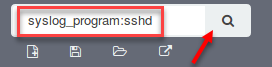

This will return any logs in **auth.log** that are related to sshd. You should show **3,239** hits. Looking at the first log shows everything parsed out nicely. **Click** the **down arrow** on the first log to view all fields.

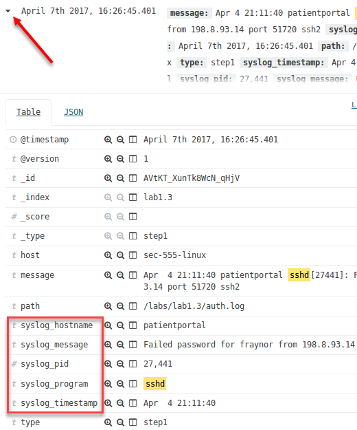

**Note**: The **\#** next to **syslog\_pid**. This means it is a number field. The **t** on the other fields represents a string. The clock symbol represents a date.
Now try looking for any logs not pertaining to sshd. This can be done using **-syslog\_program.sshd** and clicking on search.

```bash
-syslog_program:sshd
```

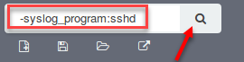

The dash **(-)** in front of **syslog\_program** converts it to a search for anything **NOT** sshd. This search should show **12** hits. Expand the log that states “session closed for user lchancello”. This should be one of the first five logs.

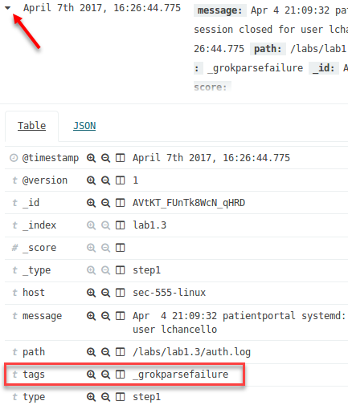

Notice the syslog fields are missing. Also, there is a **tag** of **\_grokparsefailure**. This **tag** means that the grok parser failed to parse a given log. In this case, it happened because these logs do not have **syslog\_pid** specified. Here is a breakdown using this log:

```bash
Apr 4 21:09:32 patientportal systemd: pam_unix(systemd-user:session): session closed for user lchancello
```

The initial goal is to parse this type of log down into the below information.

**syslog\_timestamp** = Apr 4 21:09:32 (Your timestamp will be different)
**syslog\_hostname** = patientportal
**syslog\_program** = systemd
**syslog\_pid** = X (Does not exist. This is what is causing **grok** to fail)
**syslog\_message** = pam\_unix(systemd-user:session): session closed for user lchancello

Go back to your Logstash terminal and stop it with **CTRL + C**. You should see **Pipeline main has been shutdown**.

3. Fix the grok parse failures by making syslog\_pid an optional field.
---------
First edit **grok.conf**

```bash
$ code /labs/lab1.3/student/grok.conf
```

Update it to look like this:

```javascript
input {
  tcp {
    port => 1056
    type => "step3"
  }
}


filter {
  grok {
    match => { "message" => "%{SYSLOGTIMESTAMP:syslog_timestamp} %{SYSLOGHOST:syslog_hostname} %{DATA:syslog_program}(?:\[%{POSINT:syslog_pid}\])?: %{GREEDYDATA:syslog_message}" }
  }
}

output {
  elasticsearch { index => "lab1.3" }
}
```

Save the file and close the Visual Studio Code editor. Now have Logstash use the updated **grok.conf**.

```bash
$ /opt/logstash/bin/logstash -v -f /labs/lab1.3/student/grok.conf
```

In the **agent terminal** use netcat to send the contents of **auth.log** to Logstash.

```bash
$ nc 127.0.0.1 1056 < /labs/lab1.3/auth.log
```

Switch back to Firefox and in Kibana search for **-syslog\_program:sshd AND type:step3**

**Note**: The **AND** must be in all caps. This is required when using **OR** and **AND** statements.

```bash
-syslog_program:sshd AND type:step3
```


Again, find the log that states “session closed for user lchancello” and expand it. Because **syslog\_pid** does not exist the field is not created but the other syslog fields are created. You can compare these logs vs previous entries by switching **type** from **step3** to **step1**.


Go back to your Logstash terminal and stop it with **CTRL + C**. You should see **Pipeline main has been shutdown**.

4. Now parse out the syslog facility and severity. Also, parse SSH logon failures.
---------
Now most of the syslog fields are extracted. However, the **severity** and **facility** are still missing. Also, the logs still lack functionality. This **auth.log** represents a brute force attack yet no fields exist to represent the end user. Back in Kibana, search for **type:step3**.

```bash
type:step3
```


Find the log that has the message containing "Failed password for fraynor". It should be within the first couple logs.


The **syslog\_message** reads “Failed password for fraynor from 198.8.93.14 port 51720 ssh”. This contains some useful fields such as **user**, **source\_port,** and **source\_ip**. It also identifies a failed logon.

Knowing this, modify **grok.conf** to add some additional parsing.

```bash
$ code /labs/lab1.3/student/grok.conf
```

In the **black terminal** modify the input to have a **type** of **step4** and also update the **filter** section to look like below.

```javascript
input {
  tcp {
    port => 1056
    type => "step4"
  }
}

filter {
  grok {
    match => { "message" => "%{SYSLOGTIMESTAMP:syslog_timestamp} %{SYSLOGHOST:syslog_hostname} %{DATA:syslog_program}(?:\[%{POSINT:syslog_pid}\])?: %{GREEDYDATA:syslog_message}" }
  }
  syslog_pri { }
  if [syslog_message] =~ "Failed password for" {
    grok {
      match => {
        "syslog_message" => "Failed password for %{USER:user} from %{IPV4:source_ip} port %{INT:source_port:int} %{WORD:auth_program}"
      }
    }
    mutate {
      add_tag => [ "logon_failure" ]
    }
  }
}

output {
  elasticsearch { 
    index => "lab1.3"
 }
}
```

The **syslog\_pri { }** function will automatically extract and parse the syslog **severity** and **facility** fields. The second **grok** statement will parse out additional fields specific to failed logons. The **mutate** function is used to arbitrarily modify logs. In this case, it is used to add a simple **tag** of **logon\_failure**.

Also, notice that parsing failed passwords is wrapped in an **if** statement. This is done so that the **grok** statement only applies if the **syslog\_message** contains “Failed password for”. It also is to make sure the **tag** only gets added for failed logon events.

Save the file and close the Visual Studio Code editor. Now have Logstash use the updated **grok.conf**.

```bash
$ /opt/logstash/bin/logstash -v -f /labs/lab1.3/student/grok.conf
```

In the **agent terminal** use netcat to send the contents of **auth.log** to Logstash.

```bash
$ nc 127.0.0.1 1056 < /labs/lab1.3/auth.log
```

Switch back to Kibana and search for **type:step4 AND tags:logon\_failure.**

```bash
type:step4 AND tags:logon_failure
```

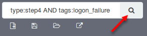

Expand the first log and viola, more fields. Also, there is a **tag** marking the log with **logon\_failure**. But there is one problem, they have a weird orange exclamation mark next to them.


Notice each of these new fields has a **?** in front of the field name. This means that Kibana does not acknowledge the field type (integer, string, etc.). Therefore, the orange exclamation mark is appearing.

To fix this click on **Settings** -&gt; **lab 1.3** and then click on the orange refresh button.


This step needs to be done anytime new fields or field types are setup. After doing this go back to **Discover** and look at the first log again.

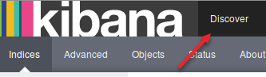

Now all the orange exclamation marks are gone and the fields are properly identified as either strings or integers.

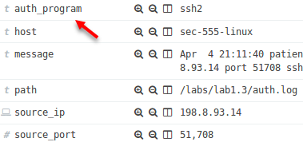

Go back to your Logstash terminal and stop it with **CTRL + C**. You should see **Pipeline main has been shutdown**.

5. Now find and parse out successful SSH logon events.
---------
In Kibana, search for **type:step4 AND** "**Accepted**".

```bash
type:step4 AND "Accepted"
```

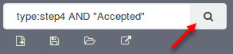

Look at the **syslog\_message** of the first log. This is what needs parsed for SSH logons.

```bash
Accepted password for lchancello from 198.8.93.14 port 51460 ssh2
```

Update **grok.conf** to parse this message. Run the following command from the **black terminal**.

```bash
$ code /labs/lab1.3/student/grok.conf
```

Modify the filter section to include an additional **grok** statement. Also, change the **type** to **step5**.

```javascript
input {
  tcp {
    port => 1056
    type => "step5"
  }
}

filter {
  grok {
    match => { "message" => "%{SYSLOGTIMESTAMP:syslog_timestamp} %{SYSLOGHOST:syslog_hostname} %{DATA:syslog_program}(?:\[%{POSINT:syslog_pid}\])?: %{GREEDYDATA:syslog_message}" }
  }
  syslog_pri { }
  if [syslog_message] =~ "Failed password for" {
    grok {
      match => {
        "syslog_message" => "Failed password for %{USER:user} from %{IPV4:source_ip} port %{INT:source_port:int} %{WORD:auth_program}"
      }
    }
    mutate {
      add_tag => [ "logon_failure" ]
    }
  }
  grok {
    match => {
      "syslog_message" => "Accepted password for %{USER:user} from %{IPV4:source_ip} port %{INT:source_port:int} %{WORD:auth_program}"
    }
    add_tag => [ "logon_success" ]
    tag_on_failure => []
  }
}
```

Notice in this instance a **grok** statement is used without being wrapped in an **if** statement. In Logstash there is usually more than one way to get the job done. In this case, **grok** looks for a log to match against the **match** statement. If there is a match the **logon\_success** **tag** is added. If there is not a match, no **tag** is added and the default **\_grokparsefailure** error is suppressed by **tag\_on\_failure** being set to an empty array of **\[\]**. This would be the same behavior as copying the previous if statement section and changing the word Failed to Accepted.

Save the file and close the Visual Studio Code editor. Now run Logstash in the **black terminal**.

```bash
$ /opt/logstash/bin/logstash -v -f /labs/lab1.3/student/grok.conf
```

In the **agent terminal** use netcat to send the contents of **auth.log** to Logstash.

```bash
$ nc 127.0.0.1 1056 < /labs/lab1.3/auth.log
```

Switch back to Kibana and search for **type:step5 AND tags:logon\_success**

```bash
type:step5 AND tags:logon_success
```


You should have **4 hits**. Looking at the first log shows that SSH logons are properly being parsed. One problem remains. The **syslog\_timestamp** is when the event occurred and the **@timestamp** defaults to when Logstash received the log. While this discrepancy is not likely to be large in a production environment it is off quite a bit compared to **auth.log** on disk. Plus, you always want to keep the time as accurate as possible.


This image shows the time difference of the logs.

**Note**: The **@timestamp** on your system will **NOT** match this image. Instead it will be whatever time you ingested logs through Logstash.

Go back to your Logstash terminal and stop it with **CTRL + C**. You should see **Pipeline main has been shutdown**.

6. Modify grok.conf to change the log time to match what is in auth.log.
---------
Update **grok.conf** to modify **@timestamp** to be the correct date and time.

```bash
$ code /labs/lab1.3/student/grok.conf
```

Set the **type** to **step6** and update the **filter** section to match this:

```javascript
input {
  tcp {
    port => 1056
    type => "step6"
  }
}

filter {
  grok {
    match => { "message" => "%{SYSLOGTIMESTAMP:syslog_timestamp} %{SYSLOGHOST:syslog_hostname} %{DATA:syslog_program}(?:\[%{POSINT:syslog_pid}\])?: %{GREEDYDATA:syslog_message}" }
  }
  date {
    match => [ "syslog_timestamp", "MMM dd yyyy HH:mm:ss", "MMM  d yyyy HH:mm:ss", "MMM  d HH:mm:ss" ]
    remove_field => [ "syslog_timestamp" ]
  }
  syslog_pri { }
}
```

Note: **remove\_field** is invoked because **syslog\_timestamp** is no longer needed once parsed and used to replace **@timestamp**. If you wanted to keep this field for some reason, simply omit **remove\_field**. The **date** function must be underneath the first **grok** statement as **syslog\_timestamp** does not exist until it is parsed.

Save the file and close the Visual Studio Code editor. Now run Logstash in the **black terminal**.

```bash
$ /opt/logstash/bin/logstash -v -f /labs/lab1.3/student/grok.conf
```

In the **agent terminal** use netcat to send the contents of **auth.log** to Logstash.

```bash
$ nc 127.0.0.1 1056 < /labs/lab1.3/auth.log
```

At this point you should have parsed SSH logon events with the correct **@timestamp**. Switch to Kibana and search for **type:step6**.

```bash
type:step6
```


You are greeted with "**No results found"**. What is going on?


What is happening is that since the **@timestamp** field is now correct the search time frame you have specified in the top right corner does not include logs from back in April. To do this change the time to **Absolute** and set **From** to **2017-04-04 00:00:00.000** and set **To** to **2017-04-04 23:59:59.999**.


Minimize the time selection by either clicking the up arrow at the bottom or clicking on the time field in the top right again.

You now have properly set time on logs.

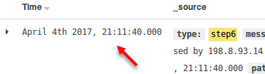

Go back to your Logstash terminal and stop it with **CTRL + C**. You should see **Pipeline main has been shutdown**.

7. Now find out which accounts were successfully brute forced.
---------
Now that data is ingested and properly parsed it is time to track down the brute force events. First, search for **type:step6 AND tags:logon\_failure**.

```bash
type:step6 AND tags:logon_failure
```

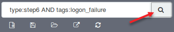

There are **1,690** hits. This is too many to manually analyze. What we are interested in is which IP address is performing the brute force attacks and which accounts are being targeted. To find out which IP address is performing the attacks find the **source\_ip** field on the left of the screen and click on **Visualize**.

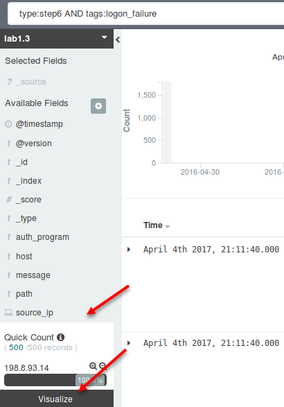

**Note**: The **Quick Count** breakdown is only composed of the first 500 records returned from your search. While it shows 100% of the failed logons came from **198.8.93.14** it does not guarantee the other 1,190 records are also from **198.8.93.14**. Therefore, you need to have Kibana chart out all counts using **Visualize**.


The chart generated by Kibana verifies that all 1,690 logon failures are coming from **198.8.93.14**. Therefore, this is the system performing the attack.

Next, we want to find out which accounts were used. To do this go back to the **Discover** tab and click on **Visualize** next for the **user** field.


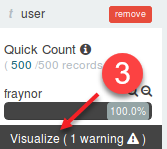

The resulting graph shows four accounts had attempted logins. These are **ploar**, **fraynor**, **lchancello**, and **wperry**.


Now we need to find out if the attack was successful. Go back to the **Discover** tab and search for **type:step6 AND tags:logon\_success**.


There are only **4 hits** this time. To view them you can either expand each log or an easier way is to add the **user** field as a column. To do this hover over the **user** field in the left column and then click on **add**.

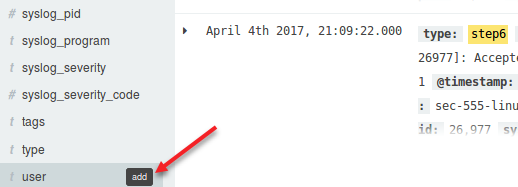

You can now see that there were four successful logins against three user accounts.

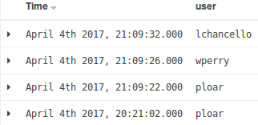

To see if these are from **198.8.93.14** hover over the **source\_ip** field and add it as a column as well.


The resulting view shows that **198.8.93.14** is who logged into these accounts. This means the brute force attack was successful but only against 3 out of 4 accounts. The **user** fraynor was not successfully brute forced.


You can remove or rearrange these columns by hovering over them and either clicking on the X to remove the column or arrow signs to move the column over.

Hover over **user** and click the **X** to remove the field. Do the same for **source\_ip**.


8. Now add a little bit of context by adding geoip lookups of the source\_ip field
---------
Switch back to the **black terminal** and edit **grok.conf**.

```bash
$ code /labs/lab1.3/student/grok.conf
```

Change **type** to **step8** and edit the **filter** section and add the **geoip** function before the closing bracket of the **filter** section.

```javascript
input {
  tcp {
    port => 1056
    type => "step8"
  }
}

filter {
  grok { … }
  date { … }
  syslog_pri { }
  if [syslog_message] =~ "Failed password for" { … }
  grok { … }
  geoip {
    source => "source_ip"
  }
  geoip {
    database => "/usr/local/share/GeoIP/GeoIPASNum.dat"
    source => "source_ip"
  }
}
```

The first **geoip** statement tells Logstash to use its built-in geo database against the **source\_ip** field. If you purchase a geoip database such as through MaxMind you will want to add the **database** parameter. This first call pulls back things like **city**, **state**, **country**, **latitutde**, and **longitude**. The second **geoip** statement is an example of using a specific geoip database. In this case, it is the free MaxMind ASN database. This pulls back **ASN names** and **numbers**.

Save the file and close the Visual Studio Code editor. In the black terminal run Logstash using the updated **grok.conf**.

```bash
$ /opt/logstash/bin/logstash -v -f /labs/lab1.3/student/grok.conf
```

In the **agent terminal** use netcat to send the contents of **auth.log** to Logstash.

```bash
$ nc 127.0.0.1 1056 < /labs/lab1.3/auth.log
```

Switch back to Kibana. Because this introduces new fields update your index by going to **Settings** and clicking on refresh for **lab1.3**.


Switch back to the **Discover** tab and search for **type:step8 AND \_exists\_:source\_ip**.

```bash
type:step8 AND _exists_:source_ip
```


**Note**: In this case **\_exists\_** is used to find all logs that have a **source\_ip** field. Similarly, you can use **\_missing\_** to look for logs that do not have a specific field.

Now expand the first log and you should see a wealth of geo information.

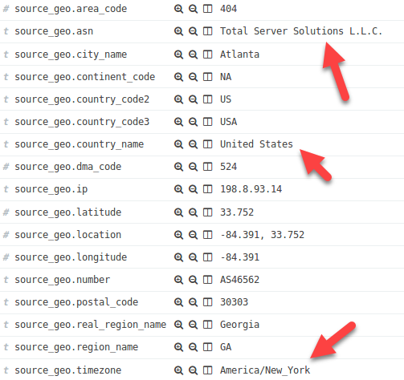

This simple enrichment technique is extremely powerful. Specifically, the **ASN**, **country** information, and **timezone** can be helpful. The **ASN** can help uncover what company an IP address came from such as Microsoft. This can be used to filter out expected "good" sources. It also can be used to identify things such as hosted systems. In this case **198.8.93.14** is hosted by **Total Server Solutions LLC**. The **timezone** can be helpful to correlate an attacks time with the possible **timezone** of the attacker.

Go back to your Logstash terminal and stop it with **CTRL + C**. You should see **Pipeline main has been shutdown**.

9. Now bring in firewall logs and use the kv plugin to auto parse it
---------
The host-based Linux firewall logs related to the compromised system has been captured from this system and exist in **/labs/lab1.3/ufw.log**. To parse these, slight modifications need to be made to **grok.conf**. Modify this file.


Switch back to your terminal and edit **grok.conf**.

```bash
$ code /labs/lab1.3/student/grok.conf
```

Edit the **input** and **filter** sections to look like the section below. This time a section is added to accept UFW firewall logs over TCP port **1057**. A section to parse these has also been added.

```javascript
input {
  tcp {
    port => 1056
    type => "step8"
  }
  tcp {
    port => 1057
    type => "step9"
  }
}

filter {
  grok {
    match => { "message" => "%{SYSLOGTIMESTAMP:syslog_timestamp} %{SYSLOGHOST:syslog_hostname} %{DATA:syslog_program}(?:\[%{POSINT:syslog_pid}\])?: %{GREEDYDATA:syslog_message}" }
  }
  if [type] == "step9" {
    grok {
      match => {
        "syslog_message" => "\[(\s+)?(?<uptime>[0-9]+\.[0-9]+)\]\s\[UFW BLOCK\]\s%{GREEDYDATA:ufw_message}"
      }
      remove_field => [ "syslog_message" ]
    }
    kv {
      source => "ufw_message"
      remove_field => [ "ufw_message" ]
    }
  }
  date {
```

This time an **if** statement is used to customize logs specific to ufw. The **syslog\_message** is first broken down into two fields: **uptime** and **ufw\_message**. This is based on a ufw log looking like this:

```bash
[3645354.099269] [UFW BLOCK] IN=eth0 OUT= MAC=00:16:3e:cf:44:70:00:11:92:b2:fa:5e:08:00 SRC=95.154.84.197 DST=5.5.5.5 LEN=40 TOS=0x00 PREC=0x00 TTL=246 ID=11156 PROTO=TCP SPT=19816 DPT=7547 WINDOW=14600 RES=0x00 SYN URGP=0
```

**Note**: The **uptime** field is stored within the first brackets (example: \[**3645354.099269**\]). The rest of the ufw message starts at **IN=eth0**. Notice in the grok statement **(\\s+)?** is added before the **uptime** field. This looks for optional spaces (**\\s**) at the beginning of the **uptime** field. This is because a system that restarts will have a low **uptime** and spaces are used to pad the field.

In the configuration, **grok** is used to parse **syslog\_message** into **uptime** and **ufw\_message**. Then, rather than parsing each field individually, **kv** is used to automatically parse **ufw\_message**. Using the log above, kv would parse out the following fields:

```bash
IN = eth0
MAC = 00:16:3e:cf:44:70:00:11:92:b2:fa:5e:08:00
SRC = 95.154.84.197
DST = 5.5.5.5
LEN = 40
TOS = 0x00
PREC = 0x00
TTL = 246
ID = 11156
PROTO = TCP
SPT = 19816
DPT = 7547
WINDOW = 14600
RES = 0x00
URGP = 0 (Notice this will parse as URGP and not SYN URGP. This is due to the space)
```

The default behavior of **kv** is to parse anything that is **field=value**. This means if a string is immediately followed by an equal sign and then that is followed by another string it will automatically parse out fields and values. 

**Note**: All fields parsed by **kv** will default to strings. This can be changed by using **mutate**.

Save the file and close the Visual Studio Code editor. In the **black terminal** run Logstash.

```bash
$ /opt/logstash/bin/logstash -v -f /labs/lab1.3/student/grok.conf
```

In the **agent terminal** use netcat to send the contents of **ufw.log** to Logstash.

```bash
$ nc 127.0.0.1 1057 < /labs/lab1.3/ufw.log
```

Because this introduces new fields update your index by going to **Settings** and clicking on refresh for **lab1.3**.


Switch back to the **Discover** tab and search for **type:step9**.

```bash
type:step9
```


Expand and look at the first log. Notice it is an ufw log and the fields are parsed.


Now, you have ufw logs and authentication logs. This is perfect. Now you can correlate between them. However, the field names are not consistent. This makes correlation difficult. The **kv** plugin parses fields as is. Therefore, the source IP address from **ufw.log** is called **SRC** while in **auth.log** it was parsed out to **source\_ip**.

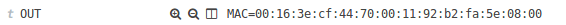


Also, notice the **OUT** field is set to **MAC=00:16:3e:cf:44:70:00:11:92:b2:fa:5e:08:00**. Does this mean **kv** is broken? No. It means that the log has empty values and **kv** is intended to auto parse field=value. This can be fixed in one of two ways: fall back to grok parsing or replace empty fields with a default value.

```javascript
mutate {
  gsub => [ "ufw_message", "= ", "=NA " ]
}
```

**Note**: Adding this code *before* **kv** would fix this by changing empty fields so they have a value of NA. You will add this code during the last step of this lab. Now on to basic correlation.

With field standardization you could simply search for **source\_ip:198.8.93.14** and you would see all logs related to this IP address. However, in the current state you would have to search for **source\_ip:198.8.93.14 OR SRC:198.8.93.14**.

Do this by searching for **(type:step8 AND source\_ip:198.8.93.14) OR (type:step9 AND SRC:198.8.93.14)**.

```bash
(type:step8 AND source_ip:198.8.93.14) OR (type:step9 AND SRC:198.8.93.14)
```


**Note**: In this case the parenthesis **()** is used to control how the search is processed. This search is the equivalent of stating find any logs that are from **step8** and have a **source\_ip** of **198.8.93.14** or are from **step9** and have a **SRC** of **198.8.93.14**. This works but it is ugly. Should analysts have to remember every field name? What about geoip? Currently it is only set to run against **source\_ip**. The point is that this is a bad position to be in. Standardize your fields and plan this out.

**Question**: If you look at the results you will not find any ufw logs related to **198.8.93.14**. This is because ufw defaults to only logging blocked connections. In this case, **198.8.93.14** did not perform a port scan prior to attack. Stop and think about this for a second. What does that mean?

**Answer**: Possibly the attacker performed recon at a much earlier date or the attacker already knew the asset was there (insider maybe?). Also, port 22 was specifically targeted for brute force attacks.

Go back to your Logstash terminal and stop it with **CTRL + C**. You should see **Pipeline main has been shutdown**.

10. Cleanup grok.conf to standardize field names and then correlate the logs again.
---------
Switch back to your terminal and edit **grok.conf**.

```bash
$ code /labs/lab1.3/student/grok.conf
```

Edit the type to **step10** so that both inputs are set to **step10**. Also, update the **if** statement specific to ufw logs to reference **step10**.

```javascript
input {
  tcp {
    port => 1056
    type => "step10"
  }
  tcp {
    port => 1057
    type => "step10"
  }
}

filter {
  grok {
    match => { "message" => "%{SYSLOGTIMESTAMP:syslog_timestamp} %{SYSLOGHOST:syslog_hostname} %{DATA:syslog_program}(?:\[%{POSINT:syslog_pid}\])?: %{GREEDYDATA:syslog_message}" }
  }
  if [type] == "step10" {
```

Modify the code directly underneath the ufw **grok** statement so the **kv** parses properly and **mutate** is called to standardize fields.

```javascript
mutate {
  gsub => [ "ufw_message", "= ", "=NA ",
            "ufw_message", "SYN URGP", "URGP" ]
}
kv {
  source => "ufw_message"
  remove_field => [ "ufw_message" ]
  
}
mutate {
  rename => [ "DPT", "destination_port" ]
  rename => [ "DST", "destination_ip" ]
  rename => [ "ID", "id" ]
  rename => [ "IN", "inbound_interface" ]
  rename => [ "LEN", "packet_length" ]
  rename => [ "MAC", "mac_address" ]
  rename => [ "OUT", "outbound_interface" ]
  rename => [ "PREC", "precedence" ]
  rename => [ "PROTO", "protocol" ]
  rename => [ "RES", "reserved" ]
  rename => [ "SPT", "source_port" ]
  rename => [ "SRC", "source_ip" ]
  rename => [ "TOS", "type_of_service" ]
  rename => [ "TTL", "time_to_live" ]
  rename => [ "URGP", "syn_urgent_flag" ]
  rename => [ "WINDOW", "windows_size" ]
  convert => [ "destination_port", "integer" ] 
  convert => [ "packet_length", "integer" ] 
  convert => [ "source_port", "integer" ] 
  convert => [ "time_to_live", "integer" ] 
  convert => [ "uptime", "float" ] 
  convert => [ "windows_size", "integer" ] 
}
```

**Note**: The code above uses **gsub** to replace empty field values with **NA** as well as to rename **SYN URGP** to **URGP**. The latter is done as an example of cleaning up a field with string replacements. It is not actually necessary as **kv** would ignore **SYN** since it does not follow with the **=** character.

Then **mutate** is then used to rename fields and change certain fields from strings to another data type such as integer or float. By default, **kv** parsing everything to a string value.

Save the file and close the Visual Studio Code editor. In the black terminal run Logstash against **grok.conf**.**

```bash
$ /opt/logstash/bin/logstash -v -f /labs/lab1.3/student/grok.conf
```

In the **agent terminal** use netcat to send the contents of **ufw.log** to Logstash.

```bash
$ nc 127.0.0.1 1057 < /labs/lab1.3/ufw.log
```

While still in the **agent terminal** use netcat to send the contents of **auth.log** to Logstash.

```bash
$ nc 127.0.0.1 1056 < /labs/lab1.3/auth.log
```

Because the fields are renamed they are considered new fields so update your index by going to **Settings** and clicking on refresh for **lab1.3**.


Now you have properly parsed and standardized logs for **auth.log** and **ufw.log**. Go back to the **Discover** tab and search for **type:step10**.

```bash
type:step10
```

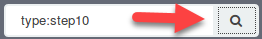

Because the logs use standardized field name you can now correlate by clicking the plus sign (**+**) next to a field. This will automatically add that field and value to the search and drill down. Expand the first log and see if there are any associated SSH logon events with **120.146.158.242**. Do this by clicking on the plus sign for **source\_ip**.

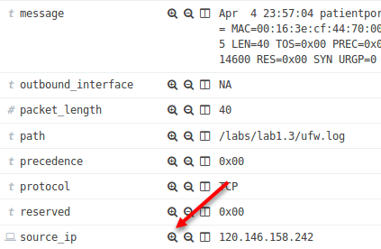

This works by adding a search for **source\_ip:120.146.158.242** to the search bar.


The results are two logs. The first is an **ufw** log showing a failed connection to port **23**, which is telnet. The second log is an **auth** log showing a successful SSH login from **ploar**.

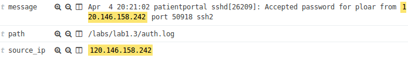

The logs are probably from a legitimate end user. The first connection on **April 4<sup>th</sup> at 8:21:02 PM** used SSH. Later, at **11:57:04 PM** telnet is used. Because of the order of operations and the fact that there was only one successful SSH attempt and one failed telnet connection, the user **ploar** most likely meant to telnet to a difference device.

Go back to your Logstash terminal and stop it with **CTRL + C**. You should see **Pipeline main has been shutdown**. Also, remove the **source\_ip** search from the search bar by hovering over it and click on the **garbage** can icon.


Note: Below is an explanation on the other icons. They are described from left to right.

**Checkbox** – This can be used to toggle the search on or off without removing it.
**Pin** – This icon can be used make the search stay even when switching across indexes, visualizations, or dashboards.
**Magnifying glass** – This icon switches between a minus sign (**-**) or plus sign (**+**). If it is a minus like in this picture and you click on it the search will be turned into a **NOT** statement. The background will also turn red to visually display this. If you click on it when it has a plus sign it will turn the background green and make the search turn into a standard search statement.
**Garbage can** – This removes the search from the search bar
**Edit** – This allows you to manually change out the search but is in JSON format

Bonus Challenge 1 – Identify if logon lockout settings are enforced
===================================================================

Use the logs from **auth.log** to identify if the system being attacked is enforcing an account lockout setting.

Bonus Challenge 2 – Identify if attacker has utilized any of the compromised credentials
========================================================================================

During this attack, multiple accounts were compromised. Find out if any of these credentials were used after being compromised.
