Lab 2.1 - Catching the Adversary with DNS
==========================================================

Objectives
==========

-   Use DNS for blacklist detection

-   Find malware by applying frequency analysis to DNS records

-   Apply methods to identify likely phishing domains

-   Identify anomalous DNS use

-   Learn to build and use visualizations and dashboards

Exercise Preparation
====================

Log into the Sec-555 VM

-   Username: student

-   Password: sec555


Exercise: No hints
==================

Logs for this lab have already been ingested and are stored in index **lab2.1-complete**. To answer the questions below use Kibana. All events for this lab occurred during **April 11, 2017**.

1.  An end user browsed to a malicious site. Fortunately, the domain for this site was in a DNS sinkhole pointing to **0.0.0.0**.

    1.  Which system attempted to access this site?

    2.  What was the domain for the site?

2.  Charting out the \# of DNS request types can be used to find anomalous DNS use.

    1.  Which domain had the highest number of **NX** records?

    2.  Which domain had the highest number of **A** records?

3.  Frequency analysis is extremely useful for finding adversaries trying to evade detection.

    1.  Find the primary domain with the lowest frequency score.

    2.  Find the subdomain with the lowest frequency score.

4.  Lab Me Inc. received a phishing email. The end user clicked the link because it **looked like it came from labmeinc.com**.

    1.  What is the phishing domain?

    2.  What system requested this domain?

5.  Build a dashboard that contains any visualizations built to answers steps 1 through 4.

Exercise – Step-by-step instructions
====================================

**Setting up the Stage**
Logs for this lab have already been ingested and are stored in index **lab2.1-complete**. To answer the questions below use Kibana.

To access this first open Kibana and change the index to **lab2.1-complete**.


All events for this lab occurred during **April 11, 2017**. To view the logs, click on the time picker in the top right. Then click on **Absolute** and enter in **2017-04-11 00:00:00.000** for the **From:** field and **2017-04-11 23:00:00:00.000** for the **To:** field. Then click on **Go**.

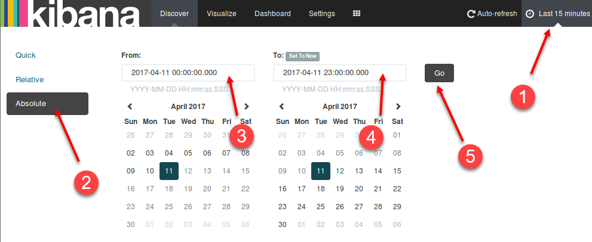

After clicking **Go** the time picker should reflect **April 11<sup>th</sup> 2017, 00:00:00.000 to April 11<sup>th</sup> 2017, 23:00:00.000**.


Minimize the time picker by clicking the arrow pointing up at the bottom.


1. Setup a visualization to view systems requesting DNS sinkholes
---------
**Note:** A DNS sinkhole is used to take known bad domain requests and point them to a different IP address. For instance, if evil.com is a malicious domain an internal DNS can be set to be authoritative for the domain and to always replay to requests with **0.0.0.0** or a specific IP address. Lab Me Inc. has decided to use a DNS sinkhole of **0.0.0.0**. This is a preventative technique. However, looking for the sinkhole IP makes it also a detective technology.

Click on **Visualize** to create a new Visualization.


You should see this screen:

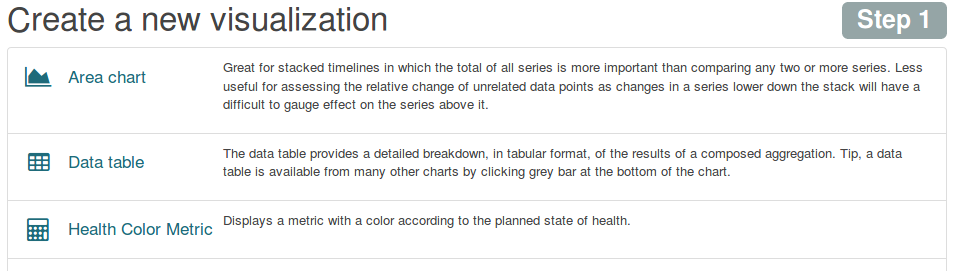

If you do not see the image above on your screen you need to click on the **New Visualization** button.


Click on **Vertical bar chart**.

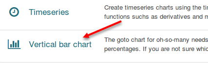

Then click on **From a new search**.

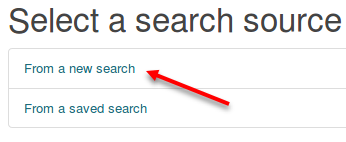

Select **lab2.1-complete** for the index.


For this visualization to work properly it needs to only represent DNS sinkhole requests. To do this set the search filter to **tags:dns\_sinkhole** and click on the search icon.

```bash
tags:dns_sinkhole
```


**Note**: This tag was created using the Logstash code below.

```javascript
if [answers] == "0.0.0.0" {
  mutate { 
    add_tag => [ "dns_sinkhole" ] 
  }
}
```

Next click on **X-Axis**.


Then select **Terms** for **Aggregation** and **highest\_registered\_domain** for the **Field**. Then set the **CustomLabel** to **Domain**. Then, click on **Add sub-buckets**.

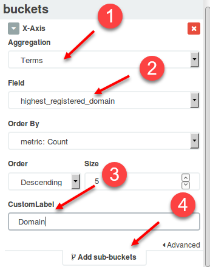

Select **Split Bars** for bucket type.


Set **Sub Aggregation** to **Terms**, **Field** to **source\_ip**, and **CustomLabel** to **Source IP**. Then click on the Green play button.


You should be rewarded with this screen:

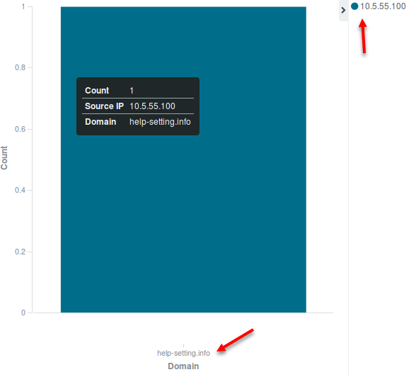

**Answer** - This shows **10.5.55.100** had a DNS request to a blacklisted domain called **help-setting.info**.

**Note**: It should not be normal for internal systems to be requesting blacklisted domains. If this happens you should investigate the system to find out why it requested the domain. This also means that deploying this technique in production ideally will display an empty graph or table.

Save the visualization by clicking on the save icon. Set the **Title** to **DNS Sinkhole Requests** and click **Save**.


2. Find anomalous DNS use by charting out the \# of DNS request types
---------
Start by clicking on the **new visualization icon**.


Click on **Vertical bar chart**.


Then click on **From a new search**.


Select **lab2.1-complete** for the index.


Since this visualization uses all DNS logs no search filter needs applied. Next click on **X-Axis**.


Then select **Terms** for **Aggregation** and **query\_type\_name.raw** for the **Field**. Then set the **CustomLabel** to **Query Type**. Then, click on **Add sub-buckets**.

**Note**: The reason for using **query\_type\_name.raw** instead of **query\_type\_name** is that **.raw** represents an unindexed value. This means it will use the exact field values which is what you want.

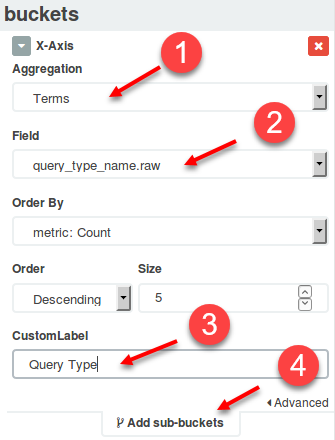

Select **Split Bars** for bucket type.


Then select **Terms** for **Sub** **Aggregation** and **highest\_registered\_domain** for the **Field**. Then set the **CustomLabel** to **Domain**. Then, click on the green play button.

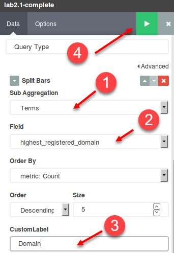

You should now see the completed chart.

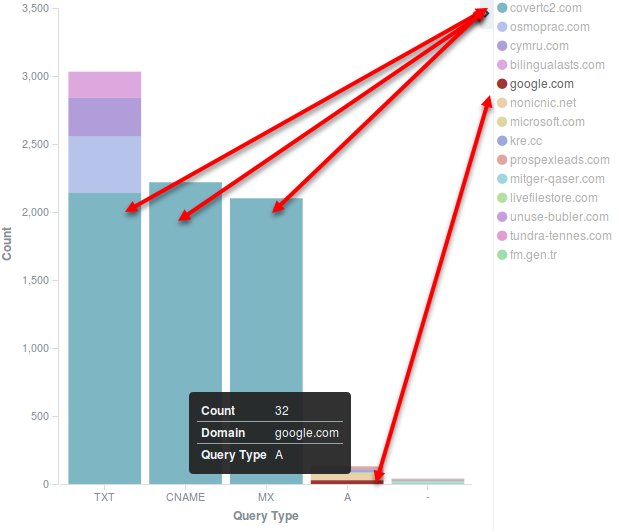

**Answer** - In this case **covertc2.com** has an enormous amount of **TXT**, **CNAME**, and **MX** records compared to other domains. The domain **google.com** has the highest amount of **A** records.

**Note**: In this case **covertc2.com** was being used as a DNS tunnel. It was performed using **dnscat2** which uses IPsec to send encrypted data over DNS **TXT**, **CNAME**, and **MX** records. To better identify DNS tunneling it may be helpful to create another chart showing DNS requests over time by source IP address.

Save the visualization by clicking on the save icon. Set the **Title** to **DNS Query Type by Domain** and click **Save**.


3. Setup a frequency analysis visualization to find adversaries trying to evade detection with random domain names
---------
#### 3a) This visualization will be based on the parent\_domain field

Start by clicking on the **new visualization icon**.


Click on **Data table**.


Then click on **From a new search**.


Select **lab2.1-complete** for the index.


Then click on **Split Rows**.


Set **Aggregation** to **Terms**, **Field** to **parent\_domain\_frequency\_score**, **Order By** to **Term**, **Order** to **Ascending**, **Size** to **10**, and **CustomLabel** to **Frequency Score**. Then click on **Add sub-buckets**.

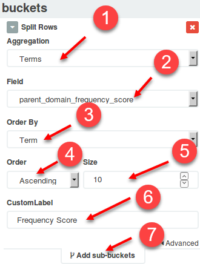

Click on **Split Rows**.


Set **Sub Aggregation** to **Terms**, **Field** to **parent\_domain.raw**, and **CustomLabel** to **Domain**. Then click on the green play button.


You should now have the complete table showing **parent domains** with the lowest frequency score or highest chance of being random.


**Answer** – The primary domain with the lowest frequency score is **tbs-wroclaw.com.pl**.

Save this visualization by clicking on the save icon. Set the **Title** to **DNS Frequency Scores on Parent Domain**. Then click **Save**.

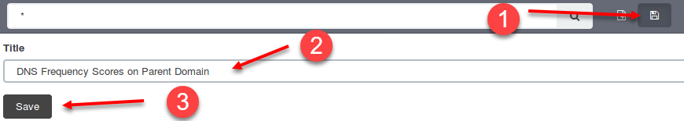

#### 3b) Setup a frequency analysis visualization to find adversaries trying to evade detection with random domain names. This visualization will be based on the subdomain field

Start by clicking on the **new visualization icon**.


Click on **Data table**.


Then click on **From a new search**.


Select **lab2.1-complete** for the index.


Then click on **Split Rows**.


Set **Aggregation** to **Terms**, **Field** to **subdomain\_frequency\_score**, **Order By** to **Term**, **Order** to **Ascending**, **Size** to **10**, and **CustomLabel** to **Frequency Score**. Then click on **Add sub-buckets**.

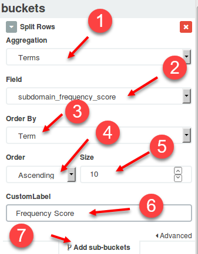

Set **Sub Aggregation** to **Terms**, the **Field** to **subdomain.raw**, and **CustomLabel** to **Subdomain**. Then click the green play button at the top of the screen.


You should now see the table for lowest frequency subdomains.


**Answer** – The **subdomain** with the lowest frequency score is **1aw2nml**.

Save the visualization by clicking on the save icon. Set the **Title** to **DNS Frequency Scores on Subdomains** and click **Save**.


4. Find the domain used to phish **labmeinc.com**. Establish a way to catch this ongoing
---------
Switch back to the discover tab and search for **labmeinc.com~**.

```bash
labmeinc.com~
```


Immediately you will see results for **1abmeinc.com**. Notice the starting character is the number **1** not the letter **L**.

**Answer** – The phishing domain is **1abmeinc.com**

This search can be saved and used to visually identify phishing domains being used. To do this click on the save icon. Set the **Save Search** title to **DNS Internal phishing domain matches** and click **Save**.

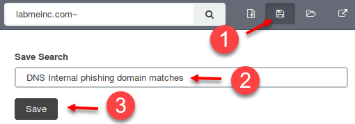

Switch back to Visualize and click on the **new visualization icon**.


Click on **Health Color Metric**


Click on **From a saved search**

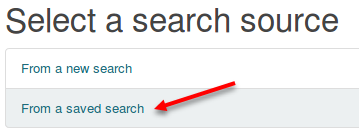

Click on **DNS Internal phishing domain matches**.


**Note**: This will tell the visualization to use the previously saved search filter. Updating the saved search will update any visualizations linked to it.

Now click on **Options**, set the **Critical threshold** to **1**, check **Invert scale**, and click on the green play icon.

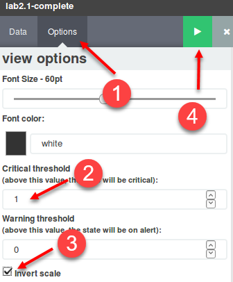

What this does is create a color-coded visualization. If there are zero phishing domains found, then the number 0 will be displayed in a green box. If one or more logs exists showing a phishing domain is in use, then the box will be red and display a count of how many logs were found.

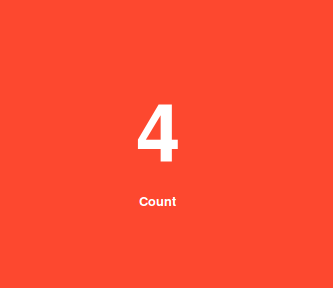

Save the visualization by clicking on the save icon. Set the **Title** to **DNS Fuzzy Domain Matches** and click **Save**.


5. Take all previously saved visualizations and make a DNS dashboard
---------
Click on **Dashboard** at the top of the screen. Then click on the **New Dashboard** icon and then the **Add Visualization** icon.


Add the visualizations to the dashboard by clicking on their names. Add them in the following order:

1. **DNS Query Type by Domain**
2. **DNS Fuzzy Domain Matches**
3. **DNS Sinkhole Requests**
4. **DNS Frequency Scores on Parent Domain**
5. **DNS Frequency Scores on Subdomains**

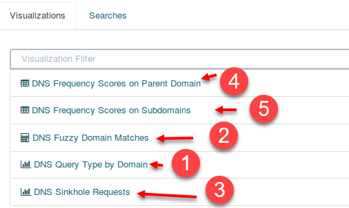

You can then resize each visualization on the dashboard by dragging the window using the symbol in the bottom right corner of each visualization. You have to hover over the visualization for it to appear.


Resize the windows to make the dashboard look similar to below. Your luck may vary based on screen size.

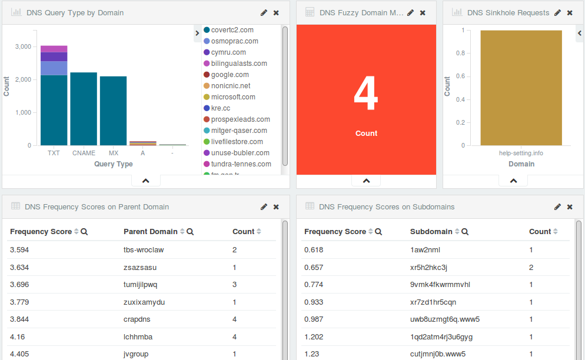

Now save the dashboard by clicking the save icon and setting the **Save As** title to **DNS Dashboard**. Then click **Save**. Congratulations. You now have a simple yet affective tactical dashboard. This is a basic example that can still be extremely effective.


**Note**: A little trick worth knowing is to add a saved search to the bottom of a dashboard. Dashboards in Kibana are for the most part interactive. This means if you click on something it will apply it as a search filter and all dashboard will update to reflect it. However, sometimes the dashboard does not show all the details you want. If you add a saved search to the bottom of the dashboard you can simply scroll down and look at the logs. You can see this by opening the dashboard called “**Lab 2.1 – DNS Dashboard**”.

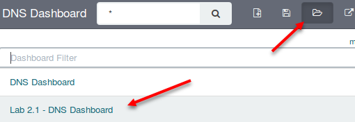

Then scroll to the bottom and you will see the DNS logs underneath the dashboard.


This allows you to start an investigation directly from a dashboard. You will not need to switch back to the **Discover** tab.

#### **Bonus Challenge 1 – Finding systems with default settings**

The **lab2.1-complete** index contains a system using default Windows SNTP settings. Which box is it?

#### **Bonus Challenge 2 – DNS time-to-live**

The lab2.1-complete index contains multiple domains with low TTLs.
1. Which domain has a TTL of 0? Why would it use a TTL of zero?
2. Which domain has 23 counts of a TTL of 5? Any guess as it if this domain is good or bad and why?
