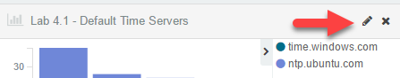
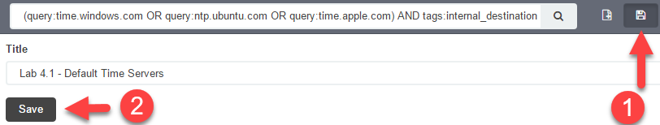
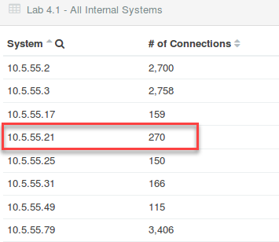
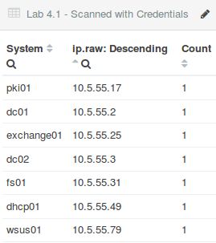
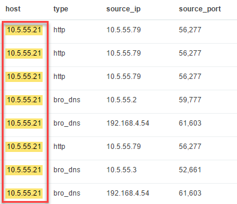
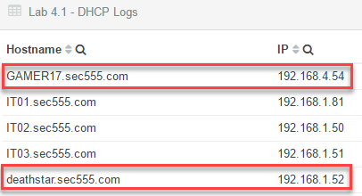

Lab 4.1 - Master Inventory
==========================================================

Objectives
==========

-   Discover how to correlate and use both active and passive asset information

-   Apply process for identifying authorized assets

-   Combine logic and credentialed scans to develop a master asset list

-   Become familiar with multiple sources of asset information

-   Identify misconfigured graphs and fix them

Exercise Preparation
====================

Log into the Sec-555 VM

-   Username: student

-   Password: sec555


Open http://localhost:5601/app/kibana


This lab has two indexes. One index is **lab4.1-complete** which contains **passive** data, and the other is **lab4.1-complete-nessus** which contains **active** data from a Nessus vulnerability scan.

The high-level asset information for this lab is as follows:

-   Internal domain is **sec555.com**
-   **IT workstations** are on the **192.168.1.0/24** subnet
-   The **HIPAA desktop subnet** used for patient data are on the **192.168.4.0/24** subnet
-   The main **server subnet** is **10.5.55.0/24** and is in a *physically secured data center*
-   **Domain controllers** are at **10.5.55.2** and **10.5.55.3**
-   Vulnerability scanner is **172.16.0.2** and is named **Nessus01**
-   All systems are supposed to use internal time servers

A dashboard called **Lab 4.1 - Asset Dashboard** has been created for this lab. To access it click on **Dashboard** and then **Load Saved Dashboard**. Type **4.1** in the search filter and then click on **Lab 4.1 - Asset Dashboard**. Loading this dashboard will also set the proper time range for this lab.


Exercise: No hints
==================

The goal of this lab is to identify all authorized vs unauthorized systems. Keep in mind that the steps you take to complete this lab likely can be automated with a SIEM.

1.  Which system(s) are using unauthorized time servers?

2.  There is one system within the server subnet that was not authenticated by the vulnerability scan.

    1.  Is this an authorized system?

    2.  What evidence proves or disproves this?

3.  Which systems are authorized?

4.  Which systems are not authorized?

Exercise – Step-by-step instructions
====================================

Sometimes an analyst is privilege to a lot of data. However, data without context is meaningless. This lab presents a lot of data directly to the analyst with the goal being to piece it all together in a logical fashion. This logic is necessary to repeat investigations or for automation.

1. Identify which systems are using unauthorized time servers
---------
There are two visualizations specific to time. One is the **Lab 4.1 - Default Time Severs**. This visualization shows IP addresses that are using default time servers such as **time.windows.com**.


This graph shows **4** systems using either **time.windows.com** or **ntp.ubuntu.com**. This is odd as **10.5.55.2** and **10.5.55.3** are domain controllers as stated in the lab **Exercise Preparation** section. To investigate this start by searching for the internal NTP servers. You can do this by searching **destination\_port:123 AND tags:internal\_destination**

```bash
destination_port:123 AND tags:internal_destination
```


The entire first page of logs within the **Lab 4.1 - Search** logs shows the internal time servers are either **10.5.55.2** or **10.5.55.3**. This means the domain controllers are the default time servers.

**Note**: This is the default behavior of an Active Directory environment.

Next, verify there are no other internal NTP servers by changing the search to **destination\_port:123 AND tags:internal\_destination -destination\_ip:10.5.55.2 -destination\_ip:10.5.55.3**

```bash
destination_port:123 AND tags:internal_destination -destination_ip:10.5.55.2 -destination_ip:10.5.55.3
```


There are no results. This means that the only internal time servers are the domain controllers. However, the **Lab 4.1 - Default Time Servers** shows the domain controllers. This is likely not the intended results of the graph. In this case, **10.5.55.2** and **10.5.55.3** are acting as time servers internally but are synchronizing time using **time.windows.com**. However, this is by design. Clear the search filter.


Then click on the **edit button** for the **Lab 4.1 - Default Time Server**.



Looking at the visualization settings you will find the search filter for it is set to **(query:time.windows.com OR query:ntp.ubuntu.com OR query:time.apple.com)**. This means it is flagging on any system that makes a DNS query to a default time server.

**Note**: The reason the domain controllers are showing up is due to DNS recursion. For instance, 192.168.1.52 asks for the IP address associated with ntp.ubuntu.com. This goes to one of the domain controllers because they are the DNS servers specified in DHCP. They are not authoritative for ntp.ubuntu.com so, they perform recursion and pass the DNS request off to an internet DNS server.

Modify the search filter to only look for DNS queries made internally. Do this by changing the query to **(query:time.windows.com OR query:ntp.ubuntu.com OR query:time.apple.com) AND tags:internal\_destination**

```bash
(query:time.windows.com OR query:ntp.ubuntu.com OR query:time.apple.com) AND tags:internal_destination
```


Now the graph only shows two systems using default time servers. These are **192.168.1.52** and **192.168.4.54**.

Click on the **Save Visualization** icon and then click on **Save**.



**Answer**: There are two systems that are using an unauthorized time server. They are **192.168.1.52** and **192.168.4.54**.
Switch back to the **Dashboard** tab.


2. Identify the system found within 10.5.55.0/24 that failed a credentialed scan and identify if it is authorized or not
---------
The **Lab 4.1 - Asset Dashboard** has a table that lists all assets. This is the **Lab 4.1 - All Internal Systems** visualization. Compare all the IP addresses in the 10.5.55.0/24 subnet to those in the list from the **Lab 4.1 - Scanned with Credentials table**. This table is a list of all systems that have been scanned successfully with service credentials.

**Note**: Successfully logging into a system is strong proof that it is an authorized asset.

 

The **10.5.55.21** system is the only system in the server subnet that has not been logged into during a credentialed vulnerability scan. The next part of this is figuring out if it is an unauthorized asset. To do this search for **10.5.55.21**.

```bash
10.5.55.21
```

**Note**: The reason for not specifying a field is you want to find this system in any log.


Looking at the dashboard you will find three of the visualizations are fully populated. If you look at the logs below you will see why.



**10.5.55.21** is the source of logs for Bro data. The reason it failed a credentialed scan is likely because it is a Linux system. Specific Bro logs contain the hostname of this sensor. For instance, if you scroll down to the 21<sup>st</sup> log entry you will find log with a type of bro\_conn. This type of log always stores a field with the sensor's name. Expand it and you will find this:


The value before the dash is the name of the sensor. In this case **10.5.55.21** has a name of **ELKHunter**. The value after the dash is the interface the connection was seen on.

**Answer**: **10.5.55.21** is the only system within the server subnet has not been successfully logged into during a credentialed scan. This is most likely because it is a Linux system providing Bro data to the SIEM. It is an **authorized** device.

Remove you search filter before moving on.


3. Identify which systems are authorized
---------
The logic for classifying systems as authorized can be handled various ways. However, this lab demonstrates an easy method of doing so. First, any system that has been vulnerability scanned successfully with service credentials is authorized. This means every system in the **Lab 4.1 - Scanned with Credentials** table is authorized.


We also know from **step 3** that **10.5.55.21 (ELKHunter)** is a Bro sensor feeding the SIEM. Therefore **10.5.55.21** is also authorized. Also, the Exercise Preparation section states that **172.16.0.2** is called **Nessus01**. This leaves only the two systems that are using default time servers: **192.168.1.51** and **192.168.4.54**.

Looking at **Lab 4.1 - DHCP Logs** shows the system names for these IP addresses.



Having the wrong time server could be a misconfiguration. However, the computer names are vastly different from corporate assets. Thus, they are not authorized devices.

**Answer:** The following systems are authorized systems:
dc01 10.5.55.2
dc02 10.5.55.3
dhcp01 10.5.55.49
doc01 192.168.4.50
doc02 192.168.4.51
doc03 192.168.4.52
elkhunter 10.5.55.21
exchange01 10.5.55.25
fs01 10.5.55.31
it01 192.168.1.81
it02 192.168.1.50
it03 192.168.1.51
pki01 10.5.55.17
nessus01 172.16.0.2
wsus01 10.5.55.79**

4. Identify which systems are not authorized and whether they are malicious or policy violations
---------
Based on previous steps the two unauthorized systems are **192.168.4.54 (GAMER17)** and **192.168.1.52 (deathstar)**. These do not follow the standard naming convention and are using default time servers.

**Answer**: **192.168.4.54 (GAMER17)** and **192.168.1.52 (deathstar)** are unauthorized systems. Based on their traffic usage they are most likely **policy violations** rather than malicious.

Bonus Challenge 1 – MAC Address Lookup
======================================

One of the systems in this lab has a Dell MAC OUI. Which one is it? You can use **/home/student/Desktop/mac\_oui.txt** to verify the OUI is for Dell.

Bonus Challenge 2 – Unauthorized but malicious?
===============================================

Are any of the unauthorized system(s) identified malicious?
