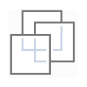
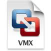

Objectives
==========

-   Understand successful lab prerequisites

-   Verify the integrity of the USB contents

-   Prep laptop for the 555 lab environment

-   Get the Security555 Linux VM up and running

-   Understand VMware networking sufficiently to complete labs

-   Troubleshooting tips: VMware Automatic Bridging challenges

Prerequisites 
==============

**Hardware Requirements**

-   CPU: A **64-bit** Intel x64 2.0+ GHz processor or higher based system is **mandatory** for this class (Important - Please Read: A 64-bit system processor is mandatory.)

-   RAM: **8 GB** (Gigabytes) of RAM or higher is mandatory for this class (Important - Please Read: 8 GB of RAM or higher of RAM is mandatory.)

-   **Wired Ethernet port (or adapter)**

-   Wireless 802.11 B/G/N/AC

-   USB 3.0 Ports highly recommended

-   Disk: 25 Gigabytes of free disk space

-   VT-x, AMD-V, or the equivalent must be enabled in the BIOS/UEFI

**Software Requirements**

-   VMware Workstation 11, Player 7, or Fusion 7 (or newer)

SEC555 Linux VM Setup
=====================

Note: These instructions and screenshots assume a Windows or OS X host for steps 1 through 7. Linux also works as long as VMware Player or Workstation is installed; see the “Linux Host” section at the end of this appendix for pointers.

1.  NOTE: When the time comes (step 7), please choose “I Copied It” when asked by VMware.

> 
>
> We remind you of this upfront because some students skip ahead and make the mistake of moving the VM. A “move” retains the original MAC address, whereas a “copy” generates a new MAC. This is a critical distinction on a wired network!

1.  Insert the Sec555 USB into your laptop. You will receive the Sec555 USB by the first day of the course
    if you do not have it now. Wait until you receive the Sec555 USB before configuring your system.

2.  Browse to the USB root directory.

3.  Copy/drag the **Sec555.zip** file to a local directory of your choice.

4.  Unzip **Sec555.zip** in that directory:

    -   Double-click **Sec555.zip** on your local disk (not on the USB).

        -   On Windows: Drag and drop the **Sec555** folder to your local disk to extract the files.

        -   OS X will automatically extract.

    -   Wait for the extraction to complete.

5.  Double-click the extracted folder. Then, double-click Sec555.vmx.

> The Linux .vmx icon has three overlapping white or blue squares (shown here on the left and middle, respectively). On OS X, the icon has blue and red overlapping squares (shown on the right):
>
>  

1.  VMware should start. If asked, you may choose to upgrade this virtual machine.

> Please choose “I Copied It” when asked by VMware.
>
> 
>
> If VMware does not start, ensure you have clicked the .vmx file. Also, ensure that VMware is properly installed.

1.  After the VM starts, you end up at the login prompt. Log in with a username of
    **student** and a case-sensitive password of **sec555**.

    

2.  Your system should be prepared for the labs now.

**Note**: If you have virtualization software that supports it, creating a snapshot of the system after the first successful boot can be useful for rapidly returning the system to a pristine state.

**Linux Host Pointers**

Linux requires exFAT support to mount the USB, and this is not included by default in some recent Debian distros, including Ubuntu.

To install via apt (for Debian-based distros):

```bash
$ sudo apt-get install exfat-fuse exfat-utils
```