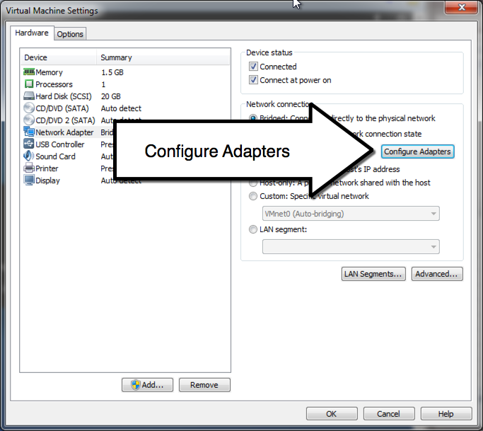
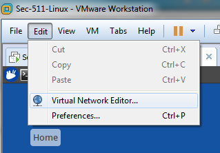
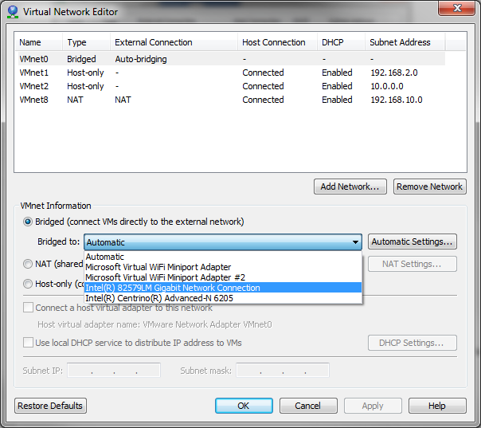
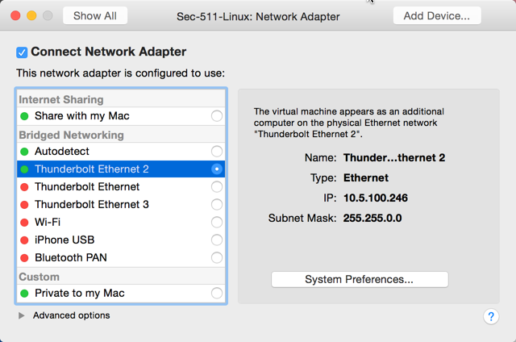

Objectives
==========

This Appendix is designed to assist with common problems with VMware’s automatic bridging feature.

If you have not done so already, please get an Ethernet cable, **plug in to the wired network**, and ensure you have connectivity. Your switch port should show blinking lights.

Next, force your bridged connection to use the wired adapter. VMware’s automatic bridging feature is notoriously unreliable and often chooses wireless instead of wired. Even if it initially automatically bridges correctly, it often changes adapters later, causing problems for future labs.

Three sections follow, for VMware Player, VMware Workstation, and VMware Fusion. Choose the appropriate section based on your version of VMware and configure bridged networking.

**VMware Player (aka VMware Workstation Player)**

VMware recently renamed its products. If your Windows VMware program has the word “Player” in it, please use this section.

Go to Player -&gt; Removable Devices -&gt; Network Adapter -&gt; Settings.

Choose “Bridged” and ensure “Connected” is checked. Then, click “Configure Adapters” (if available).

Then, deselect all adapters except your wired Ethernet adapter and press “OK”.

Older versions of VMware Player may lack the Configure Adapters option. In that case, disabling your wireless adapter usually forces VMware Player to automatically bridge to wired.

**VMware Workstation (aka VMware Workstation Pro)**

Configure bridged networking by going to VM -&gt; Removable Devices -&gt; Network Adapter -&gt; Settings.

Choose “Bridged” and ensure “Connected” is checked.

Then, go to Edit -&gt; Virtual Network Editor

If VMnet0 does not appear, click “Change Settings” to modify network settings:

Change from “Automatic” to your actual wired Ethernet adapter. **Note:** Your Ethernet adapter name may be different.

Then, press Apply. VMnet0 should be bridged to the actual wired Ethernet adapter.

**VMware Fusion**

Go to virtual Machine -&gt; Network Adapter -&gt; Network Adapter Settings.

Choose your wired Ethernet adapter. Assuming it is plugged into the wired network and operational, it should have a green icon and show a 10.5.0.0/16 address when selected.

