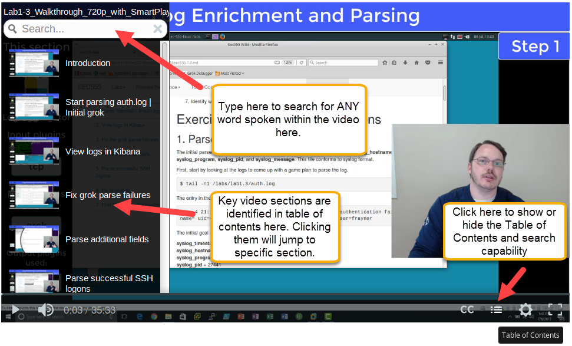
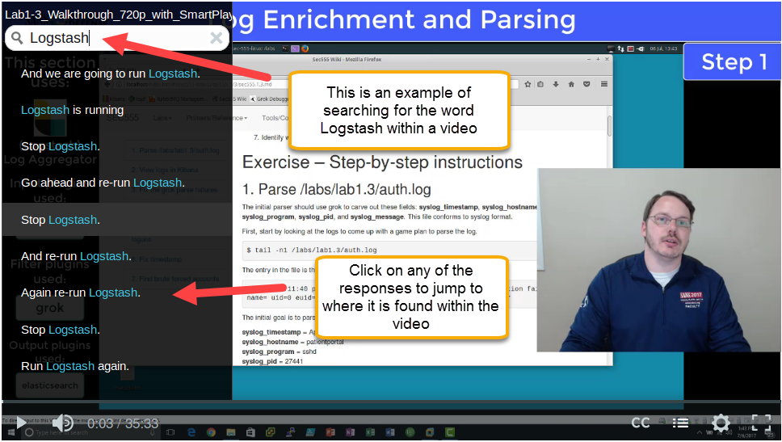

Smart Player
======

Abstract
----------

Smart Player is a HTML video player that enhances videos by provided them with extra capabilities such as interactive images, quizzes, closed captions, and search capabilities. It is part of the Camtasia video editing software by Techsmith.

Capabilities
----------

Smart Player is an interactive video player. It allows videos to support extra functionality such as:

- **Change player speed - natively**
- **Click on items within video to open links**
- **Close Caption Support** (see text of presenter talking)
- **Table of contents** - Allows you to quickly jump to specific sections in a video
- **Search** - Searching allows you to search for any word the presenter has said and then click on the section to jump to that section within the video
------

How to Access Features
----------

**Searching**

The most time consuming part of Smart Player is making the videos searchable. This extremely awesome capability allows you to jump to any section a specific word or words are spoken as well as quick jump to key sections. This is done by clicking on the Table of Contents icon and either searching for a keyword and clicking on one of the results or clicking on one of the table of content links.

**Interactive links**