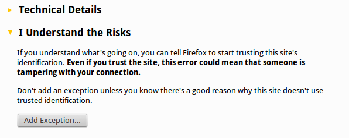
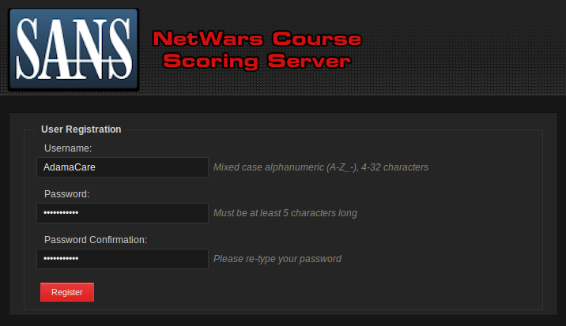
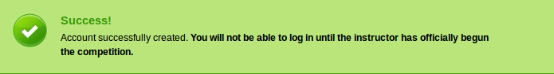
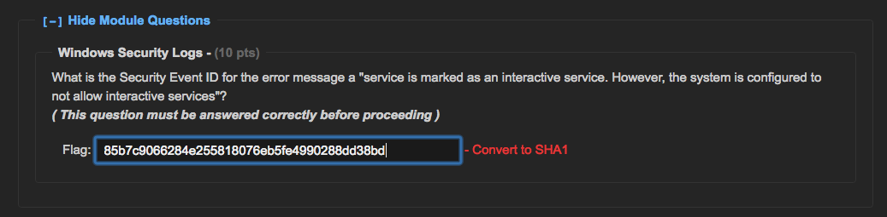

Objectives
==========

-   Provide an overview of the types of labs and when they are encountered in the course.

-   Configure the SEC555 virtual machine for the lab environment.

-   Troubleshoot VMware bridged networking issues.

-   Connect to the daily Immersive Cyber Challenges (NetWars 1-5) Environment.

-   Create an account for the Immersive Cyber Challenges (NetWars 1-5) Environment.

Overview
========

SEC555 incorporates many hands-on course elements to enhance the learning experience and show how to apply concepts taught. We employ varied approaches to hands-on components including:

-   Linux-based local labs

-   NetWars-based daily cyber challenges

-   NetWars-based final capstone

A Linux virtual machine is provided on the SEC555 USB that will need to be configured on your system. NetWars elements are hosted on the instructor laptop (for local students) or over a VPN (for remote students), but you will need to connect to it and create an account to participate.

**Appendix A:** Linux VM/Setup Guide

**Appendix B:** VMware Bridged Mode HowTo

**555.6:** Netwars Setup Guide

SEC555 Labs
===========

The table below highlights the various hands-on components occurring in SEC555. The system(s) and network connectivity required for the components are noted.

| **Day** | **Lab \#**  | **Networked/VPN or Local** | **Title**                                        |
|---------|-------------|----------------------------|--------------------------------------------------|
| **1**   | 1.1         | Local                      | Introduction to SOF-ELK                          |
|         | 1.2         | Local                      | Log Ingestion from Files and Network Connections |
|         | 1.3         | Local                      | Log Enrichment and Parsing                       |
|         | NetWars 1-5 | Networked/555A VPN         | Immersive Cyber Challenges                       |
| **2**   | 2.1         | Local                      | Catching the Adversary with DNS                  |
|         | 2.2         | Local                      | Investigating HTTP                               |
|         | 2.3         | Local                      | HTTPS Analysis                                   |
|         | NetWars 1-5 | Networked/555A VPN         | Immersive Cyber Challenges                       |
| **3**   | 3.1         | Local                      | Windows Log Filtering                            |
|         | 3.2         | Local                      | Catching Evil with Windows Logs                  |
|         | 3.3         | Local                      | Logon Monitoring                                 |
|         | NetWars 1-5 | Networked/555A VPN         | Immersive Cyber Challenges                       |
| **4**   | 4.1         | Local                      | Master Inventory                                 |
|         | 4.2         | Local                      | PowerShell Compromise                            |
|         | 4.3         | Local                      | NetFlow Detection                                |
|         | NetWars 1-5 | Networked/555A VPN         | Immersive Cyber Challenges                       |
| **5**   | 5.1         | Local                      | Alert Context                                    |
|         | 5.2         | Local                      | Virtual Tripwires                                |
|         | 5.3         | Local                      | Beacon Detection                                 |
|         | NetWars 1-5 | Networked/555A VPN         | Immersive Cyber Challenges                       |
| **6**   | Capstone    | Networked/555B VPN         | Day 6 Capstone                                   |

Linux Virtual Machine Configuration
===================================

The Xubuntu Linux VM (virtual machine) will be used every day in both workbook labs and NetWars challenges. Appendix A provides full details on configuring the Linux virtual machine.

1.  **Please turn to Appendix A, “Linux VM/Setup Guide,” and follow the instructions provided to set up the SEC555 Linux VM environment.**

Network Connectivity Issues
===========================

**Note**: Remote (e.g. OnDemand, Simulcast, vLive) students will connect to the classroom network via a VPN.

Appendix A, “Linux VM/Setup Guide,” provides details on connecting to the local classroom network.

1.  **If connectivity issues are encountered, then please see Appendix B, “VMware Bridged HowTo,” for guidance on configuring VMware to allow connectivity.**

**Warning**: The most common problem encountered in SEC555 is network connectivity resulting from VMware Bridge Mode configuration issues. Appendix B is provided to help troubleshoot the issue. However, always feel free to engage your instructor or technical support to help address these issues.

Immersive Cyber Challenge Environment (NetWars 1-5)
===================================================

1.  **Please connect to the NetWars environment, create an account, and log in.**

If you have not done so already, install the Linux VM (see Appendix A), start the VM, and log in with these credentials:

-   Username: student

-   Password: sec555

Then, start Firefox by double clicking on the Firefox icon on the Linux desktop:

Enter the address https://10.5.55.6/ in the address bar.

-   Be sure to use **https.**

If the browser gives a certificate warning, click “I understand the risks.”

Then, choose “Add Exception…”

Then, choose “Confirm Security Exception.”

Click “User Registration.”

Choose a username and password.

-   Please remember your password; the instructor does not know it and has no way of resetting it.

-   Passwords are case-sensitive; usernames are not.

**Note**: You may log in immediately, so please do so! You may see this warning, which is simply a warning:

**Again:** Please log in immediately!

The Days 1-5 NetWars bootcamp is already unlocked (meaning it has “officially begun”). This will change during 555.6 when all new questions will appear and the game will begin locked (to allow students to create accounts before the Defend the Flag competition formally begins).

You are ready for the 555 bootcamp when you see this screen:

There is a guided tour, which is optional.

As you will see during the bootcamp, many answers require a SHA1 hash. The NetWars software makes this quite easy to do. If the “Convert to SHA1” option exists, that means the answer must be a hash:

The answer may be submitted after it is converted:

If you forget to convert to SHA1 (as the course authors often do), there is no penalty. In that case, you will receive this harmless error:

You may “Submit Answers” at any time; blank answers are not submitted. For example:

In this case, only the answer to the “How many lines?” question will be submitted; the other blank answers will not.

Your instructor will discuss other elements of the Security 555 bootcamp with you. For live conferences, the formal bootcamp hours are 5-7PM on Days 1-5.
