Lab 2.2 - Investigating HTTP
==========================================================

Objectives
==========

-   Use standard HTTP fields to find abnormal events

-   Use log enrichment data to filter out noise

-   Identify web server scans

-   Look for unusual naked IP requests

-   Learn to build and use visualizations and dashboards

Exercise Preparation
====================

Log into the Sec-555 VM

-   Username: student

-   Password: sec555


Exercise: No hints
==================

Logs for this lab have already been ingested and are stored in index **pcap-\*** and have a **type** of **http**. To answer the questions below use Kibana.

1.  Between **March 10<sup>th</sup>** and **March 15<sup>th</sup>** of **2017** multiple web scans were performed against **vmmonitor.test.int** and **pki01.test.int**. This activity included attempts to perform directory traversals, cross site scripting, and many other forms of web attacks.

    1.  Which system performed the scan? 10.0.1.201

    2.  How many 404 errors were caused by this scan? 12,192

    3.  Was the scan malicious? No. It was a Nessus scan.

2.  Starting in **2017**, Lab Me Inc. began monitoring naked IP requests. These are tagged with **naked\_ip**. Specifically, they are monitoring outbound connections from **192.168.2.0/24** and **10.0.0.0/24**. Outbound connections from these subnets are being monitored as they go out to the internet through a **Fortinet** firewall.

    1.  There are many naked IP requests. Filtering which two ASNs eliminate almost all the naked IP requests? Fortinet, Inc. and Netflix Streaming Services Inc.

    2.  Are there naked IP requests to other common businesses? Google and Amazon

    3.  After eliminating common ASNs, how many naked IP addresses need investigated?

Exercise – Step-by-step instructions
====================================

First open Kibana and change the index to **pcap-\***.


1. Identify the web scan that occurred between March 10<sup>th</sup> and March 15<sup>th</sup> of 2017
---------
First, click on the **date picker** in the top right corner and then click on **Absolute**. Set the **From** field to **2017-03-10** and the **To** field to **2017-03-15 23:59**.

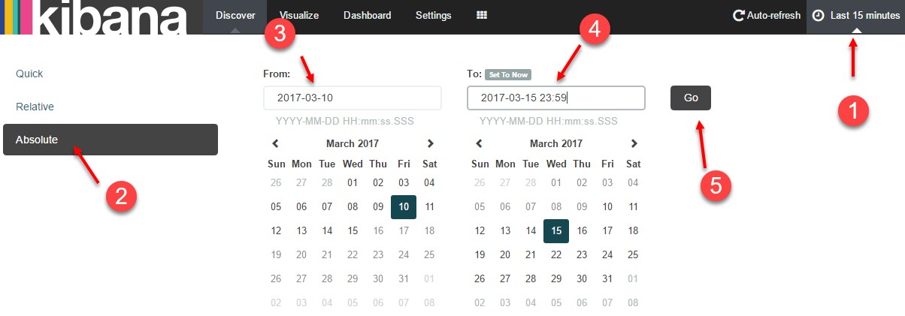

**Note**: Notice that the **From** and **To** fields do not have to be filled out. If you do not specific something a zero is submitted in its place. For example, the **From** field for this search was changed to **2017-03-10 00:00:00.000**.

This shows **118,084** hits. Visually there are some spikes but the **Discover** tab is not the best way to track the web scan down. Switch to the **Visualize** tab and then click on the **New Visualization** icon. Then click on **Vertical Bar Chart**.


Select **From a new search** and then select **pcap-\*.**

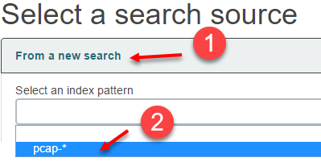

When looking for web scan activity it is common to see a status code of 404 as well as 200. Start by building out a bar chart that identifies the top sources of 404 errors by source IP. In the search bar enter "**type:http AND status\_code:404**". Then click on the search icon.

```bash
type:http AND status_code:404
```


Next, click on Split Bars.

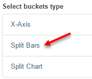

Then set the **Aggregation** to **Terms**, **Field** to **source\_ip**, **Size** to **3**, and **CustomLabel** to **Source IP**. Then click on **Add sub-buckets**.


Select X-Axis. Then set Sub Aggregation to Date Histogram. Then click on the green play button.


**Note**: The reason for adding the **Split Bars** before the **X-Axis** is so that the search is first sorted by **source\_ip** and then by **date**. This makes the legend reflect the top **source\_ip** that has 404 status codes. If you were to add the **X-Axis** first and then the **Split Bars** the outcome would display differently due to the order of the search.

Save the visualization by clicking on the save icon. Set the **Title** to **HTTP Status Code 404 by Source IP** and then click on **Save**.

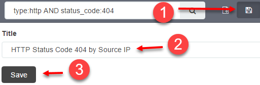

You should then see the below graph.

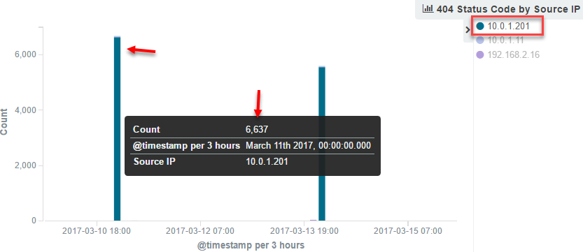

**10.0.1.201** has by far more 404 status codes than any other IP. At this point it is likely that **10.0.1.201** is scanning one or more systems. Before diving more into this modify the chart to be for a status code of 200. Do this by changing the search bar to have "**type:http AND status\_code:200**" and then click on the search icon.

```bash
type:http AND status_code:200
```


In this graph **10.0.0.1** has the most 200 status codes followed by **10.0.1.201**. This means that 10.0.0.1 could also be performing a web scan. However, it is unclear without knowing the destination **virtual\_host(s)**.

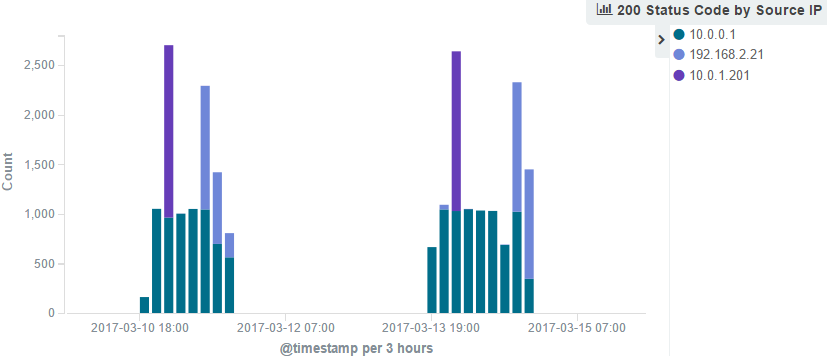

You now have the same chart layout but specific to web page requests that were successful. Click on the save icon and change the **Title** to **HTTP Status Code 200 by Source IP** and then click on **Save**.


While 10.0.1.201 still looks like the primary suspect these charts do not identify the target web site(s). To identify these targets, create a new visualization by clicking on the **New Visualization** button.


This time select **Data table**.

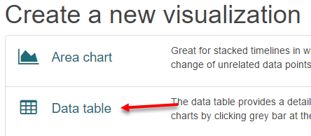

Select **From a new search** and then select **pcap-\*.**


First, set the search filter to "**type:http**". This makes the visualization specific to only **http** events.

```bash
type:http
```


For the bucket type select **Split Rows**.


Set **Aggregation** to **Terms**, **Field** to **method.raw**, and **CustomLabel** to **Method**. Then click on **Add sub-buckets**.

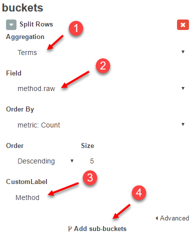

For the bucket type select **Split Rows**.


Set **Sub Aggregation** to **Terms**, **Field** to **virtual\_host.raw**, **Size** to **2**, and **CustomLabel** to **Virtual Host**. Then click on **Add sub-buckets**.

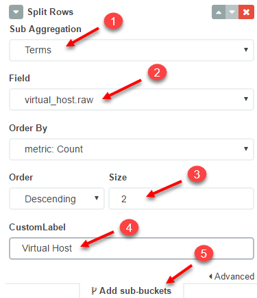

For the bucket type select **Split Rows**.


Set **Sub Aggregation** to **Date Histogram** and then click on the green play button.


**Note**: The remaining question for step one is what are the target web servers that were scanned. This only requires the **virtual\_host.raw** field. However, adding the **method.raw** and **Date Histogram** into the visualization allows it to be multi-purpose. For instance, it could be used to find abnormal GET vs POST use. Also, the timestamp breakdown helps identify if this is many events over a short period or many events simply because you are searching over a long period.

Save the visualization by clicking on the save icon. Set the **Title** to **HTTP Methods by Virtual Host** and then click **Save**.


Before adding these visualizations to a dashboard switch back to the **Discover** tab and create a saved search for HTTP. First click on the **Discover** tab. Then search for "**type:http**".


Then hover over the following fields in the left column and click on Add to add them as columns:

- method
- virtual\_host
- uri
- uri\_length
- destination\_geo.asn
- destination\_geo.country\_name

Example using method:


Then click on the save icon and set the **Save Search** title to **HTTP**. Then click on **Save**.


Now create a dashboard and add these three visualizations and saved search to it. Switch to the **Dashboard** tab. Then click on the **New Dashboard** icon.


Click on the Add Visualization icon and then add **HTTP Methods by Virtual Host**, **HTTP Status Code 200 by Source IP**, and **HTTP Status Code 404 by Source IP** by clicking on them.


Then switch to the **Searches** tab and add **HTTP**. Then minimize the **Add Visualization** view by clicking the up arrow at the bottom.

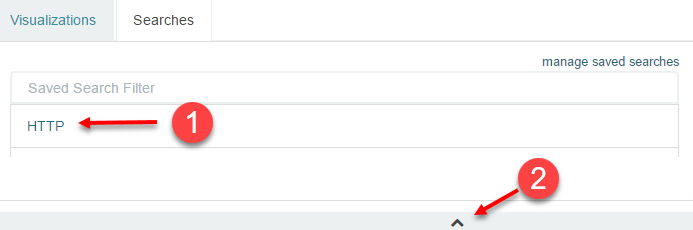

Rearrange the visualizations to your liking. Throughout this process the time should still be set to **March 10<sup>th</sup>** to **March 15<sup>th</sup>**. The dashboard reflects this by showing relative times such as X months ago or X years ago. If the date is not accurate set it to March 10<sup>th</sup> to March 15<sup>th</sup> again. Save the dashboard by clicking on the Save icon and setting the **Save As** title to **HTTP Dashboard** and then click **Save**.

Now click on **10.0.1.201** on the **HTTP Status Code 404 by Source IP** visualization and then click on the magnifying glass with the + sign. This will apply a search filter of **source\_ip:"10.0.1.201"** to the dashboard.


Now the dashboard only reflects activity from a source IP address of 10.0.1.201. However, the first question specifically is asking about **vmmonitor.test.int** and **pki01.test.int**. To have the dashboard filter down on these systems search for "**type:http AND (virtual\_host:"vmmonitor.test.int" OR virtual\_host:"pki01.test.int")**" in the search bar.

```bash
type:http AND (virtual_host:"vmmonitor.test.int" OR virtual_host:"pki01.test.int")
```


The search results show many GET and POST requests against both of these target sites. The question remaining is whether this is a malicious scan or not. This can be difficult to identify especially if you do not know if there are trusted scanners at your organization. Within the saved search click on the **Time** column to sort the Time in Chronological order.

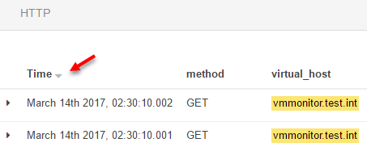

This should show that the first event from 10.0.1.201 occurred on March 11<sup>th</sup> 2017 at 02:01:26.761.

**Note**: This timestamp is specific to Central Time. The time of the logs will be shown according to the time zone of the machine accessing Kibana.

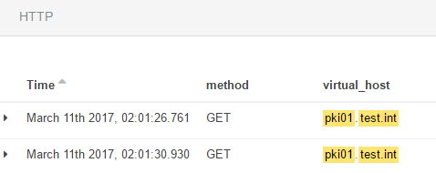

Occasionally, an **useragent** will give away whether something is malicious or not. However, looking at any of these logs shows that 10.0.1.201 has an **useragent** of **Mozilla/4.0 (compatible; MSIE 8.0; Windows NT 5.1; Trident/4.0).** This is not helpful as it reflects a Windows XP system using Internet Explorer 8. The next step could be to analyze the **uri** field to see if there are any telltale signs.

Go ahead and scroll through a few pages of the saved search results and look at the uri field. Switch to page 5.

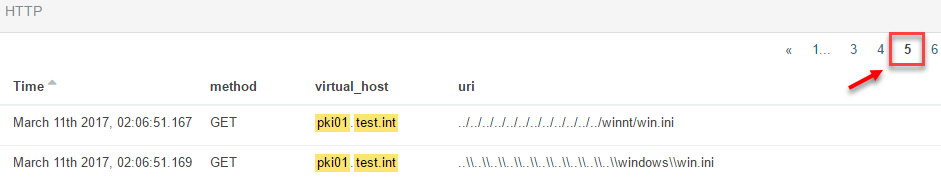

The first two requests are directory traversal attacks trying to access **win.ini**. Scrolling down to a little over halfway down the page you will find the following:


This time the directory traversal attack starts with **/nessus**. This gives away that the scan is being performed by a Nessus vulnerability scanner.

**Answer**: **10.0.1.201** is likely not a malicious system. It is a vulnerability scanner. Between March 10<sup>th</sup> and March 15<sup>th,</sup> it caused **4,504** status code 404 errors against **vmmonitor.test.int** and **pki01.test.int**. The 404 count can be calculated by hovering over the bars in the **HTTP Status Code 404 by Source IP** visualization and adding the totals.

2. Find out which naked IP requests can be filtered and which need investigated
---------
**Note**: A naked IP request is a web request to an IP address rather than a domain name.

This question involves looking for naked IP requests and finding ways to filter our legitimate noise. This requires finding naked IP requests as well as information that can be used to filter on. For this lab, a **tag** of **naked\_ip** has been added to any HTTP event that has a **virtual\_host** using an IP address.

Begin by switching to the **Visualize** tab and then click on the **New Visualization** icon.

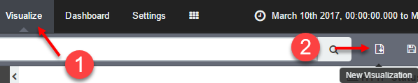

Select **Data table**.


Select **From a new search** and then select **pcap-\*.**


First, set the search filter to "**type:http AND tags:naked\_ip**". This makes the visualization specific to only **http** events.

```bash
type:http AND tags:naked_ip
```

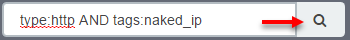

For the bucket type select **Split Rows**.


Set **Aggregation** to **Terms**, **Field** to **virtual\_host.raw**, **Size** to **6**, and **CustomLabel** to **Virtual Host**. Then click on **Add sub-buckets**.

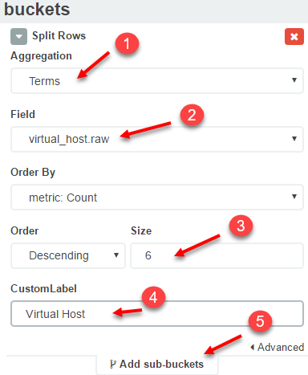

For the bucket type select **Split Rows**.


Set **Sub Aggregation** to **Terms**, **Field** to **reverse\_dns.raw**, and **CustomLabel** to **Reverse DNS**. Then click on the green play button.


**Note**: Reverse DNS takes an IP address and attempts to resolve it back to a domain. Some sites do not have reverse DNS entries. However, when they do it is very helpful to identify and filter out legitimate traffic.


Save the visualization by clicking on the save icon. Set the **Title** to **HTTP Naked IPs** and then click on **Save**.

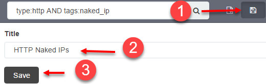

ASN and geo information is extremely helpful for filtering out legitimate naked IP requests. Proceed by building a visualization with this information. Click on the **New Visualization** icon.


Select **Data table**.


Select **From a new search** and then select **pcap-\*.**


Search for "**type:http**".

```bash
type:http
```


For the bucket type select **Split Rows**.


Set **Aggregation** to **Terms**, **Field** to **destination\_geo.asn.raw**, and **CustomLabel** to **ASN**. Then click on **Add sub-buckets**.


For the bucket type select **Split Rows**.


Set **Sub Aggregation** to **Terms**, **Field** to **destination\_geo.country\_name.raw**, **Size** to **3**, and **CustomLabel** to **Country**. Then click on the green play button.

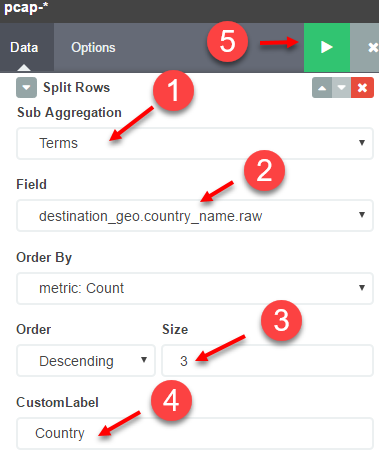

The results should look like this:

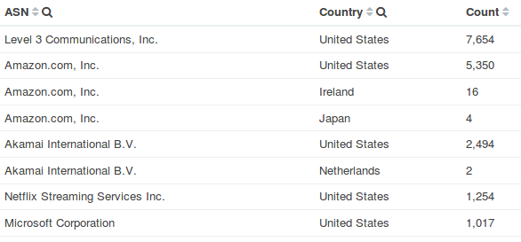

Save the visualization by clicking on the save icon. Set the **Title** to **HTTP ASN and Country** and then click on **Save**.

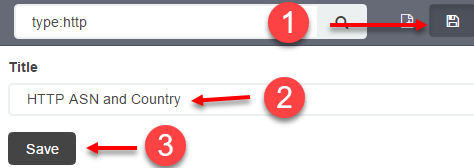

Switch back to the **Dashboard** tab. Then load the previously saved dashboard by clicking on the **Load Saved Dashboard** icon and then clicking on **HTTP Dashboard**.


Click on the **Add Visualization** icon.


Add the two new visualizations you just created by clicking on **HTTP ASN and Country** and **HTTP Naked IPs**.


Save the dashboard again by clicking on the save icon and then **Save**.


Now that the dashboard has been updated it is time to see what naked IP requests there are. The question is about logs from 2017. Change the search time to reflect this by clicking on the date picker and clicking on Absolute. Set the **From** date to **2017** and the **To** date to **2018**. Then click **Go**.


Minimize the time picker by clicking on the up arrow at the bottom.


With the current settings only the **HTTP Naked IPs** visualization reflects events that are related to naked IPs. Also, the question only pertains to events dealing with the IP address subnets of **192.168.2.0/24** and **10.0.0.0/24.** To change this set the search bar to "**tags:naked\_ip AND (source\_ip:\[192.168.2.0 TO 192.168.2.255\] OR source\_ip:\[10.0.0.0 TO 10.0.0.255\])**".

```bash
tags:naked_ip AND (source_ip:[192.168.2.0 TO 192.168.2.255] OR source_ip:[10.0.0.0 TO 10.0.0.255])
```

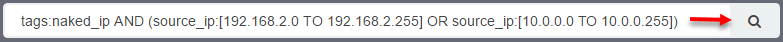

Looking at the **HTTP Naked IPs** visualization shows multiple Reverse DNS entries ending with **nflxvideo.net**. If you were to investigate this you would discover that this is traffic related to Netflix.

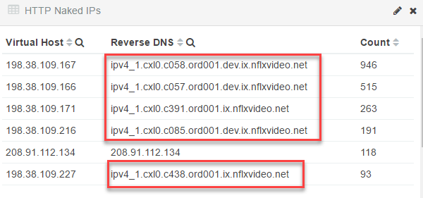

Also, looking at the **HTTP ASN and Country** visualization shows **Netflix Streaming Services Inc**. with a count of **2,544**. It also shows an ASN for **Fortinet Inc**. Since the question states these subnets are going out to the internet using a Fortinet firewall this is likely expected traffic. Click on **Netflix Streaming Services Inc.** and then change the filter to an exclusion by hovering over it and clicking the magnifying glass with a minus sign.


Do the same for **Fortinet Inc**.


At this point over 90% of the naked IP requests have been filtered out. However, 67 events may still be too many remaining to treat monitoring naked IP requests as effective. Yet more events can still be filtered. The highest remaining ASN is **Amazon.com, Inc**. Reverse DNS entries show these are related to **s3-1-w.amazonaws.com**. This is Amazon's Amazon Web Service (AWS) which is for cloud hosting. While www.amazon.com is likely trusted, AWS can be used for anything including attacks from adversaries.

Look at the raw events in the saved search section. Find the first event related to **s3-1w.amazonaws.com**. Notice, the **uri** is for **/kindle-wifi/wifistub.html**. In fact, it looks like these are the same for all **s3-1w.amazonaws.com** events. Expand the log and click on the magnifying glass with the minus sign to exclude events related to **/kindle-wifi/wifistub.html**.

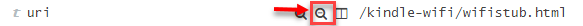

The next highest remaining ASN is **Google Inc.** The problem is Google also has cloud hosting. Filtering out the ASN of **Google Inc**. could mask attacks from a Google hosted cloud server. Looking at the logs below all the Google events are related to a Reverse DNS entry ending in **1e100.net**.


**1e100.net** is a Google-owned domain used to identify their servers. It is not malicious and not associated with cloud hosted servers. Thus, it can be used to filter out these Google events. To do so update the search filter to include **-reverse\_dns:1e100.net** as follows:

```bash
tags:naked_ip AND (source_ip:[192.168.2.0 TO 192.168.2.255] OR source_ip:[10.0.0.0 TO 10.0.0.255]) -reverse_dns:1e100.net
```

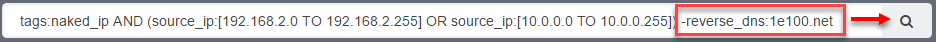

Using ASN and reverse DNS filtering narrows the remaining naked IP requests to 3 web servers and 11 events. This is much easier for an analyst to handle.

**Answer**: **Netflix Streaming Services Inc.** and **Fortinet Inc.** were by far the two most used ASNs related to naked IP request. However, both Google and Amazon were common as well. In regards to these companies filtering can be done with either the ASN or fields such as **uri** and **reverse\_dns**. Because of cloud hosting filtering on **uri** and **reverse\_dns** may be a safer way to go. Using a combination of these results in **3 virtual\_hosts** with a total of **11** events that require investigation.

Bonus Challenge 1 – Multiple sites… one destination IP?
=======================================================

Beginning on **March 10<sup>th</sup>, 2017** a system began to make many successful web connections to many web sites. However, they are all to the same destination IP and port.

1.  What is the IP of the system?

2.  What is the destination IP and port this system is connecting to?

3.  Is this malicious in nature?

Bonus Challenge 2 – Malware URI vs Normal URI
=============================================

Logs recorded **before 2017** are from malware samples.

1.  What are the two sites with the longest URIs? dgyqimolcqm.cm and 5803.sindelclick.com

2.  Compare the highest URI length from 2012 to the highest URI length in 2017 from 192.168.2.0/24 (public internet). How much of a gap is there?


