Lab 2.3 - HTTPS Analysis
==========================================================

Objectives
==========

-   Use standard HTTPS fields to find abnormal events

-   Use log enrichment data to find malicious certificate use

-   Discover certificates that are missing fields

-   Identify attacker generated certificates

-   Learn to build and use visualizations and dashboards

Exercise Preparation
====================

Log into the Sec-555 VM

-   Username: student

-   Password: sec555


**Note**: This lab contains events from normal traffic as well as malicious traffic.

Exercise: No hints
==================

Logs for this lab have already been ingested and are stored in index **pcap-\*** and have a **type** of **x509**. To answer the questions below use Kibana. A dashboard has been created called **Lab 2.3 – x509 Dashboard**. This can be used to help answer the questions below. All events took place between **2012** and **2018**.

1.  Find all **x509** events that are missing the **issuer\_organization** field.

    1.  Identify how many of these are tagged with **top-1m**. Of these events are any malicious?

    2.  Identify how many events are not tagged with **top-1m**. Ignore any legitimate issuers identified in **1a** and filter out anything related to the internal domain of **test.int**. How many events remain?

2.  Identify how many x509 events are related to certificates that are valid for more than **2000** days.

    1.  Three of these are benign. Which ones are they?

    2.  Two are malicious or unknown. Which ones are they?

3.  Identify potentially malicious sites using frequency analysis.

    1.  How many events have a **certificate\_common\_name\_frequency\_score** below **5**?

    2.  How many of these are tagged with **top-1m**?

    3.  How many of these are tagged with **top-1m** and have a **certificate\_common\_name\_length** over **16**?

    4.  How many of these are not tagged with **top-1m** and have a **certificate\_common\_name\_length** over **16**?

4.  Which two sites have an invalid US **issuer\_state** field?

Exercise – Step-by-step instructions
====================================

Attackers may use encryption to bypass security controls as well as to operate under the radar. However, analyzing certificates provides a means to catch their activity. For example, adversaries may use random names, be lazy in filling out certificate information, or accidently enter invalid field data. This lab focuses on these types of events to show how easy it is to catch.

First open Kibana and change the index to **pcap-\***.

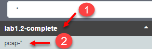

Next, click on **Dashboard** to switch to the dashboard tab. Then click on the **Load Saved Dashboard** icon and click on **Lab 2.3 – x509 Dashboard**.

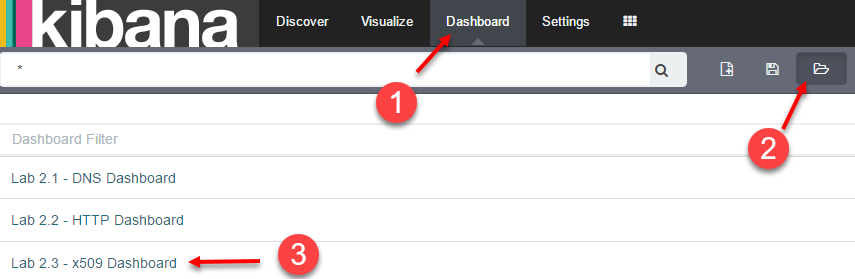

Loading this dashboard automatically sets the time for events between **2012** and the end of **2018**.

1. Identify x509 events that are missing the issuer\_organization field
---------
The **Lab 2.3 – x509 Missing Fields** visualization contains a breakdown of x509 where each column represents the number of events missing certain fields. The second column represents events missing the **issuer\_organization** field. Click on it to filter on only these events.


This shows there are **35,424** x509 events were the **issuer\_organization** field is missing. This is a lot of events. The question is, which of these are from malicious traffic and which are from normal traffic. Next, search for **tags:top-1m** to see how many are related to the top one million sites.

```bash
tags:top-1m
```


Only **200** events remain. However, looking at the **Lab 2.3 – Most common Issuers** visualization shows that the remaining issuers may be valid. The top entry is related to certificates issued from the internal domain **test.int**.

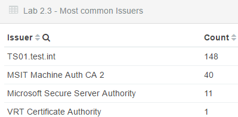

Click on **TS01.test.int** in the **Lab 2.3 - Most common Issuers** visualization and add it as a search filter. Then turn it into an exclude filter by hovering over it and clicking on the magnifying glass with the minus sign.


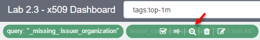

Now there are only **52** events left. Look at the first couple event shows **Microsoft Secure Server Authority** is for legitimate Microsoft domains.

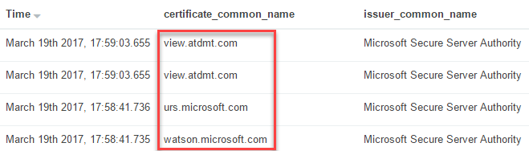

Filter **Microsoft Secure Server Authority** out by clicking on it in the **Lab 2.3 – Most common Issuers** visualization and then click on the magnifying glass to exclude it.


This narrows the events down to **41**. Yet looking at the first four x509 events within the saved search shows they are all for legitimate domains. The domain **intel.api.sourcefire.com** is used by SourceFire appliances, **bing.com** is Microsoft's search engine, and **live.com** is another of Microsoft's domains. This means both **VRT Certificate Authority** and **MSIT Machine Auth CA 2** can be filtered leaving **0** events.

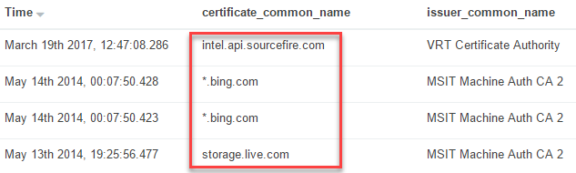

**Answer for 1a**: **200** events exist that are tagged with **top-1m** and are missing the **issuer\_organization** field. Some simple filtering and analysis shows **0** of these are malicious.

Next find out how many events are missing the **issuer\_organization** field that are not tagged with **top-1m**. To do this remove all filters except the **query:"\_missing\_:issuer\_organization"** filter by hovering over each of them and clicking on the garbage can icon. Leave **query:"\_missing\_:issuer\_organization"** applied as a filter.

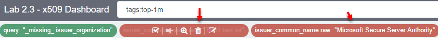

Next change **tags:top-1m** to **-tags:top-1m**.

```bash
-tags:top-1m
```

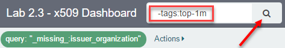

This shows that there are **35,224** events that are not tagged with **top-1m** that are missing the **issuer\_organization** field. The question states to ignore anything related to **test.int**. To do this edit the search to include **-"test.int"**. This will exclude x509 events related to the internal domain **test.int**.

```bash
-tags:top-1m -"test.int"
```


**Note**: There is a space between **-tags:top-1m** and **-"test.int"**.

This limits the number of events to **6,369**. Looking at the **Lab 2.3 - Most common Issuers** visualization shows there are three issuers with high counts. In this instance a high count likely means benign. Click on **VMware** and then look at the logs.


The resulting logs show the full certificate\_issuer of these logs is as below:


Given the high count of these logs and the layout of the issue this is likely a self-signed certificate used by a VMware product. However, this should be confirmed with other logs.

**Note**: This lab focuses solely on x509 certificate logs from Bro. If you were to investigate these VMware events, they would be for a self-signed default certificate that is non-malicious.

Switch the **issuer\_common\_name.raw:"VMware"** to an exclude filter by hovering over it and clicking on the magnifying glass with the minus sign.


This brings the count down to **4,163**. The current highest Issuer is **test-PKI01-CA**. Click on it and then investigate some of its logs.

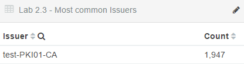

The resulting logs show this is a certificate authority for the domain test.int. You can find this by looking at any of the logs for this issuer in the saved search. Expand one of the events and look at the **certificate\_issuer** field. It ends in **DC=test,DC=int** which is the **LDAP** syntax for the domain **test.int**.

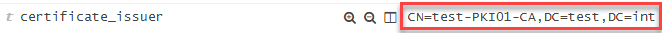

Change the search filter for **issuer\_common\_name.raw:"test-PKI01-CA"** to an exclusion by hovering over it and clicking on the magnifying glass with the minus sign.


At this point you should still have **2,216** events. The last remaining Issuer with a count over a hundred is **IOS-Self-Signed-Certificate-3389677184**. Filter on this by clicking on it.

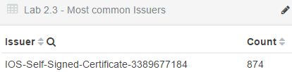

Analyzing the first log shows the issuer and common name are the same. This indicates that it truly is a self-signed certificate. However, the other fields do not pinpoint whether this is benign or malicious. An investigation into this would show it came from an internal Ipad device and is benign.

Once more change the recent filter to an exclusion event by hovering over it and clicking on the magnifying glass with a minus sign.


There are **1,342** events remaining. These have low counts and look suspicious. This means there are **1,342** events that would need investigated. The reason for so many suspicious events is these logs come from malicious packet captures used for research purposes.

**Answer**: There are **35,224** events that are not tagged with **top-1m** and are missing the **issuer\_organization** field. After filtering out items related to **test.int** there are **4,422**. If you filter out **VMware** and **IOS** related issuers than the count is **1,342**.

2. Identify how many x509 events are for certificates that are valid for more than 2000 days
---------

Remove the previous search filters by clicking on the **Load Saved Dashboard** icon and clicking on **Lab 2.3 - x509 Dashboard**.


To find x509 events that are for certificates that are valid for more than **2000** days, search for **certificate\_number\_days\_valid:&gt;2000**.

```bash
certificate_number_days_valid:>2000
```


There are **4,078** results from this search but only five issuers are present. The **IOS-Self-Signed-Certificate-3389677184** was deemed benign in step 1. This leaves four to investigate. Start by clicking on the issuer called **support**.

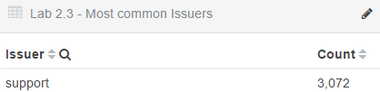

Expand the first log and look at the **certificate\_organization** and **certification\_organization\_unit** fields.


These are associated with Fortinet which is the internal firewall. Change the **issuer\_common\_name.raw:"support"** field to an exclusion.


Next click on the **Primary Certificate Authority (2009)** issuer.

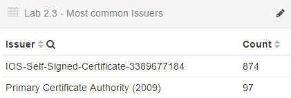**

Notice in the **Lab 2.3 - Frequency Score of Common Name** that the only domain found is for **\*.nccp.netflix.com**. Since this is for Netflix it is likely benign.


Change the **issuer\_common\_name.raw:"Primary Certificate Authority (2009)"** field to an exclusion.


The only two issuers left to investigate are **web** and **kin.pgsox.cc**. First, click on web.


Look at any of the logs and you will discover that both the **certificate\_issuer** and **certificate\_subject** are the same. This means this is a self-signed certificate. Looking at either of these fields shows that the certificate is very generic. Likely this is either the default settings for a program that generates certificates or is used by an adversary using encryption.


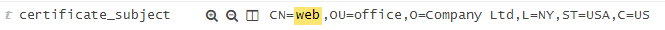

The use of this certificate is unknown. The certificate could be benign but needs additional investigation to find out. Change **issuer\_common\_name.raw:"web"** to an exclusion.


Now click on the remaining issuer of **kin.pgsox.cc**.

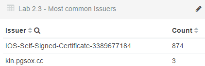

Looking at any of these logs shows multiple pieces of this certificate are wrong. For instance, look at the certificate\_issuer field.


It has each of the standard issuer fields but they all are set to XX. A state of XX is not valid. This means this specific x509 event could be caught with multiple techniques.

**Answer**: There are **4,079** events that have certificates valid for over 2000 days. However, most of these are from legitimate x509 certificates. These are **support**, **IOS-Self-Signed-Certificate-3389677184**, and **Primary Certificate Authority (2009)**. Filtering these out brings the count down to **35**. These events are unknown or malicious and related to **web** and **kin.pgsox.cc**.

3. Identify malicious sites using frequency analysis
---------
Remove the previous search filters by clicking on the **Load Saved Dashboard** icon and clicking on **Lab 2.3 - x509 Dashboard**.


Adversaries often use random names to evade security controls. This provides an opportunity to catch them. When using Mark Bagget's freq\_server.py in conjunction with your SIEM, the lower the frequency score the more likely something is considered random. Start by searching for any common name that has a frequency score below 5. Do this by searching for **"certificate\_common\_name\_frequency\_score:&lt;5"**.

```bash
certificate_common_name_frequency_score:<5
```


This search reveals that there are **1,141** events with a **certificate\_common\_name\_frequency\_score** below **5**. To find out how many of these are tagged with **top-1m** change the search filter to " **certificate\_common\_name\_frequency\_score:&lt;5 AND tags:top-1m".

```bash
certificate_common_name_frequency_score:<5 AND tags:top-1m
```


Now there are only **123** events. From glancing at the common names in the **Lab 2.3 - Frequency Score of Common Name** visualization it seems that most of these are domains that are small in length. Unfortunately, frequency analysis sometimes does not fit well with short strings. Fortunately, almost all small domain names have been purchased. Update your search so that it only includes items with a length over 16 characters by changing it to " **certificate\_common\_name\_frequency\_score:&lt;5 AND tags:top-1m AND certificate\_common\_name\_length:&gt;16".

```bash
certificate_common_name_frequency_score:<5 AND tags:top-1m AND certificate_common_name_length:>16
```


Now there are only **4** events matching. This is a manageable list of domains to investigate. However, being **top-1m** sites means you typically can filter them out anyway. But what would the same search look like for sites that were not tagged with **top-1m**? To do this simply add a minus sign in front of tags:top-1m. Your search should be " **certificate\_common\_name\_frequency\_score:&lt;5 AND -tags:top-1m AND certificate\_common\_name\_length:&gt;16".

```bash
certificate_common_name_frequency_score:<5 AND -tags:top-1m AND certificate_common_name_length:>16
```


This search results in **933** events.

**Answer**: There are a total of **1,141** events where the **certificate\_common\_name\_frequency\_score** is below **5**. Of these events, **1018** are from certificates that are not tagged with **top-1m** and **123** are tagged with **top-1m**. Further breaking these down, there were **933** out of the **1,018** none **top-1m** events that had a **certificate\_common\_name\_length** greater than **16. top-1m** tagged events only contained 4 events with a **certificate\_common\_name\_length** greater than **16**.

**Note**: There is a large amount of random generated names with a length over sixteen characters. This is for two reasons. The first is to avoid antivirus. A short string is easier to catch and write a signature for. The other reason is that most short domains have been purchased. This lab was designed to show this by comparing the top 1 million sites against previously captured malware traffic.

4. Find out which two sites have an invalid US issuer\_state field.
---------
The **issuer\_state** field may include abbreviated state names or full state names. Therefore, there are 100 possible combinations within the United States. To identify invalid US based state fields copy this search and enter it in the search bar and click search.

```bash
_exists_:issuer_state AND issuer_country_code:US -issuer_state:"AL" -issuer_state:"AK" -issuer_state:"AZ" -issuer_state:"AR" -issuer_state:"CA" -issuer_state:"CO" -issuer_state:"CT" -issuer_state:"DE" -issuer_state:"FL" -issuer_state:"GA" -issuer_state:"HI" -issuer_state:"ID" -issuer_state:"IL" -issuer_state:"IN" -issuer_state:"IA" -issuer_state:"KS" -issuer_state:"KY" -issuer_state:"LA" -issuer_state:"ME" -issuer_state:"MD" -issuer_state:"MA" -issuer_state:"MI" -issuer_state:"MN" -issuer_state:"MS" -issuer_state:"MO" -issuer_state:"MT" -issuer_state:"NE" -issuer_state:"NV" -issuer_state:"NH" -issuer_state:"NJ" -issuer_state:"NM" -issuer_state:"NY" -issuer_state:"NC" -issuer_state:"ND" -issuer_state:"OH" -issuer_state:"OK" -issuer_state:"OR" -issuer_state:"PA" -issuer_state:"RI" -issuer_state:"SC" -issuer_state:"SD" -issuer_state:"TN" -issuer_state:"TX" -issuer_state:"UT" -issuer_state:"VT" -issuer_state:"VA" -issuer_state:"WA" -issuer_state:"WV" -issuer_state:"WI" -issuer_state:"WY" -issuer_state:"Alabama" -issuer_state:"Alaska" -issuer_state:"Arizona" -issuer_state:"Arkansas" -issuer_state:"California" -issuer_state:"Colorado" -issuer_state:"Connecticut" -issuer_state:"Delaware" -issuer_state:"Florida" -issuer_state:"Georgia" -issuer_state:"Hawaii" -issuer_state:"Idaho" -issuer_state:"Illinois" -issuer_state:"Indiana" -issuer_state:"Iowa" -issuer_state:"Kansas" -issuer_state:"Kentucky" -issuer_state:"Louisiana" -issuer_state:"Maine" -issuer_state:"Maryland" -issuer_state:"Massachusetts" -issuer_state:"Michigan" -issuer_state:"Minnesota" -issuer_state:"Mississippi" -issuer_state:"Missouri" -issuer_state:"Montana" -issuer_state:"Nebraska" -issuer_state:"Nevada" -issuer_state:"New Hampshire" -issuer_state:"New Jersey" -issuer_state:"New Mexico" -issuer_state:"New York" -issuer_state:"North Carolina" -issuer_state:"North Dakota" -issuer_state:"Ohio" -issuer_state:"Oklahoma" -issuer_state:"Oregon" -issuer_state:"Pennsylvania" -issuer_state:"Rhode Island" -issuer_state:"South Carolina" -issuer_state:"South Dakota" -issuer_state:"Tennessee" -issuer_state:"Texas" -issuer_state:"Utah" -issuer_state:"Vermont" -issuer_state:"Virginia" -issuer_state:"Washington" -issuer_state:"West Virginia" -issuer_state:"Wisconsin" -issuer_state:"Wyoming"
```


Answer**: **Common Name (eg| YOUR name)** and **web** are the two sites with an invalid **issuer\_state** field. A likely hypothesis is that these were default settings for a program used to create certificates.

Bonus Challenge 1 – Issuer Whitelisting
=======================================

Certificates and trust relationships are a central part of the internet. Because of this it is important to know which certificate issuers are in use.

1.  Can you identify two high fidelity techniques that can help identify valid issuers?

2.  How could you use the results of these techniques to implement a whitelist check against issuers?


