Lab 3.1 - Windows Log Filtering
==========================================================


Objectives
==========

-   Build a dashboard for searching Windows events

-   Develop a process for filtering out noise

-   Understand what to look for and how to filter out logs

-   Identify tags that can greatly aid in searching and/or filtering

Exercise Preparation
====================

Log into the Sec-555 VM

-   Username: student

-   Password: sec555


Open http://localhost:5601/app/kibana


In Kibana click on the drop down for index selection and select **lab3.1-complete**


This lab deals with events that occurred on April 13<sup>th</sup>, 2017. To perform this lab, you need to filter down to a specific time. To do this click on the time picker and set **From** to **2017-04-13 11:11:58.534** and **To** to **2017-04-13 13:42:10.472**. Then click on **Go**

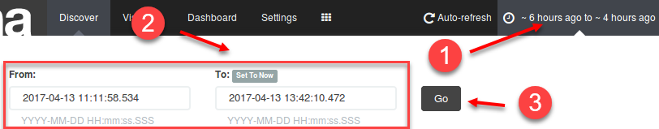

Exercise: No hints
==================

1.  What is the most frequent **event\_id**?

2.  Filter out Windows firewall events. Then find out what are the top two **event\_id** values remaining that are from the **channel** with the MOST events.

3.  Sysmon is installed on the systems from this lab. However, it is generating too many logs. Find common locations such as C:\\Program Files that standard users should not have access to and filter them out.

    -   How many logs are remaining?

    -   What percentage of logs would this eliminate?

    -   Where should this type of filtering be done?

4.  Many logon events (Event ID **4624**) are not for actual end users. Filter these out.

    -   How many logon events are remaining?

    -   If you were to filter these special logons out what percentage of logs would be eliminated?

5.  Extra credit - Look at remaining log channels. Are there any that are unnecessary to collect? This is an open-ended question. There is no right answer for this question. Different organizations have different needs plus risk appetite greatly affects an organization's decision.

Exercise – Step-by-step instructions
====================================

This type of filtering is simplified by first building out an interactive dashboard. A dashboard helps identify areas that could use filtering. First, build out visualizations and add them to a dashboard. Letters will be used to identify the step you are on. If you are having trouble reference the pre-built visualizations, search, or dashboard identified in the **Dashboard called Lab 3.1 H - Windows Event Dashboard**. This dashboard and its corresponding visualizations are saved with the same letter as the step you are on.

A. Top 5 Windows Event ID chart
---------

**Note:** This is useful for finding the most common Windows Event IDs. Often this will point out events that generate a lot of noise and may not be necessary.

Switch to the **Visualize** tab and click on **Pie chart**

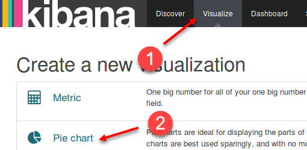

Select **from a new search** and click on **lab3.1-complete**

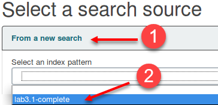

Click on **Split Slices** and then set **Aggregation** to **Terms**. Select **event\_id** for the **Field** and enter **Event ID** as the **CustomLabel**. Finally, click on the green play button.

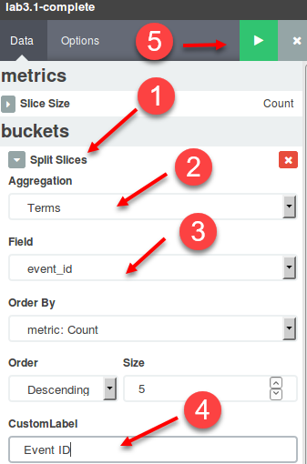

Click on the save icon and name the visualization "**Windows Top Event IDs**" and click **Save**.


B. Top 8 Windows users chart
---------
**Note**: This visualization is helpful for finding user accounts which are generating a lot of events. Accounts generating a lot of events could be malicious in nature or related to normal service account events.

First, click on the new visualization icon. Then select **Vertical Bar Chart**. Select **From a new search** and select the **lab3.1-complete** index.

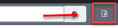


Click on **X-Axis** and set the **Aggregation** to **Terms**, the **Field** to **user**, the **Size** to **8**, and **CustomLabel** to **User**. Then click on the green play button.

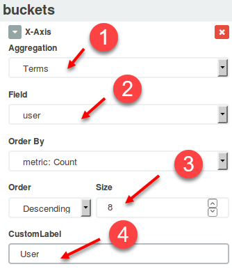

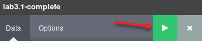

Click on the save icon and name the visualization "**Windows Logs by User**". Then click **Save**.

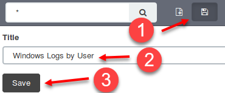

C. Top 5 Windows channels chart
---------
**Note**: This is helpful to breakdown Windows events. Logs are stored in channels, and sometimes there are entire channels that are not intended to be collected centrally or provide little to no value.

First, click on the new visualization icon. Then select **Line Chart**. Select **From a new search** and select the **lab3.1-complete** index.


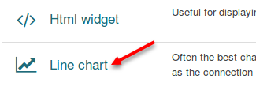


Set the **X-Axis** to **Date Histogram**. Leave the remaining settings as default and then click on **Add-sub-buckets**.

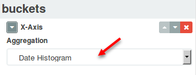

Select **Split Lines** and then set **Sub Aggregation** to **Terms**, **Field** to **channel.raw**, and **CustomLabel** to **Channel**. Then click on the green play button.


Then click on the save icon and name the visualization "**Windows Events by Channel**". Then click **Save**.

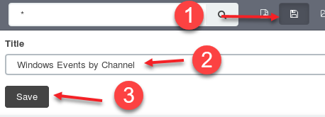

D. Top 10 Windows source_name table
---------
**Note**: This is helpful to breakdown Windows events. This provides the same functionality as **channel** but provides a more descriptive name.

First, click on the new visualization icon. Then select **Data Table**. Select **From a new search** and select the **lab3.1-complete** index.


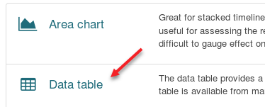


Select **Split Rows**. Then set **Aggregation** to **Terms**, **Field** to **source\_name.raw**, **Size** to **10** and **CustomLabel** to **Source Name**. Then click on the green play button.


Then click on the save icon and name the visualization "**Windows Events by Source Name**". Then click **Save**.


E. Top 10 Windows categories table
---------
**Note**: This is helpful as it breaks Windows events down into categories. Each channel can have logs of multiple categories. For example, the Security channel has categories such as Filtering Platform Connection, which is for Windows firewall events, and also other categories like Logon, which stores logon events.

First, click on the new visualization icon. Then select **Data Table**. Select **From a new search** and select the **lab3.1-complete** index.


Select **Split Rows**. Then set **Aggregation** to **Terms**, **Field** to **category.raw**, **Size** to **10** and **CustomLabel** to **Category**. Then click on the green play button.


Then click on the save icon and name the visualization "**Windows Events by Category**". Then click **Save**.

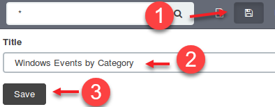

F. Total count of events metric
---------
**Note**: This will be helpful to identify how many logs are being filtered. This ultimately helps decide if something is worth the time it takes to filter it out.

First, click on the new visualization icon. Then select **Metric**. Select **From a new search** and select the **lab3.1-complete** index.


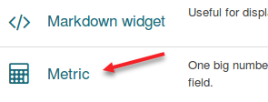


The default metric settings are to show a count for all logs. This is what you want. Click on the save icon and name the visualization "**Total Logs**". Then click **Save**.

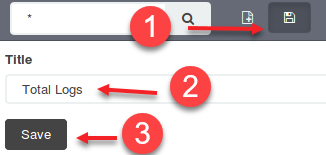

G. Create a  windows saved search
---------
**Note**: This is helpful to look at exactly what events are left after filters are applied or to find out more information on specific events.


Click on the save icon and name the search "**Windows Events**". Then click **Save**.


H. Create a Windows dashboard
---------

Switch to the **Dashboard** tab.


Click on the **New Dashboard** icon and then **Add Visualization** icon.

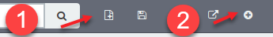

Click on the visualizations to add them. Add them in this order:
**- Windows Top Event IDs
- Windows Logs by User
- Total Logs
- Windows Events by Channel
- Windows Events by Source Name
- Windows Event by Category**

Then click on the **Searches** tab and add the saved search called **Windows Events**.


Rearrange the visualizations as you see fit. When you are done, you should have something that looks like below. Depending on the resolution of your screen it may not be possible to make it look exactly like this.


Sometimes the legend is not necessary and can be collapsed. This can be done by clicking on the **&lt;** or **&gt;** icons near the legend such as the one the arrow in this image is pointing to.

Save the dashboard by clicking on the save icon. Name the dashboard "**Windows Event Dashboard**" and click **Save**.


Now that your dashboard is created it is time to analyze the Windows events to find out what events can be filtered out.

1. Start by looking for the highest volume event\_id
---------
Looking at the **Windows Top Event IDs** shows that Event ID **5156** is clearly the highest volume event.

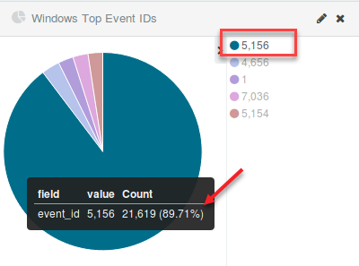

**Answer**: Event ID **5156** is the highest volume Event ID.

Click on either **5156** in the legend or the slice of the pie chart that has the largest amount. This will apply it as a filter.

Looking at the **Windows Events by Category** table shows that this Event ID is related to Windows Firewall.


Scrolling down to the saved search area and expand the first log shows that not only is it related to Windows Firewall events but specifically it is for an allowed connection. Ironically most of these logs are from NXLog, which is the log agent collecting logs and shipping them off. This can cause a log loop as the log agent will collect this Firewall log and then turn around and ship it off which then causes a new firewall log to be cut. Either Windows Firewall allowed connection logs need disabled or tuned.

**Note**: Logging allowed connections with Windows Firewall can be disabled with group policy. Alternatively, NXLog could be configured to collect these events but ignore any with an Application Name containing nxlog.

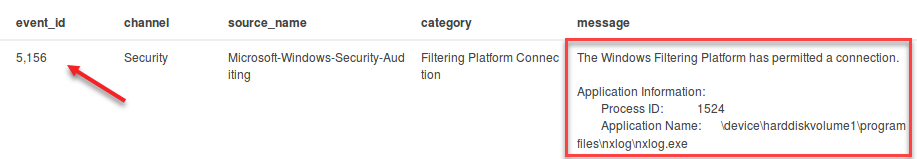

The assumption at this point is these allowed connections will later be tuned or filtered. Now on to find what else can be filtered. On the search bar flip the filter of **event\_id:5156** to an exclude by hovering over it and clicking on the magnifying glass with a **minus** sign.


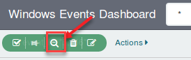

After excluding Event ID **5156** the **Windows Events by Category** still shows a decent amount of Windows Firewall related events. Go ahead and click on **Filtering Platform Connection** to see what these are.

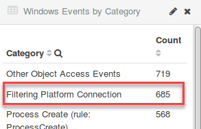

Three Event IDs outside of **5156** are found that are related to Windows Firewall. Look at each of these by clicking on them in the pie chart. Go from largest to smallest. Start by clicking on **5154**.


After this new search filter is applied scroll down and look at the logs. The first log shows:

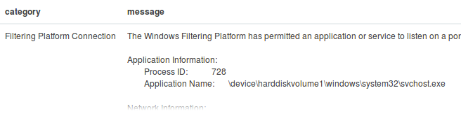

Event ID **5154** corresponds to the Windows Firewall allowing a process to listen on a network port. These should be filtered entirely or tuned to only look for new processes. Change the filter for **5154** to an exclusion by hovering over it and clicking on the **magnifying glass**.

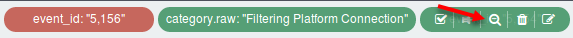

Two events are now left that are related to the Windows Firewall. They are **5158** and **5157**. You can either narrow down to each event like you did for event **5154** or you can simply scroll to the bottom and look at the logs. You should quickly see Event ID **5158** followed by **5157**.

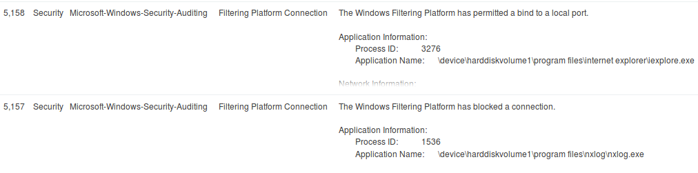

Event ID **5158** relates to the Windows Firewall allowing an application to bind to a local port. Again, this is an event that either needs filtered out entirely or tuned to ignore most applications.

**Note**: Binding to a local port is not the same as listening. For example, the log above pertains to Internet Explorer binding to a local port to access a web server. Internet Explorer is using an ephermal port on 64855 and is not listening for connections.

Event ID **5157** relates to Windows Firewall blocking a connection. In this case, it shows it blocked nxlog.exe which is the log agent. This is a misconfiguration on the system administrator's part. While logs could still be received nxlog.exe was being denied from making a local connection. Event ID **5157** is something you want to monitor but filtering is still important. This could be done by changing system configurations or filtering out specific applications.

So at this point you have identified that all **Filtering Platform Connection** events need some level of filtering.

2. Now find the top two Event IDs that remain after excluding the Filtering Platform Connection events
---------
Switch the **Filtering Platform Connection** to an exclude filter by hovering over it and clicking on the magnifying glass. Then remove all other filters by hovering over them and clicking on the trash can icon. Your search filter should now look like this:

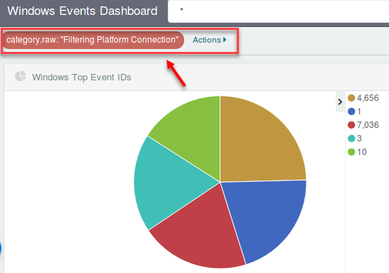

**Answer**: The top two remaining Event IDs are **4656** and **1**.

A drilldown on Event ID **4656** shows that it is related to object access.

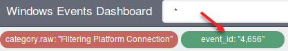


This is verbose data that likely provides little value. It is something that could be filtered out at an aggregator, an agent, or could be disabled by adjusting the audit policy using group policy.

Filtering out Event ID **4656** and then click on Event ID **1**. To do this hover over **event\_id:"4656"** and click on the magnifying glass with a minus sign in it. Then click on the largest **event\_id** field in the pie chart which is for Event ID **1**.

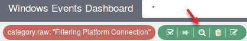


The end search filter should look like this:


Scroll to the bottom and look at the logs. The first log looks like this:


This is a Sysmon process creation event. This is used to log details about each process that is started. This can be rather verbose. Multiple options exist to limit these logs. Probably the best method is to configure Sysmon to limit what it logs. This minimizes resource usage on the end system as well as how much logs are sent over the network. Alternatively, logs could be filtered at a log agent or an aggregator. However, if you are going to take the time to change log agent settings on thousands of machines it makes more sense to change Sysmon instead. However, being able to quickly filter things out at an aggregator may make sense especially during the interim where Sysmon settings are being updated.

3. Identify methods to minimize Sysmon logs
---------
Since Event ID is part of the **Microsoft-Windows-Sysmon source\_name** filter in on it. To do this click on **Microsoft-Windows-Sysmon** under **Windows Events by Source Name** and remove the **event\_id:"1"** filter.

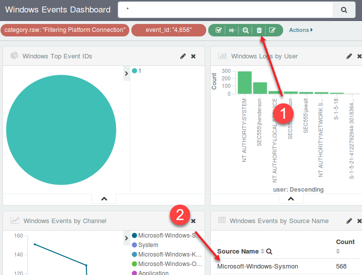

Filtering on **Microsoft-Windows-Sysmon source\_name** shows multiple categories.

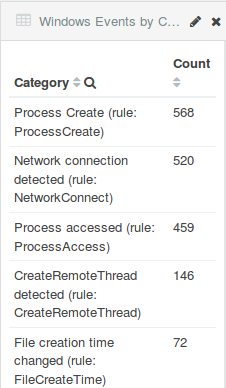

These events can be overly verbose. If you are trying to minimalize events while remaining tactical special filtering will need applied. For example, typically processes created from **C:\\Program Files, C:\\Program Files (x86)**, and **C:\\Windows\\System32** are benign. This is because binaries typically cannot be saved to these locations without Administrator access. While this is not always true it is a good start for organizations not previously gathering Sysmon.

In the search bar filter out events related to these folders by using this filter:

```bash
-image:"C:\\Program Files\\*" -image:"C:\\Program Files (x86)\\*" -image:"C:\\Windows\\System32\\*" -sourceimage:"C:\\Windows\\system32\\*"  -currentdirectory:"C:\\Windows\\system32\\*"
```

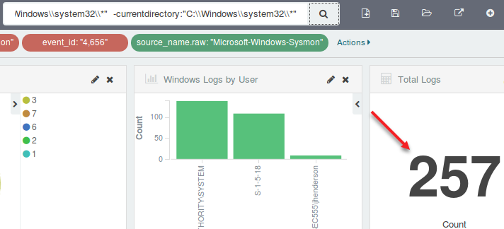

**This simple filter eliminates a majority of these logs.**

Note: This search filters on three fields: **image**, **sourceimage**, and **currentdirectory**. Also, note this will filter out things you may want such as use of cscript.exe, wscript.exe, cmd.exe, and powershell.exe. However, this filter is not to exclude these but to roughly show how many logs can be filtered out. Again, exclusions for Sysmon are best performed with Sysmon. The folders above could be filtered out except for command line or script utilities or any other potentially dangerous executables.

**Answer**: By filtering out processes started in directories such as **C:\\Program Files**, **C:\\Program Files (x86)**, and **C:\\Windows\\System32** that require Administrative access to add new binaries the event count has been reduced from **1,852** down to **257**. This is an **86.1%** reduction in logs.

**Extra Note:** If you were to continue filtering out logs and wanted to find items that were not **category.raw:"Windows Filtering Platform"**, **event\_id:"4656"**, or **source\_name.raw:"Microsoft-Windows-Sysmon"** that were from the directories above you would have to change the filtering. To do this you would need to remove the **source\_name.raw** filter and move it to the search bar. The search in the search bar would then need to be updated to reflect the below search. This is because you do not want to accidently eliminate other Event IDs that may reference these folder structures using the same field names.

```bash
-(source_name.raw:"Microsoft-Windows-Sysmon" AND (image:"C:\\Program Files\\*" OR image:"C:\\Program Files (x86)\\*" OR image:"C:\\Windows\\System32\\*" OR sourceimage:"C:\\Windows\\system32\\*"  OR currentdirectory:"C:\\Windows\\system32\\*"))
```

This would exclude only Sysmon events that match the folder criteria previously mentioned.

4. Next, filter out user accounts that are not standard users
---------
Most Windows logons are not actually tied to a standard user. For example, computer accounts show up as the computer name followed by a dollar sign like IT01$. Logons associated with computer accounts or built in service accounts such as Local Service tend to be high volume and low value.

Begin by finding the number of events that have a **user** field. First, remove all previous filters by clicking on **Actions** and then **Remove**.


Now search for "**event\_id:4624**" to find all logon related events.

```bash
event_id:4624
```


The total is **382**. Update the search to be "**event\_id:4624 -tags:machine**". This will eliminate all logs that are from a computer being used as the **user** account.

```bash
event_id:4624 -tags:machine
```


This reduces the total events from **382** to **139**. However, looking at the **Windows Logs by User** bar chart shows that there are multiple service accounts in use.


Filter out service accounts by changing the search to "**event\_id:4624 -tags:machine -tags:service\_account**".

```bash
event_id:4624 -tags:machine -tags:service_account
```


This further reduces the total count to **58**.

**Note**: In this example the tag **service\_account** includes SYSTEM. While many of the built-in service accounts are likely noise you may still want to log events associated with SYSTEM. This is because SYSTEM has more access than even a domain administrator or enterprise administrator on a local computer.

Looking at the remaining accounts on the Windows Logs by User graph shows that there are multiple events associated with ANONYMOUS LOGON. In most environments, this ends up being noise.

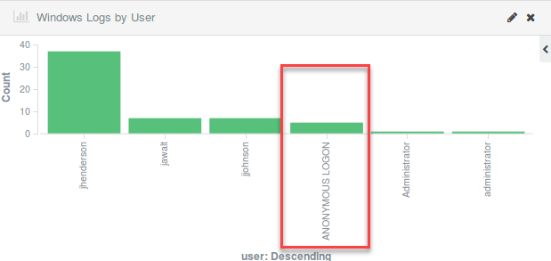

Click on **ANONYMOUS LOGON** and then change the search filter to an exclusion by clicking on the magnifying glass icon after hovering over **user:"ANONYMOUS LOGON"**.


After filtering out computer accounts, service accounts, and anonymous logons there are **53** remaining events.

**Answer**: **53** logs remain which is an **86.1%** reduction.

5. Identify other log channels that may not be necessary to collect
---------
On the Dashboard tab click on the Load Saved Dashboard icon.

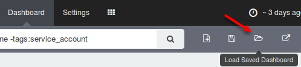

Select **Lab 3.1 H with Filters (extra) – Windows Event Dashboard with Filters Applied**


This will load a saved dashboard that contains the aggregate filter of steps 1 – 4. Notice the number of events is down to **4,078** from **29,020**, which is an **85.9%** reduction in events. Yet more could be filtered out. How much more gets filtered depends on your level of acceptance. For example, this dashboard shows that there are **1,173** remaining Microsoft-Windows-Security-Auditing events. Likely this could be investigated and more could be filtered out.

Consider the data populated in the **Source Name** and **Category** fields below. As you browse through them, think about if the logs are of any value to your organizations. This could be for security or operational purposes. There is no right or wrong. However, if no valid use case comes to mind, then likely you can eliminate the log.

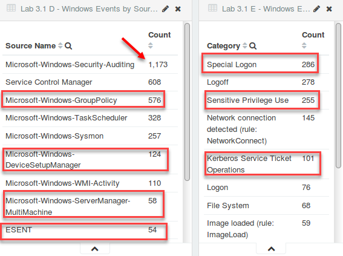

Bonus Challenge 1 – Not quite parsed…
=====================================

Look at logs from Event ID **5860**. Is there an easy way to parse the **message** or **userdata** field to extract the additional fields inside it?

-   How could this be done on the **message** field?

-   How could this be done on the **userdata** field?

Bonus Challenge 2 – Find the policy breach
==========================================

One of the IT staff has broken policy. The policy reads "The built-in domain administrator is never to be used to run tasks on client systems." Find the policy breach.

-   Which **client system** was this account used on?

-   Which **user** violated the policy?


