Lab 3.2 - Catching Evil with Windows Logs
==========================================================

Objectives
==========

-   Understand the value of monitoring Windows logs (even on desktops)

-   Understand common adversary tactics

-   Gain knowledge in investigating alerts

-   Become familiar with how Windows logs and uses user accounts

-   Find evidence of malice in standard Windows logs

Exercise Preparation
====================

Log into the Sec-555 VM

-   Username: student

-   Password: sec555


Open http://localhost:5601/app/kibana


In Kibana click on the drop down for index selection and select **lab3.2-complete**


Lab 3.2 will use a pre-built dashboard. To use it click on the **Dashboard** tab. Then click on the **Load Saved Dashboard** icon. In the **Dashboard** filter type **3.2**. Then click on **Lab 3.2 - Windows Events to Monitor.** This will load the dashboard built for this lab and will also adjust the date/time so that it is set properly for this lab.

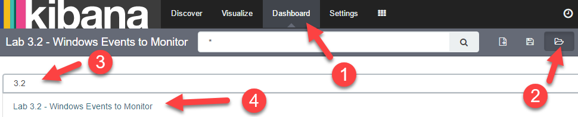

Exercise: No hints
==================

1.  There are **four** unique Security Identifiers (SIDs) on the dashboard. Find out which user account each belongs to.

    1.  Which user account is associated with **S-1-5-18**?

    2.  Which user account is associated with **S-1-5-21-4122792944-3018364698-3069667417-1001**?

    3.  Which user account is associated with **S-1-5-21-4122792944-3018364698-3069667417-1115**?

    4.  Which user account is associated with **S-1-5-21-1728717204-2435353077-2302105707-1007**?

2.  Identify which host has been compromised.

    1.  Does the attacker have administrative access?

    2.  Which user was compromised?

3.  The attacker initially did not have administrator level access. He or she used a **named pipe privilege escalation** technique to escalate privileges. What command was used for this attack?

4.  The attacker created a **local administrator account**.

    1.  What is the name of this account?

    2.  What evidence shows this account was created by the attacker?

Exercise – Step-by-step instructions
====================================

This type of filtering can be simplified by first building out an interactive dashboard. A dashboard helps identify areas

1. Find out which user belongs to each of the SIDs in the Lab 3.2 - Windows Events to Monitor dashboard
---------

**Note**: Depending on your log agent these SIDs may or may not automatically translate. For this lab, the community edition of NXLog was used. It does not natively translate SID to user accounts. For this feature either the commercial agent is necessary or a script needs invoked during log processing to perform the translation.

An easy method to translate a SID to username is to copy the SID and look for a log containing both the SID and the username. Try this by first copying the SID **S-1-5-21-4122792944-3018364698-3069667417-1001** from the **Lab 3.2 - New Service Creation** visualization. When you highlight the field to copy the SID it may also ask if you wish to **Apply a filter**. Click on **Cancel** if it asks you this.


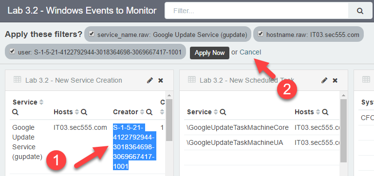

Next, **paste** the SID in the search field and surround it with double quotes. Then click on the **search icon**.

```bash
"S-1-5-21-4122792944-3018364698-3069667417-1001"
```


Look at the first two logs in the saved search. The first one mentions SEC555\\jhenderson and the second one shows both the SID and the jhenderson account.

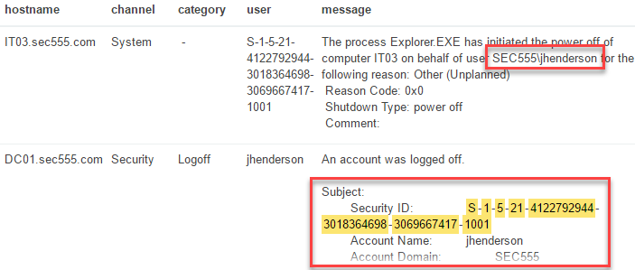

Therefore, **S-1-5-21-4122792944-3018364698-3069667417-1001** is associated with the **SEC555** domain username of **jhenderson**. Now remove the search filter and then click the search icon.


Copy the SID **S-1-5-21-4122792944-3018364698-3069667417-1115** from the **Lab 3.2 - New Service Creation** visualization. When you highlight the field to copy the SID it may also ask if you wish to **Apply a filter**. Click on **Cancel** if it asks you this. **Paste** the SID into the search bar and surround it with double quotes. Then click **search**.

```bash
"S-1-5-21-4122792944-3018364698-3069667417-1115"
```


Look at the first event in the saved search. It shows the SID of **S-1-5-21-4122792944-3018364698-3069667417-1115** is associated with the **SEC555** domain account of **pdodson**. Now remove the search filter and then click the search icon.


This time copy the SID **S-1-5-18** from the **Lab 3.2 - Cleared Logs** visualization.

```bash
"S-1-5-18"
```

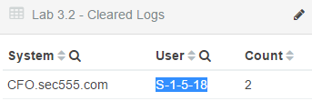

When you highlight the field to copy the SID it may also ask if you wish to **Apply a filter**. Click on **Cancel** if it asks you this. **Paste** the SID into the search bar and surround it with double quotes. Then click **search**.


Look at the fourth event in the saved search. It shows the SID of **S-1-5-18** is associated with the **SEC555** domain account of **DC01$**. However, **DC01$** is not a user account. It is a computer account.**

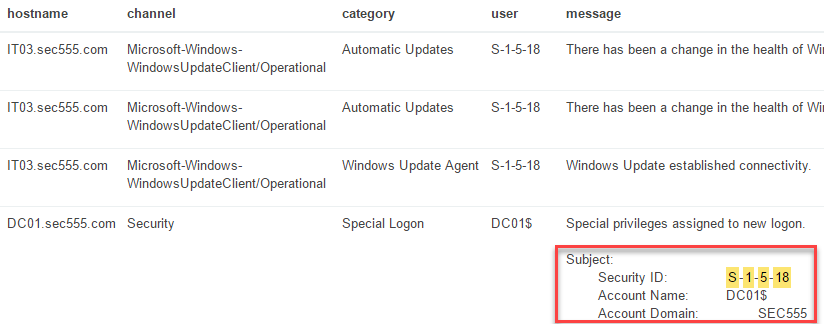

If you were to expand the first log and look at the **domain,** it states **NT AUTHORITY**. However, the **user** field specifies the SID of **S-1-5-18**. What is going on? The **S-1-5-18** SID is for the built-in **SYSTEM** account on all Windows operating systems. It is the account with the highest privileges on a local system. Therefore, you see it across multiple computers. The reason it shows up on **DC01.sec555.com** with a domain of **SEC555** is that domain controllers do not use a local account Security Accounts Manager (SAM) database. Yet **SYSTEM** still exists on domain controllers.

Now remove the search filter and then click the search icon.


Copy the SID **S-1-5-21-1728717204-2435353077-2302105707-1007** from the **Lab 3.2 - Member Added to Local Group** visualization.

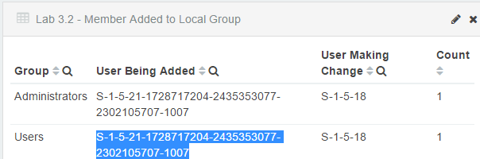

When you highlight the field to copy the SID it may also ask if you wish to **Apply a filter**. Click on **Cancel** if it asks you this. **Paste** the SID into the search bar and surround it with double quotes. Then click **search**.

```bash
"S-1-5-21-1728717204-2435353077-2302105707-1007"
```


Look at the third event in the saved search. It shows the SID of **S-1-5-21-1728717204-2435353077-2302105707-1007** is associated with the CFO account domain and the username of **HelpDesk31337**.


**Note**: The account domain of CFO is not actually for an Active Directory domain. It simply means the local computer. You can tell this if the account domain matches the computer name.

**Answer**: The SID to username mappings are below:
S-1-5-21-4122792944-3018364698-3069667417-1001 SEC555\\jhenderson
S-1-5-21-4122792944-3018364698-3069667417-1115 SEC555\\pdodson
S-1-5-18 NT AUTHORITY\\SYSTEM
S-1-5-21-1728717204-2435353077-2302105707-1007 CFO\\HelpDesk31337

Now remove the search filter and then click the search icon.


2. Identify which host has been compromised
---------
Analyze the data on the dashboard to answer this question. Looking at the pie chart shows that two machines have events of interest. These are CFO.sec555.com and IT03.sec555.com.


**IT03.sec555.com** is the smaller inner slice. Hovering over the outer pieces attached to the slice shows it has events for **New Service Creation** and **New Scheduled Task**.

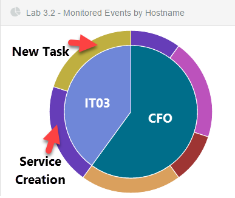

These correspond to the events for **IT03.sec555.com** in the **Lab 3.2 - New Service Creation** and **Lab 3.2 New Schedule Task** visualizations. These events are related to Google Update. While technically malware could mimic these service names or task names it is uncommon. Also, if you were to investigate these events all would correspond to executables in **C:\\Program Files\\Google**. Most likely these are related to an installation of a **Google** product such as **Google Chrome** and should be filtered out moving forward.

**Note**: If you want to verify this click on either **Google Update Service (gupdate)** in the **Lab 3.2 - New Service Creation** or **\\GoogleUpdateTaskMachineCore** in the **Lab 3.2 - New Schedule Task** visualizations. Then look at the logs, and you will find they reference an executable in **C:\\Program Files\\Google**.

Looking back at the pie chart shows the **CFO** computer has events related to logs being cleared, a new local user being created, a member being added to a local group, and new service creation. These events are all displayed on different visualizations in the dashboard. The **Lab 3.2 - Cleared Logs** shows that the **SYSTEM** account was used to clear logs.


First off, clearing logs is an abnormal event although occasionally someone, such as an IT staff member, may manually clear the logs. However, **SYSTEM** should never be clearing logs. This alone acts as proof that **CFO.sec555.com** is the compromised host. This means that the adversary has full administrative access to **CFO.sec555.com**. The question then is which account initially was compromised. Looking at the **Lab 3.2 - New Service Creation** shows a new service called **hhhrwa** was created by **pdodson**. Likely, this is the user account that was initially compromised.

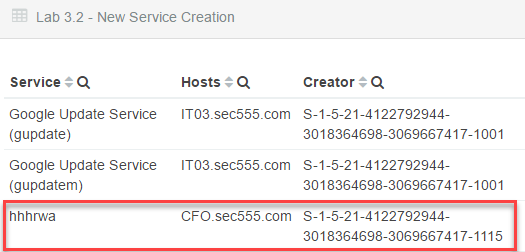

While the service name is odd and suspicious, it is not 100% proof that this is the account that was compromised. One method to verify which account was compromised is to create a quick visualization. Click on the **Visualize** tab. and then click on the **New Visualization** icon.

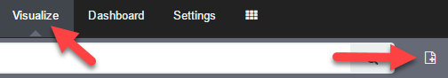

Select **Data table**.


Then click on **From a new search**. Then click on **lab3.2-complete**.

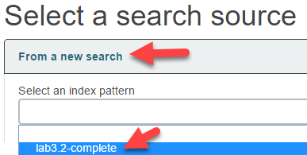

For **bucket type** select **Split Rows**. Then set **Aggregation** to **Terms**, **Field** to **user**, **Size** to **10**, and then click on the green play button.


Because you are only interested in user activity from **CFO.sec555.com** search for **hostname:"CFO.sec555.com" -tags:machine -tags:service\_account**.

```bash
hostname:"CFO.sec555.com" -tags:machine -tags:service_account
```


Because this search is not filtered on specific event IDs it shows the user field for all events. Because of how Windows logs this includes groups as group names are often referenced in the Windows user field. However, looking at the results shows that most events come from the built-in **SYSTEM** account or **pdodson**.

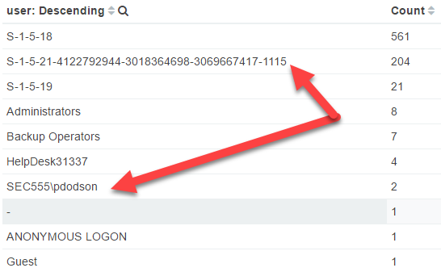

Note: Remember that the SID **S-1-5-21-4122792944-3018364698-3069667417-1115** is the same account as the **SEC555\\pdodson** account. Also, for reference**, S-1-5-19** is the **NT AUTHORITY\\Local Service** built-in account. It is normal to see events from this as well as **SYSTEM**.

This data helps confirm that **pdodson** is most likely the account that was compromised. However, it is possible than a server-side exploit was used and the attacker immediately compromised the host and was **SYSTEM**. Go back to the dashboard by clicking on the **Dashboard** tab and then click on the **hhhrwa** service.


Looking at the first log shows the new service created is for **cmd.exe /c echo hhhrwa &gt; \\\\.\\pipe\\hhhrwa**. This is what is known as a named pipe privilege escalation. This provides strong proof that the initial compromise gave the adversary access with the **pdodson** account.

**Answer**: **CFO.sec555.com** is the compromised system. Evidence shows that the attacker initially had access to the **pdodson** account and then used privilege escalation to successfully gain full administrative access as the **SYSTEM** account.

3. Identify the command used to perform privilege escalation
---------
**Answer**: The last step in step 2 shows that the command involved with a named pipe privilege escalation technique is **cmd.exe /c echo hhhrwa &gt; \\\\.\\pipe\\hhhrwa**

4. What local administrator account did the attacker create?
---------
Looking at the **Lab 3.2 - New Local User(s)** visualization shows only one local account was created on **CFO.sec555.com**. This account was the **HelpDesk31337** account. Also, the **creator** of this local account was **SYSTEM**. This is evidence that the attacker created the local account as **SYSTEM** should not be used to create accounts.


Also, the SID **S-1-5-21-1728717204-2435353077-2302105707-1007** was verified in step 1 as being the **HelpDesk31337** account. This corresponds to the events in the **Lab 3.2 - Member Added to Local Group** visualization. In it the **HelpDesk31337** account is added to the **Administrators** and **Users** group.

**Note**: Creation of local accounts is an abnormal event especially on systems joined to a domain. While it is possible a local account is created to be used as a service account this can be easily combated. The easiest way would be to use a suffix or prefix on all service accounts created such as SVC\_VulnScanner. Another alternative is to use SYSTEM, Local Service, or Network Service as your service account. These are built-in local accounts that can be used to run services or scheduled tasks. SYSTEM and Network Service can even be used for service accounts that need basic access to resources across the network. Also, domain user accounts could be created even if for a single system.

**Answer**: The local account created during the compromise is the **HelpDesk31337** account and it was added to the local **Administrators** group on **CFO.sec555.com**.

Bonus Challenge 1 – Adversary Method of Compromise
==================================================

What executable was used to compromise the system involved with this lab?

Bonus Challenge 2 – Audit Policies
==================================

This lab involved logs from multiple systems. Analyze the events and identify if a consistent audit policy is applied across all systems.
