Lab 3.3 - Logon Monitoring
==========================================================

Objectives
==========

-   Identify normal vs abnormal logon behavior

-   Correlate Windows events to identify

-   Gain knowledge in investigating alerts

-   Become familiar with how Windows logs and uses user accounts

-   Find evidence of malice in standard Windows logs

Exercise Preparation
====================

Log into the Sec-555 VM

-   Username: student

-   Password: sec555


Open http://localhost:5601/app/kibana


In Kibana click on the drop down for index selection and select **lab3.3-complete**


A pre-built dashboard has been created for this lab. To use it click on the **Dashboard** tab. Then click on the **Load Saved Dashboard** icon. In the **Dashboard** filter type **3.3**. Then click on **Lab 3.3 - Logon Dashboard.** This will load the dashboard built for this lab and will also adjust the date/time so that it is set properly for this lab.


Exercise: No hints
==================

1.  Which two user accounts have abnormally large amounts of failed logons?

    1.  Are they user error or malicious?

    2.  What system or system(s) are these failed logon attempts related to?

2.  Which local user account was used successfully for pass-the-hash?

3.  Which two user accounts have a high number of successful logons?

    1.  Are these logons malicious in nature?

    2.  What evidence backs up your hypothesis?

    3.  If an account was used malicious, which systems was it used to access?

4.  The vulnerability scanner service user **SVC\_VulnScan** is being used outside of policy.

    1.  Which computer is it being used from?

    2.  Which computer is it being used to access?

Exercise – Step-by-step instructions
====================================

**Note**: The visualizations built in the **Lab 3.3 - Logon Dashboard** are based on logons that have an impersonation level of **Delegate**. Delegate means the logon has rights both locally and over the network and is associated with a traditional logon. The key to monitoring and investigation Windows logons is understanding how Windows handles logons. You need to understand logon types, authentication types, and impersonation levels. (Optional) Feel free to click the **edit** button on a visualization to see how it is setup.

**README:** Timeframes recorded during the walkthrough are in Central Time. If you change the time zone of the Sec555 virtual machine or are accessing Kibana from your host system, the times will be based on your time zone. Kibana automatically translates UTC time to the time zone of the analyst's machine.

**If you did not read the README above… DO NOT CONTINUE.**

1. Identify and investigate the two user accounts with the largest number of failed logons
---------
If you look at the **Lab 3.3 - Failed Logons visualization** you will see that **lchancello** and **Administrator** are the two accounts with the most failed logons. Also, if you hover over each account you will discover that both are logon failures against **FS01.sec555.com**.


The question is whether these are malicious. Looking at the **Lab 3.3 - Failed Logons over Time** shows that both accounts experienced a rapid number of failed logons within approximately a five-minute period.


Considering that **fs01.sec555.com** is a file server these logon events are *likely* malicious. This is because they happen rapidly over a short period and then stop. If this was caused by a password change and an application attempting to use the previous password, then the failed logons would keep occurring.

**Note**: It is common to have repetitive logon failures due to misconfigured software. However, they typically have a low volume count that constantly repeats itself. This is common for things such as smartphones that connect to Microsoft ActiveSync to check email. When a user changes his or her password, the smartphone will regularly fail to logon to the email system.

The failed logons can be analyzed for more evidence. Click on **lchancello** in the **Lab 3.3 - Failed Logons** visualization. Then click on **Apply Now** for the search filters it adds.

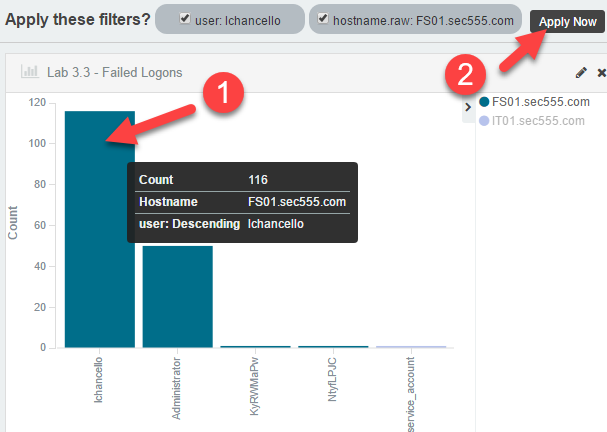

Looking at the message field of the first log shows a successful logon. However, it is a **type 3 network logon** and only grants an impersonation level of **Impersonation**. This could mean that the attacker has successfully brute forced **FS01.sec555.com** or it could mean the user browsed a file server (or a mapped drive). The other items to note are that the **workstation name** field is **empty** and the **authentication type** is **kerberos**.


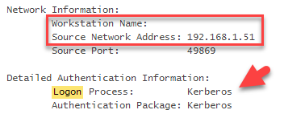

Next, scroll down and look at the **second** log. Looking at the message field, you will see this section:


This log displayed above is one of the failed logons. However, there is what looks to be a **randomly** **generated** **workstation name** and the authentication type is **NTLM** instead of **Kerberos**. This likely means the most recent log that was a successful Kerberos login is not related to the failed logons. Also, the inconsistency and the random workstation name is a strong indicator that the failed logons are from a brute force logon attack. If you were to look at the third log you would see the Workstation Name field is randomly generated per each logon attempt.

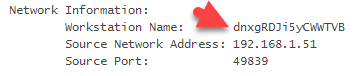

These failed logons are related to **lchancello**. The question now is if the failed logons for **Administrator** are the same. To change the current filter from **lchancello** to **Administrator** hover over the **user:"lchancello"** filter and click on the **edit icon**.


Then change the line **"query": "lchancello"** to **"query":"Administrator"** and click on **Done**.

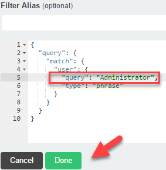

Looking at the first log message shows a failed logon with a randomly generated workstation name using NTLM authentication. Therefore, the Administrator account is also likely being brute forced.


**Answer**: The top two user accounts that are generating failed logon attempts are **lchancello** and **Administrator**. These accounts are being brute forced from **192.168.1.51** against **FS01.sec555.com**. This attack is malicious. The brute force attack occurred between **2:49 and 2:55 PM CST**. There are no successful NTLM logons for these accounts.

Clear your filter by clicking on **Actions** and then clicking on **Remove**.


2. Identify which local user account was used successfully for pass-the-hash
---------
Logons from workstation to workstation using local accounts is almost exclusively malicious in nature. This is an attacker favorite as many organizations have a local administrator account on each box with the same password. This allows for pass-the-hash using the local administrator account to logon to other systems with the same local administrator username and password. To find this search for successful logons not using the Active Directory domain. To do this change the search filter to **tags:logon -target\_domain\_name:SEC555**

```bash
tags:logon -target_domain_name:SEC555
```


Next, look at the **Lab 3.3 Successful Logons** visualization. The only account shown is **Administrator**. The legend shows it was used on **IT01.sec555.com** and **IT02.sec555.com**.

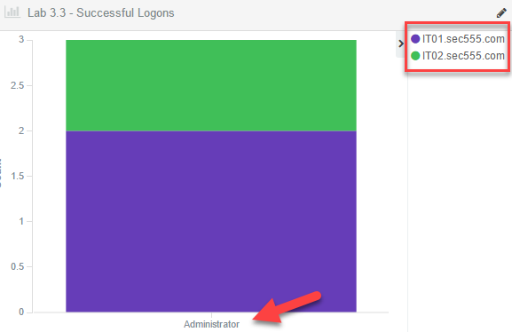

Within the legend, click on **IT01.sec555.com** and then the magnifying glass icon with the **+** sign to apply it as a search filter.

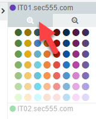

Look at the first log. The log message shows the **Administrator** logon occurred from **192.168.1.51** using NTLM. It also shows a **randomly generated computer name**. This occurred at **3:14 PM CST**. This occurred after the brute force attack in step 1.


Change the search filter of **hostname.raw:"IT01.sec555.com"** to **hostname.raw:"IT02.sec555.com"** by hovering over it and clicking on the **edit icon**. Change the **query** to reflect **IT02.sec555.com** and then click on **Done**.


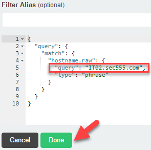

Look at the logon that uses the **Administrator** account on **IT02.sec555.com**. This is the **8<sup>th</sup>** log. Again, it shows a randomly generated workstations name logging in from **192.168.1.51** and uses **NTLM** authentication.

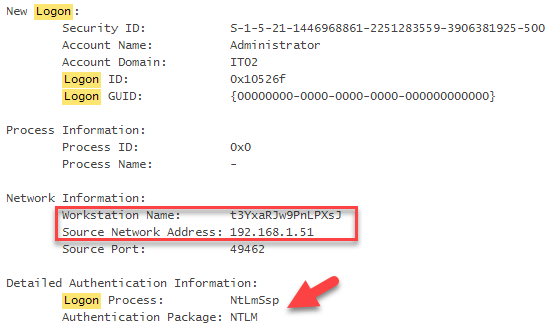

One thing is odd though. The logon time for this was **2:43 PM CST**. This was *before* the brute force attack. A working hypothesis may be that **IT02.sec555.com** did not have credentials or access the attacker wanted.

**Answer**: The local account used successfully for pass-the-hash was the local Administrator account found on **192.168.1.51**. Since this worked, it means that **IT01.sec555.com** and **IT02.sec555.com** have the same local administrator account and password as **192.168.1.51**.

Change the filters back to the default dashboard settings by clicking on the **Load Saved Dashboard** icon and then type **3.3** in the search area. Then click on **Lab 3.3 - Logon Dashboard**.


At this point **192.168.1.51** has shown up multiple times. It may make sense to find out what system this is as it is most likely compromised. To do this change the search filter in the dashboard to **192.168.1.51**.

```bash
192.168.1.51
```


Then look at the first log. It shows that **192.168.1.51** has a hostname of **IT03.sec555.com**.

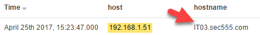

Change the search filter back to the default dashboard filter by settings it back to **(tags:logon OR tags:logon\_failure)** or reload the dashboard**.**

```bash
(tags:logon OR tags:logon_failure)
```


3. Find and investigate the two user accounts with the highest number of successful logons
---------
If you look at the **Lab 3.3 - Successful Logons visualization** you will see that **jhenderson** and **fraynor** are the two accounts with the most successful logons. Hovering over them or looking at the multiple colors shows that each has logged into **at least five** systems.

**Note**: This visualization is limited to the top five systems so it only shows a max of five systems.


Looking at the **Lab 3.3 - Successful Logons over Time** visualization shows the both **jhenderson** and **fraynor** have had spikes in logons although **jhenderson** has had much more.

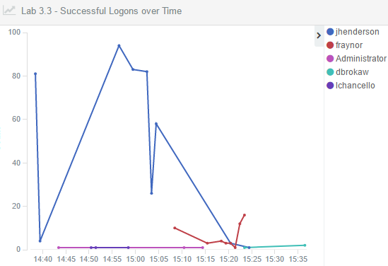

First, investigate **jhenderson** by clicking on **jhenderson** in **the Lab 3.3 - Successful Logons over Time** visualization and then clicking on the magnifying glass with the **+** sign.


The results show the **jhenderson** account logging into multiple systems. When trying to figure out if this is malicious or not it sometimes helps to focus in on a single host. In this case focus in on **DHCP01**. Do this by clicking on **DHCP01.sec555.com** in the **Lab 3.3 - Successful Logons** visualization and then clicking on the magnifying glass with the **+** sign.


**Note**: When dealing with multiple systems you typically want to pick one that is least likely to generate a lot of noise. For instance, domain controllers commonly generate many logs which is why **DC01** or **DC02** were not picked.

Looking at the logs in the saved search shows only logs dealing with logon, log off, or privileges being assigned at logon. This is because the filter is too narrow.


Sometimes Windows uses different field names or only has usernames in the message field. To expand the search to anything dealing with **jhenderson** and **DHCP01** first remove the current search filters by clicking on **Actions** and then clicking on **Remove**.

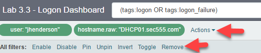

Then change the search filter to **jhenderson AND DHCP01**

```bash
jhenderson AND DHCP01
```


Looking at the **2<sup>nd</sup>** and **3<sup>rd</sup>** logs shows multiple PowerShell related events. Looking at the **13<sup>th</sup>** log shows an event that is taking place on **DC01**.

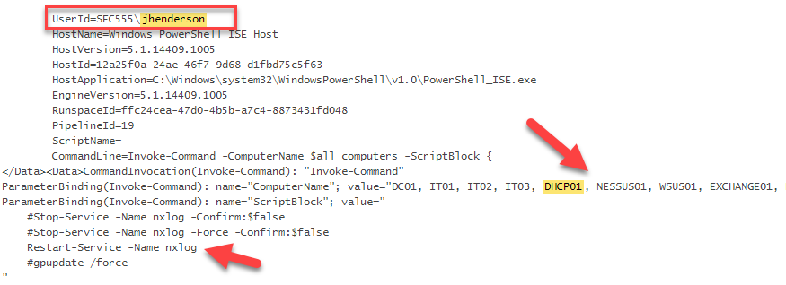

This shows that a PowerShell script is being run on **DC01** to restart the NXLog agent on multiple systems which is causing the large number of successful logons. Therefore, the **jhenderson** account is not being used maliciously.

Knowing that the **Lab 3.3 - Successful Logons** showed similar results with **fraynor** change the search filter to **fraynor** AND **DHCP01**.

```bash
fraynor AND DHCP01
```


This time the logs look a little different. The **2<sup>nd</sup>** through **4<sup>th</sup>** logs show **powershell.exe** connecting from **IT01.sec555.com (192.168.1.81)** to **DHCP01.sec555.com (10.5.55.49)**.


The **7<sup>th</sup>** log in this search shows what is happening. At **3:23 PM CST**, **powershell.exe** was used on **IT01** to establish a PowerShell remote session to **DHCP01**. This would grant remote access to **DHCP01** as the user **fraynor**. Click on the magnifying glass with the **+** sign next **to event\_id 800** on the **7<sup>th</sup>** log.

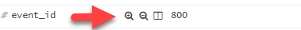

Then click on the magnifying glass with the **+** sign next to **host 192.168.1.81.


This narrows the logs to look for other PowerShell sessions from **IT01**. Before this will work you need to remove **AND DHCP01** from the search filter so that it only contains **fraynor**.

```
fraynor
```


If you were to look at the results logs you would find that the **fraynor** accounts was used on **IT01** to launch remote PowerShell sessions to **DC01**, **DC02**, **WSUS01**, **FS01**, **EXCHANGE01**, and **DHCP01**. These occur between **3:18** and **3:23 PM CST**. No PowerShell commands are recorded after these sessions are established. This is suspicious as normally IT staff would enter a remote session and run administrative tasks. While suspicious, there is not enough evidence to guarantee this is malicious.

**Note**: You can update your search filter to **fraynor AND "enter-pssession -Computername"** to eliminate some of the noise and narrow down on which systems the **enter-pssession** command was run.

**Answer**: The user accounts of **jhenderson** and **fraynor** had the most successful logons. The **jhenderson** account is being used to perform remote tasks and is **benign**. The **fraynor** account is being used from **IT01.sec555.com** to enter remote PowerShell sessions to **DC01**, **DC02**, **WSUS01**, **FS01**, **EXCHANGE01**, and **DHCP01**. Considering that **IT03.sec555.com** was previously compromised by pass-the-hash at **3:14 PM CST** this is most likely malicious.

Change the filters back to the default dashboard settings by clicking on the **Load Saved Dashboard** icon and then type **3.3** in the search area. Then click on **Lab 3.3 - Logon Dashboard**.


4. Find out which system improperly is using SVC\_VulnScan outside its expected use
---------
Service credentials are typically used only **from** specific systems. In this case, SVC\_VulnScan logons should only come from the vulnerability scanner. Looking at the **Lab 3.3 - Successful Logons** you can see the hostname **nessus01.sec555.com**. This is the vulnerability scanner so the SVC\_VulnScan accounts should only be used **from** it. Click on **nessus01.sec555.com** in the **Lab 3.3 - Successful Logons** visualizations and then click on the magnifying glass with the **-** sign.

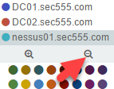

Now update the search to look for logins from **SVC\_VulnScan** by changing it to **tags:logon AND user:SVC\_VulnScan

There are many logs shows. However, if you look closely, the first **6** logs are related to **192.168.3.50 (hr01.sec555.com)**. After that, all the remaining logs contain a **client\_ip** of **172.16.0.2**. **172.16.0.2** is the **nessus01.sec555.com's** IP address. Also, the logon type of **10** is related to a RDP logon.

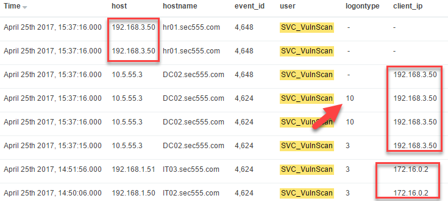

The 1<sup>st</sup> log shown with a logon type value of **10** shows it is for a **RDP** logon sourcing from **192.168.3.50** to **DC02** using the **SVC\_VulnScan** account.

**Answer**: The **SVC\_VulnScan** account was used from the **hr01.sec555.com (192.168.3.50)** workstation to login to **DC02 (10.5.55.3).

**Note:** The **Lab 3.3 - User Logon Map** was not used during this lab but is very helpful. It visually graphs out any user account that has 2 or more successful logons that result in delegation tokens. In this case **jhenderson** and **fraynor** are shown. The **-** means the log is local such as from a domain controller authenticating itself.

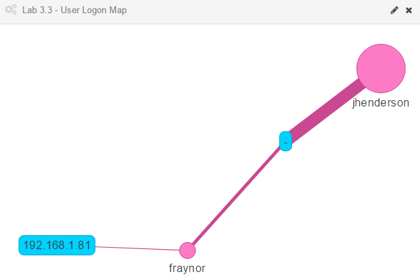

Bonus Challenge 1 – Pass-the-hash or Pass-the-token
===================================================

The attack in this lab involved both pass-the-hash and pass-the-token. Can you identify which user accounts were used for which attack?

**Hint**: Both are acceptable forms of Windows logons. However, authentication is handled differently as there is more than one way to authenticate in Windows environments.
