Lab 5.1 - Alert Context
==========================================================

Objectives
==========

-   Understand the limited context provided by alerts

-   Understand the importance of correlation (and having data to correlate with)

-   Identify attacker movement on the internal network

-   Discover other compromised assets that had no alerts of compromise

-   Build a more holistic report of what happened

Exercise Preparation
====================

Log into the Sec-555 VM

-   Username: student

-   Password: sec555


Open http://localhost:5601/app/kibana


A dashboard called **Lab 5.1 - Alert Dashboard** has been created for this lab. To access it click on **Dashboard** and then **Load Saved Dashboard**. Type **5.1** in the search filter and then click on **Lab 5.1 - Alert Dashboard**. Loading this dashboard will also set the proper time range for this lab.

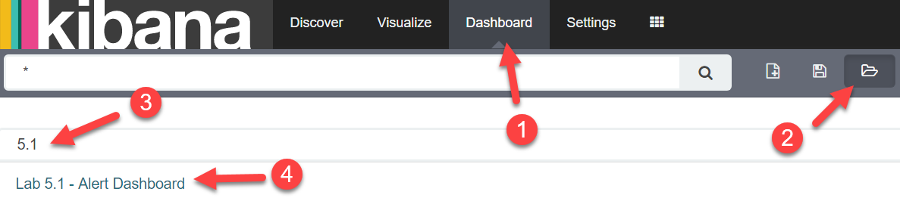

This lab uses systems the same network structure and systems from previous labs. Some asset information is provided below:
- 10.5.55.0/24, 172.16.0.0/24, and 10.0.0.0/24 are **server** subnets
- 10.5.55.20 is the **SIEM**
- 10.5.55.2 and 10.5.55.3 are the **domain controllers** for **sec555.com**
- 172.16.0.2 is the corporate **vulnerability** **scanner**
- All other private IP addresses are **client** subnets

Exercise: No hints
==================

Using the **Lab 5.1 - Alert Dashboard** filter out the noise and identify any alerts dealing with system(s) that are compromised. Using this information build a detailed report. This should include things such as:

1.  Was this system used to attack other systems?

2.  Was pivoting involved?

3.  How many total systems are likely compromised?

Move backward or forward to find your answers. For this lab, you will need to use both the **Lab 5.1 - Alert Dashboard** and any logs of your choosing in the **Discover** tab for **index lab5.1-complete-\***

Exercise – Step-by-step instructions
====================================

This lab is intentionally open ended. The goal is to find any credible alerts and then track down what happened. Looking at both **Lab 5.1 - Alerts over Time by Destination** and **Lab 5.1 - Alerts over Time by Source** shows large spikes of activity from **172.16.0.2**.

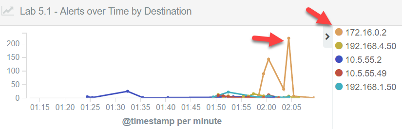


However, the asset information provided states that **172.16.0.2** is the corporate vulnerability scanner. Vulnerability scanners typically are excluded from monitoring as they generate tremendous amounts of false positives. Filter out this system completely by applying a search filter of **-172.16.0.2**.

```bash
-172.16.0.2
```


This greatly reduces the number of alerts. While there are still many remaining alerts they consist of only three signatures as seen in **Lab 5.1 - Signatures by Count**.


None of these overtly specify something malicious has happened. However, looking at **Lab 5.1 - Signatures by Source Port** shows a single alert in regards to an **EXE** or **DLL** being downloaded. It is normal for these kinds of files to be downloaded. What is odd is the fact that it occurred over port 4444 as shown in **Lab 5.1 - Signatures by Source Port**.


Port **4444** is the default port for **Metasploit Meterpreter** and should not be in use. Looking at **Lab 5.1 - Signatures by Source and Dest** shows a source of **72.99.4.33** and a destination of **192.168.2.50**.

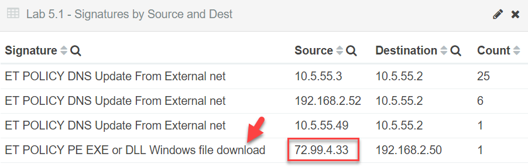

This makes it look like **72.99.4.33** directly exploited and compromised **192.168.2.50**. However, without the table showing ports this cannot be confirmed. To verify the direction of the connection switch to the **Discover** tab. and then select the index called **lab5.1-complete-\*.**

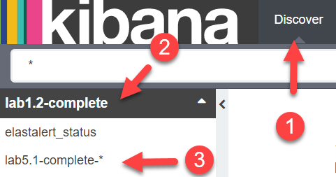

First, look at the alert. Do this by searching for **type:suricata AND event\_type:alert AND 4444**.

```bash
type:suricata AND event_type:alert AND 4444
```


Looking at the raw log shows it has a **source\_ip** of **72.99.4.33**, a **source\_port** of **4444**, a **destination\_ip** of **192.168.2.50**, and a **destination\_port** of **49959**. While the alert states the **source\_ip** is **72.99.4.33** that actual source is **192.168.2.50**. You can infer this by **192.168.2.50** using an ephermal (high port) while **72.99.4.33** has a low port. This alert was recorded at **2:03 AM CST**.

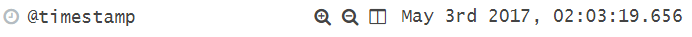

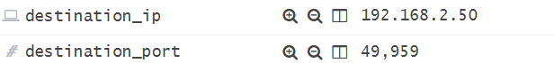

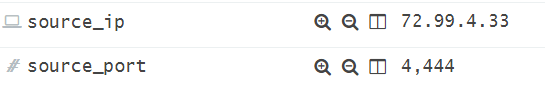

**Note**: IDS signatures report source and destination IP addresses per how the packet is being analyzed. This regularly causes source and destination to be switched causing confusion to analysts.

At this point it is likely that **192.168.2.50** is compromised and possibly being controlled by **72.99.4.33**. Next, search for flow data relating to connections to or from **72.99.4.33** by changing the search to **type:suricata AND event\_type:flow AND (source\_ip:72.99.4.33 OR destination\_ip:72.99.4.33)**.

```bash
type:suricata AND event_type:flow AND (source_ip:72.99.4.33 OR destination_ip:72.99.4.33)
```


The default view of **Time** and **\_source** is not helpful for manual analysis.

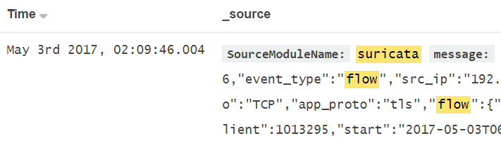

Fix this by adding columns for **source\_ip**, **source\_port**, **destination\_ip**, and **destination\_port**. You can do this by hovering over the field in the **Available Fields** column on the left and then clicking on **Add**.


The results are interesting. There are **20** logs all from **192.168.2.52** to **72.99.4.33** over port **443**. These occur between **1:52 AM** and **2:09 AM**.


This is a little alarming though. What happened to the port **4444** connection? It is possible that **Suricata** did not have enough resources to keep up with checking packets for alerts and creating flow data. If you are lucky, you may have more than one data source for correlation such as firewall logs. Fortunately, we have flow data in **Suricata** and connection logging with **Bro**. Change your search filter to **type:bro\_conn AND (source\_ip:72.99.4.33 OR destination\_ip:72.99.4.33)**.

```bash
type:bro_conn AND (source_ip:72.99.4.33 OR destination_ip:72.99.4.33
```


This shows **30** logs. Within these are connections from **192.168.2.52** to **72.99.4.33** over **443** ranging from **1:49 AM** to **2:06 AM CST**. This correlates and is close to the previous **Suricata** logs. However, this search also shows a single connection from **192.168.2.50** to **72.99.4.33** over port **4444** at **2:03 AM**. This coincides with the original **Suricata** alert.

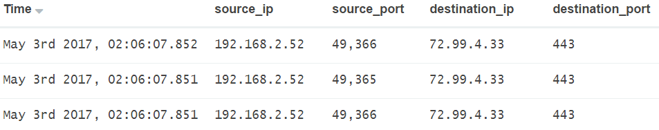

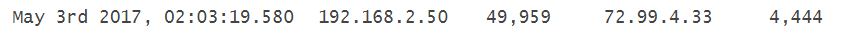

At this point there is enough evidence to suggest both **192.168.2.50** and **192.168.2.52** are compromised. Now that connections to and from **72.99.4.33** have been looked at next look for any internal connections made from these compromised systems to other internal systems. To do this change you search to **type:bro\_conn AND (source\_ip:192.168.2.50 OR source\_ip:192.168.2.52) AND tags:internal\_destination**

```bash
type:bro_conn AND (source_ip:192.168.2.50 OR source_ip:192.168.2.52) AND tags:internal_destination
```


There are **815** results. This is a lot to manually analyze. However, looking within the first four logs shows this is returning records of logs from these systems going to the SIEM on port **6052**.


Filter out the SIEM by expanding one of these logs and clicking on the magnifying glass with the **-** sign for on the **destination\_ip** of **10.5.55.20**.

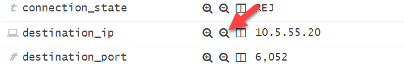

This narrowed the search down from **815** results to **625**. However, that is still a lot to manually analyze. Looking at the events there are a decent number of logs related to connections to the internal domain controllers. Since these are not so high as to be alarming go ahead and filter out the domain controllers. Do this by expanding the **2<sup>nd</sup>** log and clicking on the magnifying glass with the **-** sign next to **destination\_ip 10.5.55.2**.


Once again expand the **2<sup>nd</sup>** log and clicking on the magnifying glass with the **-** sign next to **destination\_ip 10.5.55.3**.


This narrows the results from the original **815** down to **41**.

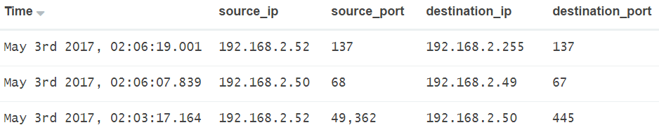


This is a much more manageable number. Scanning through these shows the following:
- Connections from both compromised systems to **192.168.2.49** on port **67** which is **DHCP** (Dynamic Host Configuration Protocol which is likely benign)
- Connections from both compromised systems to **10.5.55.79** on port **8530** which is **WSUS** (Windows Server Update Services which is likely benign)
- Connections from both compromised systems to **192.168.2.255** on port **137** which is **NetBIOS broadcasts** (likely benign)


Outside of these there are connections from **192.168.2.52** to **192.168.2.50** on port **445**. This began at **1:53 AM** up until **2:03 AM CST**. **2:03 AM** corresponds to the initial alert about **192.168.2.50** being compromised. Also, workstations typically do not and should not talk to one another. Combined these together and it is likely that **192.168.2.52** was initially compromised and then used to turn around and compromise **192.168.2.50**.

At this point go ahead and remove the columns specific to flow data by hovering next to them and clicking on Remove column. Do this for the **source\_ip**, **source\_port**, **destination\_ip**, and **destination\_port** columns.

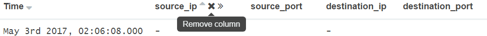

Remove all additional search filters by clicking on **Actions** and then click on **Remove**.

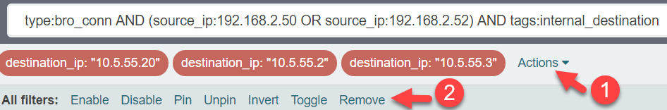

This is commonly the stopping point for most analysts due to not having access to other correlating information. However, this lab just happens to include Windows event logs. Start by seeing if **192.168.2.52** compromised **192.168.2.50**. Do this by searching for **type:windows AND host:192.168.2.50**.

```bash
type:windows AND host:192.168.2.50
```


There are **83** results. However, you know the connection from **192.168.2.52** to **192.168.2.50** occurred around **2:03 AM CST** so scroll down to that time frame and analyze the logs. Around this time, you will discover multiple PowerShell logs and a new service being installed.

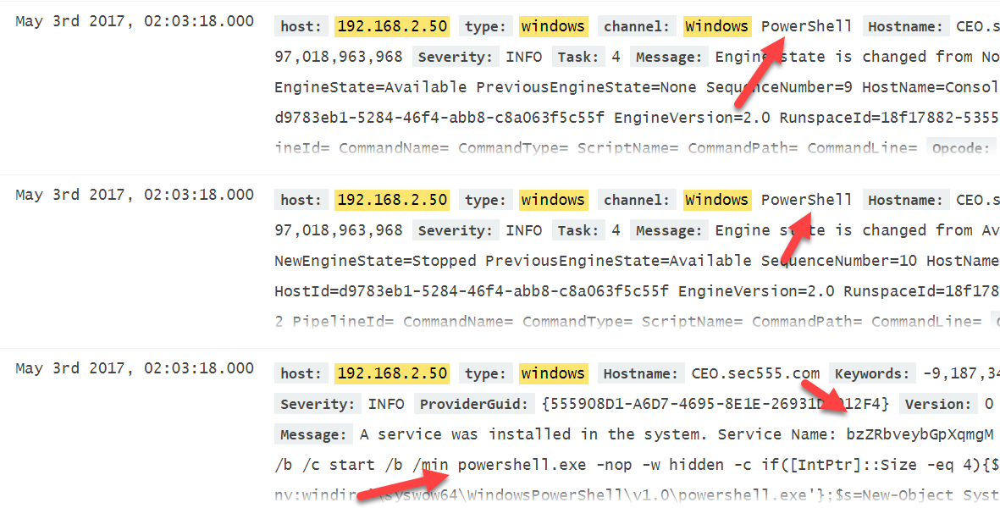

Looking into the service name shows it has a random generated name and is using obfuscated PowerShell commands. This is likely the command and control being launched.

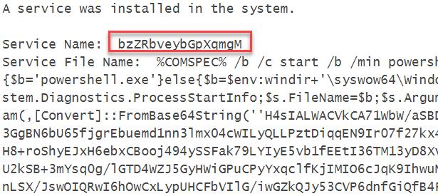

Looking around more you will find that **at 2:03:17 AM CST** a logon event was generated.


This log message shows that the logon came from **192.168.2.52** and was used to successfully logon as **Administrator** with a domain of **CEO**. This means that **192.168.2.50** is the **CEO's** machine. Also, the workstation name is randomly generated. More than likely this was a pass-the-hash attack from **192.168.2.52** to **192.168.2.50**.


This confirms suspicions about how **192.168.2.50** was compromised. Now to consider **192.168.2.52**. Change the search filter to **type:windows AND host:192.168.2.52**.

```bash
type:windows AND host:192.168.2.52
```


This shows **725** results. This is a lot to manually analyze. One thing you can try is to free text search for the command and control server by changing the search filter to **type:windows AND host:192.168.2.52 AND 72.99.4.33**.

```bash
type:windows AND host:192.168.2.52 AND 72.99.4.33
```


This yields **1** result which is a PowerShell ScriptBlock log showing the execution and download of code from **72.99.4.33**. This means PowerShell was used against **192.168.2.52** and is likely the mechanism for command and control.


Remove the **AND 72.99.4.33** from the search filter by searching for **type:windows AND host:192.168.2.52**.

```bash
type:windows AND host:192.168.2.50
```


This yields the **725** events from earlier. Click on **channel** in the left field pane to see which channels these events are from.


Looking at this shows that most of the **725** events are from PowerShell. Since the initial call out to **72.99.4.33** was already discovered in a PowerShell log click on the magnifying glass with a **-** sign next to Windows PowerShell to filter it out.

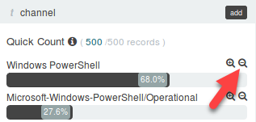

**Note**: Expanding any of these logs shows the hostname for **192.168.2.52** is **Accounting01**.

This limits the results down to **33** events. Within these you can find another service installation event. This occurs at **1:49:48 AM CST**.


This shows the service **bwjtcw**, which is a randomly generated name, being used for named pipe privilege escalation.

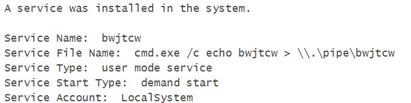

**Answer**: **192.168.2.52 (Accounting01)** was compromised around **1:49 AM CST** by unknown means. It was being controlled by **72.99.4.33** over port **443**. **Accounting01** was later used at **1:53 AM CST** to compromise **192.168.2.50 (CEO)**. This compromise led to the **CEO** computer also to be controlled by **72.99.4.33** but this time over port **4444**. This subsequent compromise was what started this incident as it generated an alert by the IDS system.

Bonus Challenge 1 – Unknown
===========================

There are multiple systems compromised within this lab. Identify if the means of compromise is the same for all systems.
