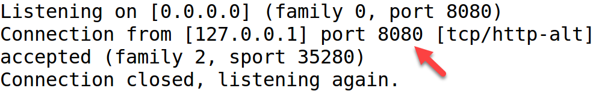

Lab 5.2 - Virtual Tripwires
==========================================================

Objectives
==========

-   Implement tripwire logs to catch adversary and malware

-   Understand and apply multiple techniques to identify abnormal endpoint use

-   Identify internal attacker reconnaissance behavior

-   Implement high fidelity alerts for early detection

Exercise Preparation
====================

Log into the Sec-555 VM

-   Username: student

-   Password: sec555


Exercise: No hints
==================

This lab focuses on using Linux auditing to implement log tripwires. For this lab, you will need to use the command **auditctl** or save audit rules to **/etc/audit/rules.d**. Recommendation is to use **auditctl**.

1.  Create an audit rule to monitor for read attempts against **/etc/group**

2.  Create a folder called **confidential** in **/opt**. Then create an audit rule to monitor for read attempts against this folder

3.  Create a **netcat** listener that listens on port **8080** and logs to **/var/log/honeypot.log**

4.  Ingest the log files at **/var/log/audit/audit.log and /var/log/honeypot.log**

    -   Parse the logs

    -   Tag unauthorized access as alert

5.  Verify that alerts are being generated for attempts to access **/etc/group**, **/opt/confidential**, and port **8080**

Exercise – Step-by-step instructions
====================================

1. Create an audit rule to monitor for read attempts against /etc/group
---------
The command auditctl can be used to implement auditing rules. To audit read attempts against /etc/group run the below command.

```bash
$ sudo auditctl -w /etc/group -p war -k group-file
```

**Note:** This command implements a watch (**-w**) against **/etc/group** and monitor for any read (**-r**), write (**-w**), or attribute modifications (**-a**) against **/etc/group**. It also classifies any logs as **password-file** using **-k**.

Verify this is working by performing the below steps. First, run this command:

```bash
$ sudo tail -f /var/log/audit/audit.log
```

**Note:** tail -f is used to continuously monitor data added to a file.

Now open another terminal. For visual affect, open a **purple terminal**.


While in the **purple terminal** run this command:

```bash
$ cat /etc/group
```

Back in the **black terminal** you should see something like this:


In the **black terminal**, press CTRL + C to stop tailing the **/var/log/audit/audit.log** file.

Keep both terminals open for the remainder of this lab.

**Note**: Monitoring **/etc/group** is being used to simulate an attacker looking for privileged group members. It is like monitoring Windows groups. The main different is attempts to read any group will be recorded where in Windows you can monitor read attempts against specific groups.

2. Create a folder called confidential in /opt. Then create an audit rule to monitor for read attempts against this folder
---------

First create the **/opt/confidential** directory by running these commands in the **black terminal**:

```bash
$ sudo mkdir /opt/confidential
$ sudo chmod 744 /opt/confidential
```

Then create another audit rule using this command in the **black terminal**:

```bash
$ sudo auditctl -w /opt/confidential -p r -k confidential-file
```

Once more verify this is working. In the **black terminal** run this command:

```bash
$ sudo tail -f /var/log/audit/audit.log
```

Switch to the **purple terminal** and attempt to list files in the **/opt/confidential** directory using:

```bash
$ ls /opt/confidential
```

The **black terminal** should show a log being generated for the access attempt against **/opt/confidential**.


In the **black terminal**, press CTRL + C to stop tailing the **/var/log/audit/audit.log** file.

3. Create a netcat listener that listens on port 8080 and logs to /var/log/honeypot.log
---------
**Note:** Netcat is a tool built into almost every Linux operating system. In this lab, it is being used to emulate a virtual honeypot by listening on port **8080**. In this case, port **8080** should never be accessed on this machine.

To run netcat and have it output to **/var/log/honeypot.log** run these commands in the **black terminal**:

```bash
$ sudo touch /var/log/honeypot.log
$ sudo chmod 777 /var/log/honeypot.log
$ nc -lvkp 8080 > /var/log/honeypot.log 2>&1
```

**Note:** The command **touch** is used to create an empty file. To allow a standard user to write to **/var/log/honeypot.log** the command **chmod 777 /var/log/honeypot.log** is used. **777** allows any user to write to **honeypot.log**. You would want to lock this down and use a service account in production. 

Netcat is used with the following switches:
**-l** is used to listen on a port
**-v** makes the output verbose
**-k** means to continuously listen
**-p** specifies the port to listen on

Also, the reason **2&gt;&1** is required is **nc** output will not save to the file without it. In this case the number **2** means **STDERR** output and the number **1** means **STDOUT** output. **2&gt;&1** tells the output to include both in one output.

Switch to the **purple terminal** and perform a port scan of port **8080**.

```bash
$ nmap -p 8080 127.0.0.1
```

Verify this was logged by netcat. In the **purple terminal** run the below command.

```bash
$ cat /var/log/honeypot.log
```

You should see output like this:



In the **black terminal**, press CTRL + C to stop netcat.

4. Collect the log file at /var/log/audit/audit.log and /var/log/honeypot.log
---------
Now that logs are properly being generated it is time to simulate central collection of the logs. To do this create a logstash configuration file at **/labs/lab5.2/student/ingest.conf.** To do this run the below command in the **black terminal**.

```bash
$ code /labs/lab5.2/student/ingest.conf
```

Enter the below Logstash configuration. (You can also copy this from **/labs/lab5.2/files/step4.conf**)

```javascript
input {
  file {
    path => "/var/log/audit/audit.log"
    type => "audit"
  }
  file {
    path => "/var/log/honeypot.log"
    type => "honeypot"
  }
}
filter {
  if [type] == "audit" {
    mutate {
      gsub => [ "message", "type=", "audit_type=" ]
    }
    kv {
      source => "message"
    }
    mutate {
      convert => [ "auid", "integer" ]
      convert => [ "egid", "integer" ]
      convert => [ "euid", "integer" ]
      convert => [ "gid", "integer" ]
      convert => [ "pid", "integer" ]
      convert => [ "ppid", "integer" ]
      convert => [ "sgid", "integer" ]
      convert => [ "suid", "integer" ]
      convert => [ "uid", "integer" ]
      rename => [ "comm", "command" ]
      add_tag => [ "alert" ]
    }
    if [uid] == 0 { drop { } }
    if [exe] == "/usr/bin/sudo" or [exe] == "/bin/su" { drop { } }
    if [audit_type] != "SYSCALL" { drop { } }
  }
  if [type] == "honeypot" {
    if [message] =~ "^Listening on " or [message] =~ "^Connection closed" {
      drop {}
    } else {
      grok { match => { "message" => "%{IPV4:source_ip}" } }
      mutate { add_tag => [ "alert" ] }
    }
  }
}
output {
  elasticsearch { index => "lab5.2-complete" }
}
```

**Note**: **gsub** is used to replace **type=** with **audit\_type=.** If you did not do this, then logs with a type of **audit** would get their type value changed. The reason for dropping certain audit logs is because built in functionality regularly queries **/etc/group** as **uid 0**. Plus, using **sudo** or **su** requires checking **/etc/group**.

**Save the file** and close out of Visual Studio Code. Now run Logstash in the **black terminal** with the following parameters:

```bash
$ sudo /opt/logstash/bin/logstash -v -f /labs/lab5.2/student/ingest.conf
```

The above command is a one line command. Leave Logstash running in the **black terminal** and move on to **step 5**.

5. Verify alerts are working properly by accessing /etc/group, /opt/confidential, and port 8080

**Open a third terminal by clicking on the black terminal icon in the top left corner**


In this third terminal run the below command.

```bash
$ nc -lvkp 8080 > /var/log/honeypot.log 2>&1
```

In the **purple terminal** run the following commands:

```bash
$ cat /etc/group
$ nmap -p 8080 127.0.0.1
$ ls /opt/confidential
```

Now open **Firefox** to access **Kibana**.


Within **Kibana** click on **Dashboard**, then click on **Load Saved Dashboard**. In the **Dashboard Filter** type **5.2** and then click on **Lab 5.2 - Tripwire Dashboard**.


You should now see alerts related to accessing **/etc/group**, **/opt/confidential**, and **port** **8080**.


**Note: Lab 5.2 - Audit Alert** is a table showing all the alerts related to targeted **audit** events.


**Note: Lab 5.2 - Honeypot Alert** is a table showing all the alerts related to honeypot access. It is a simple table showing what IP addresses have attempted to access the honeypot.

Bonus Challenge 1 – UID and GID Conversion
==========================================

Take the **uid** and **gid** fields in the **/var/log/audit/audit.log** records and convert them back to a username or group during log ingestion.
