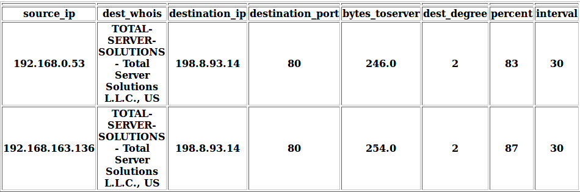
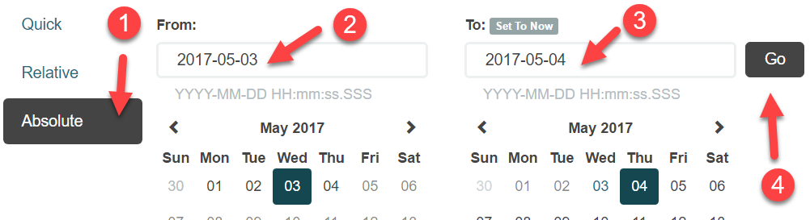
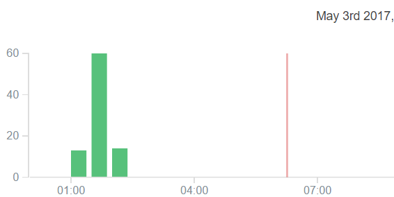
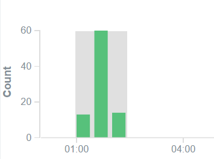
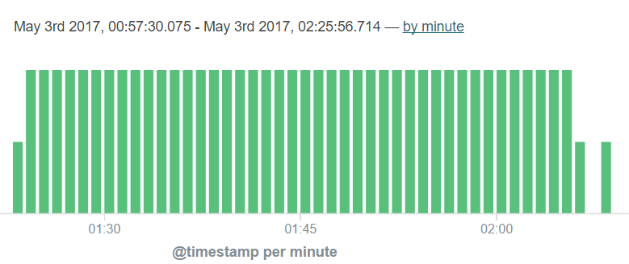

Lab 5.3 - Beacon Detection
==========================================================

Objectives
==========

-   Learn how to use historical logs to catch post compromise activity

-   Learn what command and control beaconing is

-   Apply visual detection methods to identify beaconing

-   Use advanced tools for automatic beacon detection

-   Configure and use **flare**

Exercise Preparation
====================

Log into the Sec-555 VM

-   Username: student

-   Password: sec555


**Flare** is installed to **/opt/flare**. You will need it for this lab. This lab uses data from **lab5.1-complete-\* index**.

Exercise: No hints
==================

Use flare to identify command and control beaconing.

1.  Configure flare to use the index **lab5.1-complete-suricata**

2.  Use flare to identify the IP addresses that are beaconing with a high percentage of beacon traffic

3.  Use Kibana to visually identify the beaconing activity

Exercise – Step-by-step instructions
====================================

1. Configure flare
---------
Identify beaconing can seem overly complicated. This lab is designed to show you how to do it for free as well as show you how easy it is to setup. First, make a copy of the default flare configuration file.

```bash
$ cp /opt/flare/configs/elasticsearch.ini /labs/lab5.3/student/flare.ini
```

Next, open it with the Visual Studio Code Editor

```bash
$ code /labs/lab5.3/student/flare.ini
```

The values displayed are the default settings. These assume Suricata logs are being stored in an index called **logstash-flow-\*** and follow the traditional Suricata field names.

```bash
[beacon]
es_host=localhost
es_index=logstash-flow-*
es_port=9200
es_timeout=480
min_occur=10
min_percent=5
window=2
threads=8
period=24
kibana_version=4
verbose=True

#Elasticsearch fields for beaconing
field_source_ip=srce_ip
field_destination_ip=dest_ip
field_destination_port=dest_port
field_timestamp=@timestamp
field_flow_bytes_toserver=bytes_toserver
field_flow_id=flow_id
```

However, **lab5.1-complete-\*** is a different index and uses different field names. Also, the data in lab5.1-complete-\* is older than 24 hours. This means **index** and **period** need changing as well as the **Elasticsearch field names**. To update this, change the configuration file to look like this:

```bash
[beacon]
es_host=localhost
es_index=lab5.1-complete-suricata
es_port=9200
es_timeout=480
min_occur=10
min_percent=50
window=2
threads=8
period=26280
kibana_version=4
verbose=True

#Elasticsearch fields for beaconing
field_source_ip=source_ip
field_destination_ip=destination_ip
field_destination_port=destination_port
field_timestamp=@timestamp
field_flow_bytes_toserver=bytes_to_server
field_flow_id=flow_id
```

**Note**: The following fields have changes made to them in **flare.ini**:
- **es\_index**
- **period** (This was changed to 26280 so that flare searching data up to 3 years old.)
- **min\_percent** (This was changed to 50 so it will only show systems that 50% of their traffic is beacons)
- **field\_source\_ip**
- **field\_destination\_ip**
- **field\_destination\_port**
- **field\_flow\_bytes\_toserver** (there is an extra underscore added between **to** and **server**)

Save the file by either using **CTRL + S** or clicking **File -&gt; Save**. Then **close** out of Visual Studio Code by clicking the **X** in the top right corner.


At this point you are done configuring **flare**.

2. Identify beacons by running flare
---------
Flare has many options and extra capabilities to help analyst analyze beacons. To see all these options run flare with -h like follows:

```bash
$ flare_beacon -h
```

Specifically the following options are of interest:

-gr or --group This switch will group results together for easier handling by an analyst
-who or --whois This will provide whois information about beacons in question
-fo or --focus\_outbound This will remove private IP and multicast IP addresses from analysis
-csv or --csv\_out This outputs the results to CSV (can be used to import data into a SIEM)
-html or --html\_out This outputs the results to a HTML file for easy analyst viewing

Now run flare with the configuration file you previously created.

```bash
$ flare_beacon -c /labs/lab5.3/student/flare.ini  --focus_outbound --whois --group --html=/labs/lab5.3/student/beacons.html
```

**Note**: This command should be ran all as one line.

Now use **Firefox** to open the output file it created.

```bash
$ firefox /labs/lab5.3/student/beacons.html
```

The output should show the following:



This output is stating that **192.168.0.53** and **192.168.163.136** are regularly communicating with **198.8.93.14** in **30** second intervals.

**Note**: Here is a breakdown of the three right columns means:
- **dest\_degree** This is how many systems are talking to the same **destination\_ip**
- **percent** This is how much of the overall traffic between the **source\_ip** and **destination\_ip** is beaconing in accordance with the interval detected
- **interval** This is how many seconds occurs between each beacon

**Answer**: Given such a high percent score, **192.168.0.53** and **192.168.163.136** are beaconing to **198.8.93.14**.

Do not close **Firefox**. If you have, re-open for the next step.


3. Use Kibana to visually identify the beaconing activity
---------
Trust but verify is always a good idea. In **Firefox** click on the **Home** button to load **Kibana**.


Switch to the **lab5.1-complete-\*** index by clicking on the dropdown and then clicking on **lab5.1-complete-\***.


Make sure to change your time field before moving on. Do this by clicking on the **date picker** in the top right corner.


Then click on **Absolute** and set **From** to **2017-05-03** and **To** to **2017-05-04**. Then click on **Go**.



Minimize the date picker by clicking the up arrow at the bottom of the date picker.


Now search for traffic sourcing from **192.168.0.53** going to **198.8.93.14** over port **80**. This one of the results from flare. Do this by specifying a search filter of **type:suricata AND event\_type:flow AND source\_ip:192.168.0.53 AND destination\_ip:198.8.93.14 AND destination\_port:80**

```bash
type:suricata AND event_type:flow AND source_ip:192.168.0.53 AND destination_ip:198.8.93.14 AND destination_port:80
```


The results should look like this:



This does not look like beaconing. However, it is because the current view is breaking logs out in increments of **30** **minutes**. Carefully drag your mouse from the begging of the vertical bars to the end. It should highlight the area you want to drilldown into like the picture below.



When you let go of your mouse you should see something like this:



This does look like beaconing. However, flare identified the beacons as every **30** **seconds** and this still breaks logs down **every minute**. Highlight a midsection of the logs again until the **@timestamp** is broken down by **30 seconds**. Once the **@timestamp reflects per 30 seconds** you should see this:


This reflects that a connection is being made every **30 seconds** just as flare calculated. This is what a beacon looks like on a graph. However, since logs are typically looked at over larger time spans analysts do not see this type of repetition. Change your search filter so that the **source\_ip** is **192.168.163.136** instead of **192.168.0.53.**

```bash
type:suricata AND event_type:flow AND source_ip:192.168.163.163 AND destination_ip:198.8.93.14 AND destination_port:80
```


Upon hitting search you once again should see a perfect repetition proving **flare** was also right about **192.168.163.136**.

**Answer**: Both **192.168.163.136** and **192.168.0.53** are beaconing to **198.8.93.14** over port **80**. When looked at with Kibana the beaconing can be discovered due to its repetition and near perfect timing. This type of beaconing activity looks like this:


Bonus Challenge 1 – Make your own beacon
========================================

Make your own beacon. Use netcat, nmap, or scripting to generate traffic to a destination using the same interval. Log this activity and then use flare to see if it picks it up.

**Note**: If you do this from private IP to private IP make sure not to run flare without the **--foucs\_outbound** switch.
